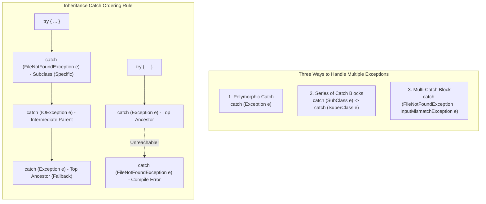

# Robust Exception Handling: Polymorphic Catching, Multi-Catch Blocks & Inheritance Ordering

---

## Key Takeaways

When application logic risks throwing multiple distinct exceptions, Java provides three structural strategies to intercept and handle them: **polymorphic catching** using ancestor types, a **series of dedicated `catch` blocks**, and the **multi-catch block** (using the pipe `|` operator). Because all exceptions inherit from the top-level superclass `java.lang.Exception`, broader superclasses can catch derived exceptions polymorphically. When using a series of `catch` blocks for related exception types, Java enforces a strict inheritance ordering rule: specialized subclasses must appear before generalized superclasses, or the compiler flags subsequent blocks as unreachable code.



- **The Three Handling Patterns**:
  - **Polymorphic Catch**: Catches a broad family of exceptions using a common superclass (e.g., `catch (Exception e)`).
  - **Series of Catch Blocks**: Defines distinct handling logic for each exception type by chaining multiple `catch` blocks sequentially.
  - **Multi-Catch (`|`)**: Combines unrelated or distinct exceptions into a single block separated by a vertical bar (`|`) when both require the exact same recovery behavior.
- **Subclass-First Hierarchy Rule**: When catching related exceptions in a series of blocks, the subclass catch block **must** precede the superclass catch block. Placing a superclass first causes a compilation error because subsequent subclass blocks become unreachable.
- **Top-Level Fallback**: Placing `catch (Exception e)` as the final block in a multi-catch series acts as a safe, catch-all fallback for any unexpected runtime errors.

---

## Main Discussion

### Idiomatic Java Code Snippets

#### Strategy 1: Series of Dedicated Catch Blocks (Specialized Responses)

When different exceptions require different recovery logic (e.g., file issues vs. bad input formatting), chain individual catch blocks ordered from most specific to most general:

```java
package multi_exceptions;

import java.io.File;
import java.io.FileNotFoundException;
import java.util.InputMismatchException;
import java.util.Scanner;

public class SeriesCatchDemo {

    public static void main(String[] args) {
        File file = new File("numbers.txt");

        try {
            Scanner fileReader = new Scanner(file);

            while (fileReader.hasNext()) {
                // nextDouble() throws unchecked InputMismatchException if token is not a double
                double value = fileReader.nextDouble();
                System.out.println("Read value: " + value);
            }
            fileReader.close();

        } catch (FileNotFoundException e) {
            // Specific handling: checked exception for missing file
            System.out.println("File Error: Unable to locate 'numbers.txt'. Please verify path.");
            e.printStackTrace();

        } catch (InputMismatchException e) {
            // Specific handling: unchecked exception for malformed data inside the file
            System.out.println("Format Error: Found non-numeric data inside the file.");
            e.printStackTrace();

        } catch (Exception e) {
            // Generalized polymorphic fallback: catches any other unexpected exception
            System.out.println("Unexpected Error: " + e.getMessage());
            e.printStackTrace();
        }
    }
}
```

#### 2. Strategy 2: Multi-Catch Block with the Pipe (`|`) Operator

When distinct exceptions share identical recovery code, collapse them into a single multi-catch block using `|` to eliminate code duplication:

```java
package multi_exceptions;

import java.io.File;
import java.io.FileNotFoundException;
import java.util.InputMismatchException;
import java.util.Scanner;

public class MultiCatchDemo {

    public static void main(String[] args) {
        File file = new File("numbers.txt");

        try {
            Scanner fileReader = new Scanner(file);

            while (fileReader.hasNext()) {
                double value = fileReader.nextDouble();
                System.out.println("Read value: " + value);
            }
            fileReader.close();

        // Multi-catch: handles either exception with identical recovery logic
        } catch (FileNotFoundException | InputMismatchException e) {
            System.out.println("Data processing interrupted: Issue with file availability or number format.");
            e.printStackTrace();
        }
    }
}
```

#### 3. Strategy 3: Pure Polymorphic Catch

When broad error handling is desired and distinguishing the exact exception subclass is unnecessary:

```java
package multi_exceptions;

import java.io.File;
import java.util.Scanner;

public class PolymorphicCatchDemo {

    public static void main(String[] args) {
        File file = new File("numbers.txt");

        try {
            Scanner fileReader = new Scanner(file);
            while (fileReader.hasNext()) {
                System.out.println(fileReader.nextDouble());
            }
            fileReader.close();

        // Catches FileNotFoundException, InputMismatchException, and all other exceptions
        } catch (Exception e) {
            System.out.println("A processing failure occurred: " + e.getMessage());
        }
    }
}
```

### Under the Hood / JVM Mechanics

1. **Linear Exception Table Generation:**
   For a series of catch blocks, javac emits ordered entries in the class file's bytecode Exception table. Each entry links the protected instruction range to a specific handler routine offset and class type token.
2. **Reachability & Shadowing Analysis:**
   During semantic analysis, the compiler inspects catch block ordering. If an entry's exception class is a subtype of an entry preceding it in the same table, the compiler marks the second entry unreachable and halts with: exception has already been caught.
3. **Multi-Catch Disjunction Desugaring:**
   For a multi-catch block like catch (FileNotFoundException | InputMismatchException e), the compiler emits two separate entries in the internal Exception table that both point to the same byte target address. Inside the handler, the parameter e is treated as implicitly final.
4. **Runtime Top-Down Traversal:**
   When an exception occurs, the JVM searches the Exception table top-down. The first handler whose type is assignment-compatible with the thrown exception object takes control, bypassing all subsequent blocks.

### Structural Comparisons

#### The Three Multiple Exception Handling Approaches

| Approach                   | Syntax Pattern                            | When to Use                                                       | Duplicate Code?               |
| -------------------------- | ----------------------------------------- | ----------------------------------------------------------------- | ----------------------------- |
| **Polymorphic Catch**      | `catch (Exception e)`                     | When you want a broad, universal fallback for an entire hierarchy | None                          |
| **Series of Catch Blocks** | `catch (A e) { ... } catch (B e) { ... }` | When different exceptions require distinct recovery code          | Yes, if handlers share logic  |
| **Multi-Catch Block**      | `catch (A \| B e) { ... }`                | When distinct exceptions need the **exact same** recovery logic   | No, single block handles both |

#### Hierarchy Ordering Rules

| Ordering Scenario            | Example Code                                                                              | Compiler Result       | Explanation                                                                                    |
| ---------------------------- | ----------------------------------------------------------------------------------------- | --------------------- | ---------------------------------------------------------------------------------------------- |
| **Subclass First**           | `catch (FileNotFoundException e)`<br />`catch (IOException e)`<br />`catch (Exception e)` | **Compiles Cleanly**  | Specific exceptions are intercepted before broad parent catchers.                              |
| **Superclass First**         | `catch (Exception e)`<br />`catch (IOException e)`<br />`catch (FileNotFoundException e)` | **Compilation Error** | `FileNotFoundException` is already caught by `Exception`, making the second block unreachable. |
| **Multi-Catch with Subtype** | `catch (IOException \| FileNotFoundException e)`                                          | **Compilation Error** | `FileNotFoundException` is a subtype of `IOException`, so the union is redundant.              |

### Common Anti-Patterns & Edge Cases

- **Catching Superclass Before Subclass**: Writing `catch (Exception e)` before `catch (FileNotFoundException e)` causes an immediate compile error: `exception java.io.FileNotFoundException has already been caught`.
- **Multi-Catch with Inheritance Subtypes**: Writing `catch (IOException | FileNotFoundException e)` fails compilation with: `Types in multi-catch must be alternatives, not in a subtype relation`. Since `FileNotFoundException` is an `IOException`, the union is redundant.
- **Mutating Variables in Multi-Catch**: In a multi-catch block `catch (A | B e)`, the parameter `e` is implicitly `final`. Reassigning it (e.g., `e = new A();`) triggers a compile-time failure.
- **Over-Relying on Generic `catch (Exception e)`**: Using only `catch (Exception e)` when specific business recovery is needed obscures the failure root cause and prevents targeted recovery actions.

---

## Knowledge Check & JetBrains-Style Coding Challenges

### Theory Tips

- **Subclass Order Mandate**: When using multiple catch blocks, subclasses must always appear **before** their parent superclasses.
- **Multi-Catch Syntax**: In multi-catch blocks, exceptions are separated using a single vertical pipe character (`|`).
- **Universal Ancestor**: The `Exception` class is the top-level superclass for all checked and unchecked application exceptions in Java.

### Question 1: Conceptual / Code Analysis

Consider the following exception-handling structure:

```java
import java.io.FileNotFoundException;
import java.io.IOException;

public class ExceptionOrderQuiz {
    public static void main(String[] args) {
        try {
            riskyOperation();
        } catch (IOException e) {
            System.out.print("IO ");
        } catch (FileNotFoundException e) {
            System.out.print("FNF ");
        } catch (Exception e) {
            System.out.print("GEN ");
        }
    }

    static void riskyOperation() throws IOException {
        throw new FileNotFoundException();
    }
}
```

What happens when attempting to compile this code?

- [ ] **A.** It compiles successfully and prints `FNF ` at runtime.
- [ ] **B.** It compiles successfully and prints `IO ` at runtime.
- [ ] **C.** A compilation error occurs because `FileNotFoundException` has already been caught by the `IOException` block.
- [ ] **D.** A runtime `IllegalStateException` occurs due to ambiguous handler paths.

<details>
<summary>Correct Answer</summary>

**Correct Answer**: **C**

**Technical Breakdown**:

- **C is correct**: `FileNotFoundException` extends `IOException`. In Java, catch blocks are evaluated from top to bottom. Because `catch (IOException e)` appears first, it would intercept all `IOException` instances—including any `FileNotFoundException`. Consequently, the subsequent `catch (FileNotFoundException e)` block can never be reached. The Java compiler detects this unreachable code and rejects the program: `exception java.io.FileNotFoundException has already been caught`.
- **A is incorrect**: Subclasses must appear before superclasses; the code does not compile.
- **B is incorrect**: While `IOException` would match polymorphically at runtime, compilation fails beforehand.
- **D is incorrect**: Handler ordering conflicts are caught at compile time, not runtime.

</details>

---

### Question 2: Mini Coding Problem / Implementation Challenge

**Task**: Implement a resilient batch number parser named `DataStreamParser` inside package `multi_exceptions`:

1. Method `public static double sumNumberFile(String filePath)`:
   - Instantiates a `File` with `filePath` and wraps it in a `Scanner`.
   - Iterates using `while (scanner.hasNext())` and accumulates values using `scanner.nextDouble()`.
   - Encloses file and scanner operations in a `try-catch` structure.
   - Handles `FileNotFoundException` specifically: logs `"FILE_NOT_FOUND"` to `System.err` and returns `-1.0`.
   - Handles `InputMismatchException` specifically: logs `"INVALID_DATA_FORMAT"` to `System.err` and returns `-2.0`.
   - Handles any other unexpected `Exception` using a generalized fallback catch block: logs `"UNEXPECTED_ERROR"` to `System.err` and returns `-3.0`.
2. Method `public static boolean verifyFileAvailability(String filePath)`:
   - Attempts to open the file via `new Scanner(new File(filePath))`.
   - Uses a **multi-catch block** to catch `FileNotFoundException | NullPointerException e`.
   - Returns `false` inside the multi-catch block.
   - If scanner creation succeeds, closes the scanner and returns `true`.

**Test Assertions**:

- `sumNumberFile("missing_file.txt")` $\rightarrow$ Intercepted by `FileNotFoundException` catch block $\rightarrow$ Returns: `-1.0`
- `verifyFileAvailability(null)` $\rightarrow$ Catches `NullPointerException` via multi-catch $\rightarrow$ Returns: `false`
- `verifyFileAvailability("missing_file.txt")` $\rightarrow$ Catches `FileNotFoundException` via multi-catch $\rightarrow$ Returns: `false`

<details>
<summary>Solution</summary>

```java
package multi_exceptions;

import java.io.File;
import java.io.FileNotFoundException;
import java.util.InputMismatchException;
import java.util.Scanner;

public class DataStreamParser {

    public static double sumNumberFile(String filePath) {
        double sum = 0.0;

        try {
            Scanner scanner = new Scanner(new File(filePath));

            while (scanner.hasNext()) {
                sum += scanner.nextDouble();
            }

            scanner.close();
            return sum;

        // Specific subclass catch block 1
        } catch (FileNotFoundException e) {
            System.err.println("FILE_NOT_FOUND");
            return -1.0;

        // Specific subclass catch block 2
        } catch (InputMismatchException e) {
            System.err.println("INVALID_DATA_FORMAT");
            return -2.0;

        // Fallback superclass catch block (must be ordered last)
        } catch (Exception e) {
            System.err.println("UNEXPECTED_ERROR");
            return -3.0;
        }
    }

    public static boolean verifyFileAvailability(String filePath) {
        try {
            if (filePath == null) {
                throw new NullPointerException("Path cannot be null");
            }

            Scanner scanner = new Scanner(new File(filePath));
            scanner.close();
            return true;

        // Multi-catch syntax combining distinct exceptions with identical logic
        } catch (FileNotFoundException | NullPointerException e) {
            return false;
        }
    }
}
```

**Complexity Analysis**:

- **Time Complexity**:
  - `sumNumberFile`: $\mathcal{O}(N)$ where $N$ is the number of whitespace-delimited tokens in the file.
  - `verifyFileAvailability`: $\mathcal{O}(1)$ filesystem metadata lookup time.
- **Space Complexity**: $\mathcal{O}(1)$ auxiliary space beyond the temporary `Scanner` and `File` reference instances.

</details>

---
