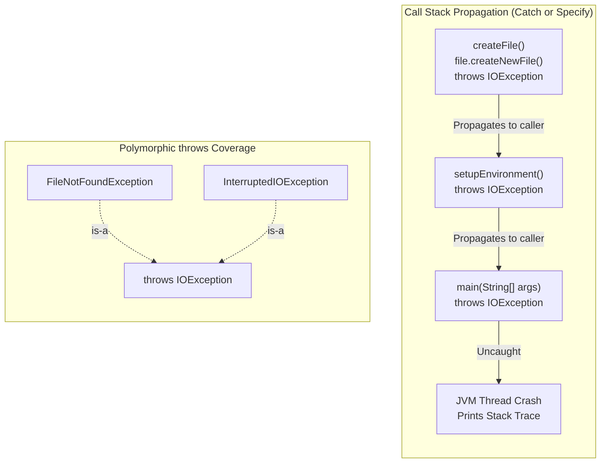

# Exception Propagation: The "Catch or Specify" Rule, Rethrowing & Polymorphic `throws` Signatures

---

## Key Takeaways

When a method encounters a checked exception, Java enforces the strict **Catch or Specify** requirement: the method must either catch the exception internally using a `try-catch` block, or declare it in its header using the `throws` keyword to propagate (rethrow) the responsibility up the call stack to its caller. If the caller also declines to catch the exception and rethrows it via `throws`, propagation continues until a caller handles it or it reaches the `main` method. If the `main` method declares `throws` and an uncaught exception escapes, the JVM terminates the thread and crashes the application with a stack trace. Multiple exceptions can be listed in a `throws` clause separated by commas, and polymorphism applies: declaring a broad checked superclass (like `IOException`) covers all of its specialized subclasses (like `FileNotFoundException`).



- **The "Catch or Specify" Contract**: Any checked exception (like `IOException`) must either be caught locally via `try-catch` or specified in the method signature using `throws`.
- **Passing the Burden**: Declaring `throws` shifts the obligation of exception handling entirely to the calling method.
- **Escalation to `main`**: If the `main` method specifies `throws` without handling the exception, escaping exceptions cause the JVM to terminate execution and dump a stack trace to standard error.
- **Multiple Exception Signatures**: A method header can specify multiple exceptions separated by commas (e.g., `throws IOException, InterruptedException`).
- **Polymorphic Coverage**: A `throws` clause stating a superclass (e.g., `throws IOException`) satisfies the compiler for any statement inside the method that throws a subclass of that type (e.g., `FileNotFoundException`).

---

## Main Discussion

### Idiomatic Java Code Snippets

#### 1. Propagating Checked Exceptions via `throws`

Instead of catching `IOException` locally, the method rethrows the exception up the call stack by declaring it in its signature:

```java
package exception_propagation;

import java.io.File;
import java.io.IOException;

public class FileCreationPipeline {

    // Passing the burden: this method will not handle IOException
    public static void createProjectFile(String path) throws IOException {
        File file = new File(path);
        // createNewFile() throws IOException; signature declaration satisfies compiler
        file.createNewFile();
    }

    // Caller method rethrowing to main, which also rethrows to the JVM
    public static void main(String[] args) throws IOException {
        System.out.println("Starting file setup...");

        // If path is invalid, createProjectFile throws IOException.
        // Because main does not catch it, the program will terminate with a stack trace.
        createProjectFile("nonexistent_directory/config.sys");

        System.out.println("Setup completed successfully.");
    }
}
```

#### 2. Polymorphic `throws` and Comma-Delimited Declarations

Declaring a superclass satisfies compiler checks for multiple distinct subclass operations:

```java
package exception_propagation;

import java.io.File;
import java.io.FileNotFoundException;
import java.io.IOException;
import java.util.Scanner;

public class PolymorphicThrowsDemo {

    // Listing multiple exceptions explicitly:
    public static void explicitMultiThrows(String path) throws IOException, InterruptedException {
        File file = new File(path);
        file.createNewFile();
        Thread.sleep(100);
    }

    // Polymorphism in action:
    // Scanner(File) throws FileNotFoundException.
    // File.createNewFile() throws IOException.
    // Because FileNotFoundException extends IOException, 'throws IOException' covers both!
    public static void readAndEnsureFile(String path) throws IOException {
        File file = new File(path);

        // Checked call 1: throws IOException
        file.createNewFile();

        // Checked call 2: throws FileNotFoundException (subclass of IOException)
        // No compiler error occurs because IOException polymorphically covers it
        Scanner scanner = new Scanner(file);
        if (scanner.hasNextLine()) {
            System.out.println(scanner.nextLine());
        }
        scanner.close();
    }
}
```

### Under the Hood / JVM Mechanics

1. **Class File Exceptions Attribute Encoding:**
   When a method header includes a throws clause, javac records an Exceptions attribute inside the compiled method descriptor in the .class file, listing constant pool index references to the declared exception classes.
2. **Call-Site Obligation Verification:**
   During semantic analysis of any method calling createProjectFile(), the compiler reads that method's Exceptions attribute. If the caller lacks a matching try-catch block or fails to declare the exception (or its supertype) in its own throws signature, compilation halts.
3. **Runtime Call Stack Unwinding:**
   When an exception is thrown inside a method without a local catch block, the JVM immediately unwinds the call stack frame, popping local variables and operand stacks, and passes the thrown exception reference down to the previous caller frame.
4. **Uncaught Handler Activation at Thread Boundary:**
   If the stack unwinds completely through main without encountering any catch block, control transfers to the thread's default UncaughtExceptionHandler. The JVM halts execution and prints the unhandled exception's message and stack trace to System.err.

### Structural Comparisons

#### Catching Locally vs. Rethrowing via `throws`

| Feature               | Catching Locally (`try-catch`)                          | Rethrowing (`throws [Type]`)                                 |
| --------------------- | ------------------------------------------------------- | ------------------------------------------------------------ |
| **Control Flow**      | Handled in place; calling method continues normally     | Method execution halts; exception propagates up the stack    |
| **Caller Awareness**  | Caller does not know or need to account for the error   | Caller is forced by the compiler to handle or rethrow        |
| **Recovery Strategy** | Best when the local method has enough context to fix it | Best when the calling context should decide how to handle it |
| **Signature Impact**  | No impact on method signature                           | Requires declaring the checked exception type in the header  |

#### Explicit vs. Polymorphic `throws` Signatures

| Syntax Style                   | Method Header Example                      | Covered Exceptions                                              | Advantage / Trade-off                                             |
| ------------------------------ | ------------------------------------------ | --------------------------------------------------------------- | ----------------------------------------------------------------- |
| **Explicit Multi-Declaration** | `throws IOException, InterruptedException` | Only the specific types named (and their subclasses)            | Clear, granular documentation of failure modes                    |
| **Polymorphic Superclass**     | `throws IOException`                       | `IOException`, `FileNotFoundException`, `SocketException`, etc. | Concise; covers entire family trees of checked exceptions         |
| **Broad Fallback**             | `throws Exception`                         | All checked exceptions across the application                   | Satisfies compiler easily, but sacrifices specificity for callers |

### Common Anti-Patterns & Edge Cases

- **Missing `throws` on Delegated Calls**: Calling a method that declares `throws IOException` inside a method that neither catches it nor declares `throws IOException` causes a compilation error: `unreported exception java.io.IOException; must be caught or declared to be thrown`.
- **Rethrowing in `main` in Production Code**: Adding `throws Exception` to `main()` is common in quick prototypes or academic exercises, but in production applications it allows unexpected failures to terminate the application abruptly rather than gracefully logging and shutting down.
- **Redundant Subclass in Multi-`throws` Clause**: Writing `public void run() throws IOException, FileNotFoundException` compiles, but `FileNotFoundException` is redundant because `IOException` already covers it polymorphically.
- **Declaring `throws` for Unchecked Exceptions**: Declaring `throws RuntimeException` or `throws IllegalArgumentException` is syntactically legal, but the compiler does not enforce catching or rethrowing unchecked types, making it purely documentation.

---

## Knowledge Check & JetBrains-Style Coding Challenges

### Theory Tips

- **Catch or Specify Rule**: For checked exceptions, you must either catch them with `try-catch` or specify them with `throws` in the method signature.
- **Polymorphic Matching in `throws`**: Declaring `throws SuperClassException`satisfies compiler requirements for any operations within that method that throw subclasses of`SuperClassException`.
- **Signature Syntax**: When declaring multiple exceptions, separate their class names with commas (`throws IOException, ParseException`).

### Question 1: Conceptual / Code Analysis

Consider the following class:

```java
import java.io.File;
import java.io.FileNotFoundException;
import java.util.Scanner;

public class ConfigLoader {

    public static void loadConfig(String path) {
        openFile(path); // Line 8
    }

    public static void openFile(String path) throws FileNotFoundException {
        File file = new File(path);
        Scanner scanner = new Scanner(file);
    }

    public static void main(String[] args) {
        loadConfig("app.config");
    }
}
```

What occurs when compiling this program?

- [ ] **A.** The program compiles successfully because `openFile` declares `throws FileNotFoundException`.
- [ ] **B.** A compilation error occurs at Line 8 because `loadConfig` calls a method that throws a checked exception without catching or declaring it.
- [ ] **C.** A compilation error occurs inside `openFile` because `Scanner` does not throw `FileNotFoundException`.
- [ ] **D.** Compilation succeeds, but throws `NullPointerException` at runtime.

<details>
<summary>Solution</summary>

**Correct Answer**: **B**

**Technical Breakdown**:

- **B is correct**: `FileNotFoundException` is a checked exception. Although `openFile` properly specifies `throws FileNotFoundException` in its method signature, any method calling it must also adhere to the Catch or Specify requirement. `loadConfig` calls `openFile(path)` at Line 8 without wrapping the call in a `try-catch` block and without declaring `throws FileNotFoundException` in its own signature. The compiler rejects this: `unreported exception FileNotFoundException; must be caught or declared to be thrown`.
- **A is incorrect**: Handling obligations propagate up the call chain; satisfying it in the callee does not exempt the caller.
- **C is incorrect**: `Scanner(File)` declares `throws FileNotFoundException`.
- **D is incorrect**: The program fails during compilation.

</details>

---

### Question 2: Mini Coding Problem / Implementation Challenge

**Task**: Implement a multi-stage document processing pipeline inside package `exception_propagation`:

1. Custom checked exception `CorruptedDataException`:
   - Extends `java.io.IOException` (demonstrating inheritance from checked types).
   - Constructor `public CorruptedDataException(String message)` chaining to `super(message)`.
2. Utility class `DocumentProcessor`:
   - Method `public static void readHeader(String content) throws CorruptedDataException`:
     - If `content` is empty (`content.isEmpty()`), throws `new CorruptedDataException("Empty document payload")`.
     - Otherwise, prints `"Header valid"`.
   - Method `public static void parseDocument(String content) throws java.io.IOException`:
     - Calls `readHeader(content)`.
     - Demonstrates polymorphic `throws`: does not need to declare `CorruptedDataException` explicitly because its method header declares `throws java.io.IOException`.
   - Method `public static boolean safeExecute(String content)`:
   - Calls `parseDocument(content)` inside a `try-catch` block.
   - Catches `java.io.IOException e`.
   - Returns `true` on successful parsing, or `false` if an `IOException` (or any subclass) is caught.

**Test Assertions**:

- `safeExecute("Valid Content Header")` $\rightarrow$ Prints `"Header valid"` and returns `true`.
- `safeExecute("")` $\rightarrow$ Triggers `CorruptedDataException`, caught polymorphically by `catch (IOException e)` in `safeExecute`, returning `false`.

<details>
<summary>Solution</summary>

```java
package exception_propagation;

import java.io.IOException;

// Custom checked exception extending IOException
public class CorruptedDataException extends IOException {

    public CorruptedDataException(String message) {
        super(message);
    }
}
```

```java
package exception_propagation;

import java.io.IOException;

public class DocumentProcessor {

    // Specifies its own custom checked exception
    public static void readHeader(String content) throws CorruptedDataException {
        if (content == null || content.isEmpty()) {
            throw new CorruptedDataException("Empty document payload");
        }
        System.out.println("Header valid");
    }

    // Demonstrates polymorphic throws:
    // CorruptedDataException extends IOException, so 'throws IOException' satisfies the compiler
    public static void parseDocument(String content) throws IOException {
        readHeader(content);
    }

    // Terminal caller that breaks the rethrow chain by catching the exception
    public static boolean safeExecute(String content) {
        try {
            parseDocument(content);
            return true;
        } catch (IOException e) {
            // Catches IOException and all subclasses (including CorruptedDataException)
            return false;
        }
    }
}
```

**Complexity Analysis**:

- **Time Complexity**: $\mathcal{O}(1)$ constant-time execution; string length checking and frame unwinding operate without iterative processing.
- **Space Complexity**: $\mathcal{O}(1)$ auxiliary memory allocated; only the thrown exception instance resides on the heap during failure paths.

</details>

---
