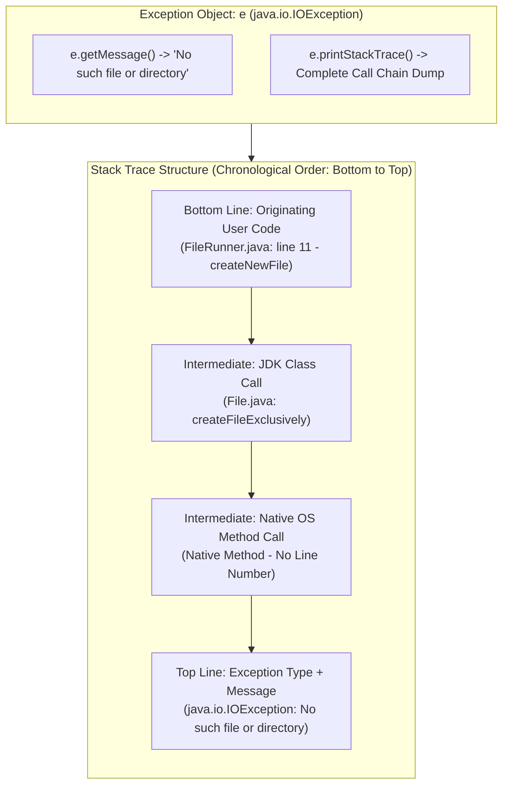

# Exception Diagnostics: The Exception Object, `getMessage()` & Stack Trace Analysis

---

## Key Takeaways

Because exceptions in Java are first-class heap objects, they encapsulate rich diagnostic data concerning runtime failures. When caught in a `catch` block, developers inspect this object to understand the root cause and execution history of the failure. The `getMessage()` method extracts an error string detailing _why_ the exception was thrown (e.g., `"No such file or directory"`). For deep diagnostics, the `printStackTrace()` method outputs the **stack trace**—a chronologically inverted call graph recording the exact classes, method names, and line numbers traversed leading up to the thrown exception.



- **Exception as an Object**: Exceptions possess methods and internal state populated by the JVM at the moment of throwing.
- **`getMessage()`**: Returns a concise textual description of the specific condition that caused the error, suitable for appending to user alerts or system logs.
- **`printStackTrace()`**: Formats and prints the call stack directly to standard error output (`System.err`), showing the execution path that led to the fault.
- **Reading Stack Traces**: The stack trace prints in reverse chronological order: the **last line** represents where the user application initiated the call chain, intermediate lines show JDK or external library calls, and the **top line** displays the exact exception type and message.
- **Native Methods**: Certain calls in the stack trace display `(Native Method)` instead of line numbers, indicating execution transitioned into platform-specific C/C++ libraries compiled outside the JVM.

---

## Main Discussion

### Idiomatic Java Code Snippets

#### 1. Utilizing `getMessage()` for User-Facing Feedback

Enriching user-facing alerts by extracting the diagnostic reason string from the caught exception object:

```java
package exception_diagnostics;

import java.io.File;
import java.io.IOException;

public class ExceptionMessageDemo {

    public static void main(String[] args) {
        File targetFile = new File("nonexistent_directory/config.properties");

        try {
            System.out.println("Attempting file creation...");
            targetFile.createNewFile();
        } catch (IOException e) {
            // e.getMessage() returns the reason string: "No such file or directory"
            System.out.println("Sorry, an error has occurred: " + e.getMessage());
        }
    }
}
```

#### 2. Deep Debugging with `printStackTrace()`

Invoking `e.printStackTrace()` to inspect class, method, and source-code line coordinates:

```java
package exception_diagnostics;

import java.io.File;
import java.io.IOException;

public class StackTraceDemo {

    public static void main(String[] args) {
        File file = new File("invalid_path/sample.txt");

        try {
            // Line 11: Call that triggers the exception sequence
            file.createNewFile();
        } catch (IOException e) {
            System.out.println("--- Diagnostics Log ---");
            System.out.println("Reason: " + e.getMessage());

            System.out.println("--- Full Stack Trace ---");
            // Outputs the entire method invocation history to standard error
            e.printStackTrace();
        }

        System.out.println("Execution survived stack trace inspection.");
    }
}
```

**Simulated Console Output**:

```text
--- Diagnostics Log ---
Reason: No such file or directory
--- Full Stack Trace ---
java.io.IOException: No such file or directory
	at java.base/java.io.File.createNewFile(File.java:1043)
	at exception_diagnostics.StackTraceDemo.main(StackTraceDemo.java:11)
Execution survived stack trace inspection.

```

### Under the Hood / JVM Mechanics

1. **Stack Snapshot Capture (fillInStackTrace):**
   When an exception instance is constructed, the constructor invokes the native method Throwable.fillInStackTrace(). The JVM reads the execution thread's call frame pointers on the call stack and records each active frame into the exception object.
2. **Frame Parsing & Metadata Association:**
   Each captured stack frame is mapped to a StackTraceElement object containing the declaring class name, method name, source file name, and the program counter's corresponding line number.
3. **Native Call Identification:**
   When a thread executes platform-specific OS calls (such as interacting directly with the filesystem via the JVM's C runtime), the bytecode program counter is absent. The JVM flags the stack frame with a negative line number (-2), rendering as (Native Method).
4. **Formatting Output (printStackTrace):**
   Invoking e.printStackTrace() traverses the StackTraceElement[] array in reverse chronological order, writing the exception class name, message string, and frame entries prefixed with \tat to standard error.

### Structural Comparisons

#### Diagnostic Methods on `Throwable`

| Method Signature    | Return Type | Output Destination     | Best Suited For                                  |
| ------------------- | ----------- | ---------------------- | ------------------------------------------------ |
| `getMessage()`      | `String`    | Returned as a value    | User-facing notifications, structured log fields |
| `printStackTrace()` | `void`      | Prints to `System.err` | Local debugging, tracing full method call chains |

#### Anatomy of a Stack Trace Frame

| Component in Frame    | Example                                          | Meaning                                               |
| --------------------- | ------------------------------------------------ | ----------------------------------------------------- |
| **Top Header**        | `java.io.IOException: No such file...`           | Exception class name followed by the detail message   |
| **Native Frame**      | `at java.io.WinNTFileSystem... (Native Method)`  | Execution within underlying OS-level C/C++ routines   |
| **JDK Library Frame** | `at java.io.File.createNewFile(File.java:1043)`  | Method within the Java standard library causing error |
| **Application Frame** | `at StackTraceDemo.main(StackTraceDemo.java:11)` | Originating user code line where execution started    |

### Common Anti-Patterns & Edge Cases

- **Discarding `getMessage()` Content**: Writing generic error strings like `"An error occurred"` while omitting `e.getMessage()` strips users and maintainers of critical context (e.g., differentiating `"Permission denied"` from `"No such file or directory"`).
- **Null Check on `getMessage()`**: Certain exceptions can be instantiated without detail messages (e.g., `new NullPointerException()`), causing `e.getMessage()`to return`null`. Always account for possible null outputs when formatting logs.
- **Confusing Top and Bottom of Stack Trace**: Assuming the top entry is where your user code began. The **bottom** of the relevant trace is the entry point within your application, while the **top** is the point of actual failure.
- **Over-Relying on `printStackTrace()` in Production**: While `printStackTrace()` is suitable for local debugging, production enterprise applications capture `e.getMessage()` or stream the stack trace into structured logging frameworks rather than raw standard error.

---

## Knowledge Check & JetBrains-Style Coding Challenges

### Theory Tips

- **Diagnostic Origin**: `getMessage()` provides the specific reason why the exception was raised.
- **Stack Trace Definition**: A stack trace is the historical sequence of method invocations that executed right up until the exception was thrown.
- **Native Method Representation**: When a method in the stack trace was written in a language outside Java (like C/C++), the trace displays `(Native Method)` instead of a line number.

### Question 1: Conceptual / Code Analysis

Consider the following stack trace output:

```text
java.io.FileNotFoundException: config/app.json (No such file or directory)
    at java.base/java.io.FileInputStream.open0(Native Method)
    at java.base/java.io.FileInputStream.open(FileInputStream.java:216)
    at java.base/java.io.FileInputStream.<init>(FileInputStream.java:157)
    at com.app.ConfigReader.loadConfig(ConfigReader.java:24)
    at com.app.Main.main(Main.java:8)
```

Based on this diagnostic report, which line in the user's project code directly initiated the failing operation, and what was the detail message?

- [ ] **A.** Line 216 in `FileInputStream.java`; detail message: `"config/app.json"`.
- [ ] **B.** Line 8 in `Main.java`; detail message: `"Native Method"`.
- [ ] **C.** Line 24 in `ConfigReader.java`; detail message: `"config/app.json (No such file or directory)"`.
- [ ] **D.** Line 157 in `FileInputStream.java`; detail message: `"FileInputStream.<init>"`.

<details>
<summary>Correct Answer</summary>

**Correct Answer**: **C**

**Technical Breakdown**:

- **C is correct**: Reading the trace from bottom to top, `com.app.Main.main(Main.java:8)` called `com.app.ConfigReader.loadConfig(ConfigReader.java:24)`. Line 24 in `ConfigReader.java` is the innermost user code frame that called the JDK's `FileInputStream` constructor. The top line displays the exception class and the detail message returned by `getMessage()`: `"config/app.json (No such file or directory)"`.
- **A & D are incorrect**: `FileInputStream.java` is part of the JDK standard library (`java.base`), not user code.
- **B is incorrect**: `Main.java:8` started the flow, but it delegated to line 24 of `ConfigReader.java`; `"Native Method"` indicates unmapped platform code, not the detail message.

</details>

---

### Question 2: Mini Coding Problem / Implementation Challenge

**Task**: Implement an exception diagnostics formatter named `DiagnosticReporter` inside package `exception_diagnostics`:

1. Method `public static String formatUserAlert(Exception e, String contextName)`:
   - Accepts an `Exception` and a context description `contextName`.
   - If `e.getMessage()` is non-null, returns: `"[contextName] failed: " + e.getMessage()`.
   - If `e.getMessage()` is `null`, returns: `"[contextName] failed: Reason unspecified"`.
2. Method `public static void executeWithDiagnosticTrace(Runnable task)`:
   - Runs the provided `Runnable` task inside a `try` block.
   - Catches `Exception e`.
   - Prints the message returned by `e.getMessage()` via `System.out.println`.
   - Calls `e.printStackTrace()` on the caught exception.

**Test Assertions**:

- `formatUserAlert(new IOException("Disk full"), "File save")` $\rightarrow$ Returns: `"File save failed: Disk full"`
- `formatUserAlert(new NullPointerException(), "Parsing")` $\rightarrow$ Returns: `"Parsing failed: Reason unspecified"`
- Passing a failing task `() -> { throw new RuntimeException("Test crash"); }` to `executeWithDiagnosticTrace`:
  - Prints `"Test crash"` and outputs the trace to `System.err` without terminating the host test runner.

<details>
<summary>Solution</summary>

```java
package exception_diagnostics;

public class DiagnosticReporter {

    public static String formatUserAlert(Exception e, String contextName) {
        String detail = e.getMessage();

        // Guard against exceptions instantiated without detail messages
        if (detail == null || detail.isEmpty()) {
            return contextName + " failed: Reason unspecified";
        }

        return contextName + " failed: " + detail;
    }

    public static void executeWithDiagnosticTrace(Runnable task) {
        try {
            task.run();
        } catch (Exception e) {
            // Print the concise reason message
            System.out.println(e.getMessage());

            // Dump complete chronological call trace for debugging
            e.printStackTrace();
        }
    }
}
```

**Complexity Analysis**:

- **Time Complexity**:
  - `formatUserAlert`: $\mathcal{O}(L)$ string concatenation time where $L$ is the character length of the message.
  - `executeWithDiagnosticTrace`: $\mathcal{O}(D)$ where $D$ is the call stack depth traversed by `printStackTrace()`.
- **Space Complexity**: $\mathcal{O}(1)$ auxiliary memory; operates on existing stack frames and error references.

</details>

---
