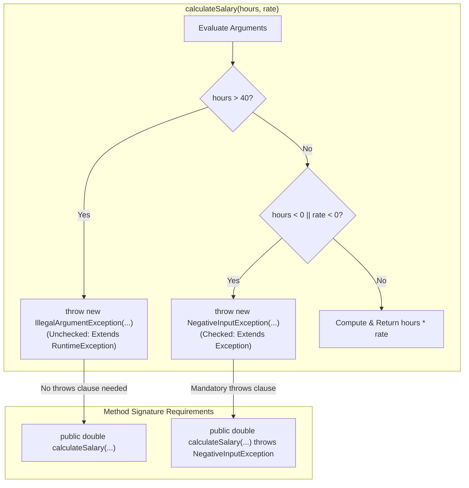

# Programmatic Error Generation: The `throw` Keyword, `throws` Signatures & Custom Checked Exceptions

---

## Key Takeaways

When an application encounters state or input that violates business domain rules—such as disallowing overtime beyond 40 hours or rejecting negative financial amounts—the Java runtime cannot identify the violation automatically. Developers must flag and raise these domain errors explicitly using the `throw` keyword followed by an instantiated exception object. Java distinguishes between throwing an existing unchecked exception (such as `IllegalArgumentException`), which requires no method signature declaration, and throwing a checked exception (such as a custom class extending `Exception`), which strictly mandates declaring the `throws` clause in the method header.



- **The `throw` Statement**: The programmatic command (`throw new ExceptionType(...)`) used to actively interrupt control flow and raise an exception instance.
- **Standard Unchecked Violations**: Standard exceptions like `IllegalArgumentException` inherit from `RuntimeException`. They signal illegal or inappropriate arguments and do not require signature declarations.
- **Custom Exception Construction**: Creating a custom checked exception requires extending `java.lang.Exception` and providing standard constructors (a no-argument default constructor and an overloaded constructor accepting a `String message` passed to `super(message)`).
- **The `throws` Signature Clause**: Placed after the parameter list in a method header to declare to the compiler and calling clients that the method may propagate specified checked exceptions.

---

## Main Discussion

### Idiomatic Java Code Snippets

#### 1. Defining a Custom Checked Exception (`NegativeInputException`)

Extending `Exception` establishes a custom checked exception with delegated constructor chaining:

```java
package exception_authoring;

// Custom checked exception: extends Exception directly
public class NegativeInputException extends Exception {

    // Default no-argument constructor providing a standard domain error message
    public NegativeInputException() {
        this("Input must be greater than or equal to zero.");
    }

    // Overloaded constructor allowing caller-specified diagnostic messages
    public NegativeInputException(String message) {
        // Chains message directly to Throwable.getMessage() via super
        super(message);
    }
}
```

#### 2. Throwing Unchecked and Checked Exceptions from Business Logic

Enforcing validation boundaries by throwing `IllegalArgumentException` and declaring `throws NegativeInputException`:

```java
package exception_authoring;

public class PayrollCalculator {

    // Method declares 'throws NegativeInputException' because it is a checked exception.
    // 'IllegalArgumentException' is unchecked, so it is omitted from the signature.
    public double calculateSalary(double hours, double payRate) throws NegativeInputException {

        // Rule 1: Custom business check throwing checked exception
        if (hours < 0 || payRate < 0) {
            throw new NegativeInputException();
        }

        // Rule 2: Application domain rule throwing standard JDK unchecked exception
        if (hours > 40) {
            throw new IllegalArgumentException("Hours must be less than or equal to 40.");
        }

        return hours * payRate;
    }
}
```

#### 3. Client Consumption and Exception Handling

Caller code must fulfill compiler verification for the declared checked exception:

```java
package exception_authoring;

public class PayrollRunner {

    public static void main(String[] args) {
        PayrollCalculator calculator = new PayrollCalculator();

        // 1. Triggering the custom checked exception
        try {
            calculator.calculateSalary(-5, 25.0);
        } catch (NegativeInputException e) {
            System.out.println("Handled checked error: " + e.getMessage());
        }

        // 2. Triggering the built-in unchecked exception
        try {
            calculator.calculateSalary(45, 25.0);
        } catch (IllegalArgumentException e) {
            System.out.println("Handled unchecked error: " + e.getMessage());
        }

        // 3. Valid business path
        try {
            double netPay = calculator.calculateSalary(35, 20.0);
            System.out.println("Valid Net Pay: $" + netPay); // Prints: $700.0
        } catch (NegativeInputException e) {
            System.err.println("Unexpected failure: " + e.getMessage());
        }
    }
}
```

### Under the Hood / JVM Mechanics

1. **Instantiation and Message Encapsulation:**
   When new NegativeInputException('...') executes, the constructor invokes super(message), populating the private detailMessage field inside java.lang.Throwable and capturing the current execution call stack frames.
2. **The athrow Bytecode Instruction:**
   The keyword throw is compiled into the single JVM opcode athrow. The JVM pops the exception reference from the operand stack and immediately aborts the current method frame's sequential program counter.
3. **Method Signature Class Attribute (Exceptions):**
   Because NegativeInputException is checked, the throws clause causes javac to emit an Exceptions attribute inside the compiled method descriptor in the .class file, signaling to calling bytecode that callers must handle or re-declare it.
4. **Runtime Stack Unwinding:**
   If the immediate method frame contains no matching entry in its Exception table, the JVM pops the frame, restores the caller's frame, and re-evaluates the caller's exception table. This repeats until a matching handler is found or the main thread terminates.

### Structural Comparisons

#### `throw` vs. `throws`

| Dimension           | `throw` (Keyword)                                     | `throws` (Clause)                                              |
| ------------------- | ----------------------------------------------------- | -------------------------------------------------------------- |
| **Location**        | Inside method bodies / execution blocks               | In the method declaration header                               |
| **Syntax Target**   | Followed by an **instance** (`throw new Exception()`) | Followed by one or more **class names** (`throws IOException`) |
| **Action**          | Actively triggers and raises an exception event       | Informs the compiler and callers that an exception may escape  |
| **Usage Frequency** | Once per error branch                                 | Once in the method signature (comma-delimited for multiples)   |

#### Custom Checked vs. Custom Unchecked Exceptions

| Feature                  | Custom Checked Exception                          | Custom Unchecked Exception                          |
| ------------------------ | ------------------------------------------------- | --------------------------------------------------- |
| **Superclass**           | Extends `java.lang.Exception`                     | Extends `java.lang.RuntimeException`                |
| **Compiler Enforcement** | `javac` verifies all callers handle or re-declare | Ignored during compilation                          |
| **`throws` Declaration** | **Mandatory** on throwing methods                 | Optional / Omitted                                  |
| **Design Intent**        | Expected recoverable business conditions          | Severe logic faults, programmatic invalid arguments |

### Common Anti-Patterns & Edge Cases

- **Confusing `throw` with `throws`**: Using `throw` in a method header (e.g.,`public void run() throw Exception`) or using `throws` inside an execution block (`throws new Exception()`) causes immediate syntax compilation failures.
- **Throwing Type Rather than Instance**: Writing `throw IllegalArgumentException;` without invoking the constructor via `new` fails compilation: `type not allowed here`.
- **Omitting `throws` on Checked Exceptions**: Throwing an instance of a class that extends `Exception` without either catching it locally or writing `throws [CustomException]` in the method header triggers: `unreported exception; must be caught or declared to be thrown`.
- **Swallowing Custom Error Messages**: Writing custom exceptions without passing the `message` parameter to `super(message)` causes `e.getMessage()` to return `null`, stripping callers of diagnostic context.

---

## Knowledge Check & JetBrains-Style Coding Challenges

### Theory Tips

- **Syntax Distinctions**:
  - `throw` is an action verb used inside method bodies to raise a specific exception object instance.
  - `throws` is a declarative keyword used in method headers to declare class types.
- **Inheritance Rules for Custom Exceptions**:
  - Extend `Exception` to create a **checked exception**.
  - Extend `RuntimeException` to create an **unchecked exception**.
- **Unchecked Exemption**: Methods throwing `IllegalArgumentException` (or any `RuntimeException`) are not required to specify `throws` in their method header.

### Question 1: Conceptual / Code Analysis

Consider the following proposed class structure:

```java
public class InvalidScoreException extends Exception {
    public InvalidScoreException(String msg) {
        super(msg);
    }
}

public class ExamService {
    public void submitScore(int score) {
        if (score < 0 || score > 100) {
            throw new InvalidScoreException("Score must be between 0 and 100"); // Line 9
        }
        System.out.println("Score registered: " + score);
    }
}
```

What occurs when attempting to compile `ExamService.java`?

- [ ] **A.** Compilation succeeds; `InvalidScoreException` is raised if `score` is out of bounds.
- [ ] **B.** A compilation error occurs at Line 9 because `InvalidScoreException` is a checked exception and `submitScore` does not declare `throws InvalidScoreException`.
- [ ] **C.** A compilation error occurs because `InvalidScoreException` lacks a parameterless default constructor.
- [ ] **D.** Compilation succeeds, but throws `ClassCastException` at runtime when line 9 executes.

<details>
<summary>Correct Answer</summary>

**Correct Answer**: **B**

**Technical Breakdown**:

- **B is correct**: `InvalidScoreException` directly extends `java.lang.Exception`, making it a **checked exception**. The compiler requires any method that explicitly instantiates and throws a checked exception to either handle it internally via a `try-catch` block or declare it in its signature using `throws InvalidScoreException`. Because `submitScore(int score)` does neither, `javac` halts with: `unreported exception InvalidScoreException; must be caught or declared to be thrown`.
- **A is incorrect**: The code fails at compile time before any bytecode can run.
- **C is incorrect**: Java does not require custom exceptions to have no-argument constructors; having only an overloaded `String` constructor is fully legal syntax.
- **D is incorrect**: There are no illegal object casts present in the snippet.

</details>

---

### Question 2: Mini Coding Problem / Implementation Challenge

**Task**: Model an account withdrawal verification pipeline inside package `exception_authoring`:

1. Custom Checked Exception `InsufficientFundsException`:
   - Extends `java.lang.Exception`.
   - Constructor `public InsufficientFundsException(double deficit)`: calls `super("Shortage of: $" + deficit)`.
2. Class `BankAccount`:
   - Private field `balance` (`double`).
   - Constructor `public BankAccount(double initialBalance)`.
   - Public getter `public double getBalance()`.
   - Method `public void withdraw(double amount) throws InsufficientFundsException`:
   - If `amount <= 0`, throws an unchecked `IllegalArgumentException` with message `"Withdrawal amount must be positive"`.
   - If `amount > balance`, throws checked `InsufficientFundsException` passing `(amount - balance)` to its constructor.
   - Otherwise, subtracts `amount` from `balance`.

**Test Assertions**:

- `BankAccount acc = new BankAccount(100.0);`
- `acc.withdraw(40.0);` $\rightarrow$ `acc.getBalance()` becomes `60.0`
- `acc.withdraw(-10.0);` $\rightarrow$ Throws unchecked `IllegalArgumentException` ("Withdrawal amount must be positive")
- `acc.withdraw(80.0);` $\rightarrow$ Throws checked `InsufficientFundsException` with `getMessage()` returning `"Shortage of: $20.0"`

<details>
<summary>Solution</summary>

```java
package exception_authoring;

// Custom checked domain exception
public class InsufficientFundsException extends Exception {

    public InsufficientFundsException(double deficit) {
        super("Shortage of: $" + deficit);
    }
}
```

```java
package exception_authoring;

public class BankAccount {

    private double balance;

    public BankAccount(double initialBalance) {
        this.balance = initialBalance;
    }

    public double getBalance() {
        return balance;
    }

    // Method declares throws for the checked InsufficientFundsException
    public void withdraw(double amount) throws InsufficientFundsException {
        // Standard unchecked exception for invalid input parameters
        if (amount <= 0) {
            throw new IllegalArgumentException("Withdrawal amount must be positive");
        }

        // Custom checked exception for business constraint violations
        if (amount > balance) {
            throw new InsufficientFundsException(amount - balance);
        }

        this.balance -= amount;
    }
}
```

**Complexity Analysis**:

- **Time Complexity**: $\mathcal{O}(1)$ for object instantiation, balance retrieval, and `withdraw` verification checks, as validation conditions and field updates execute in constant time.
- **Space Complexity**: $\mathcal{O}(1)$ auxiliary space beyond the `BankAccount` and thrown exception instances allocated on the heap.

</details>

---
