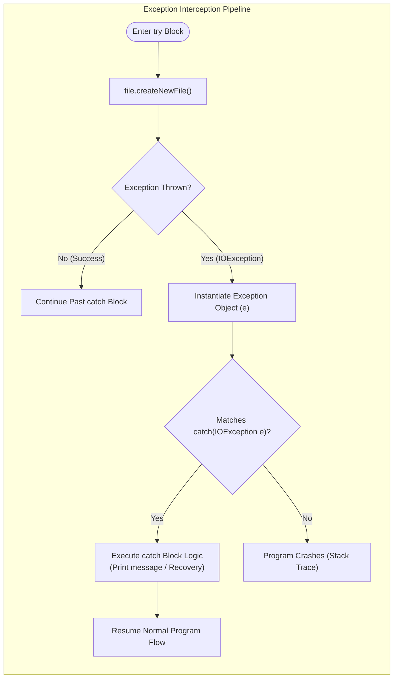

# Exception Handling: Runtime Disruptions, Checked Exceptions & Try-Catch Mechanics

---

## Key Takeaways

An exception in Java is an event that occurs during program execution that disrupts the normal instruction flow. Unhandled exceptions propagate up the call stack, abruptly terminating the thread and crashing the application (e.g., encountering an `ArrayIndexOutOfBoundsException` on illegal index access). Certain operations—such as file system interactions via `File.createNewFile()`—declare checked exceptions like `IOException`, which the compiler strictly enforces must be handled. Wrapping hazardous code inside a `try` block and pairing it with a targeted `catch` block intercepts the thrown exception object, allowing the application to recover gracefully, notify the user, or run corrective logic rather than aborting.



- **Exception Definition**: A runtime disruption triggered by an error that aborts normal instruction execution if left unhandled.
- **Checked Exception Enforcement**: Methods declaring checked exceptions (like `IOException` in `createNewFile()`) cause compile-time errors if not handled or propagated.
- **The `try` Block**: Encloses potentially hazardous statements whose execution might throw an exception.
- **The `catch` Block**: Declares the specific exception type to intercept (`IOException e`) and supplies the alternative recovery code executed only if that exception occurs.
- **Graceful Degradation**: Catching an exception prevents catastrophic application crashes, keeping the JVM alive to execute subsequent instructions or fallback logic.

---

## Main Discussion

### Idiomatic Java Code Snippets

#### 1. Unchecked Exception: Array Index Out of Bounds

Demonstrating how unhandled runtime exceptions interrupt execution flow without compile-time warnings:

```java
package exception_handling;

public class UncheckedArrayDemo {

    public static void main(String[] args) {
        int[] numbers = {10, 20, 30};

        System.out.println("Beginning array iteration...");

        // Accessing index 3 when valid indices are only 0, 1, 2
        // Compiles cleanly, but crashes at runtime if unguarded
        try {
            for (int i = 0; i <= 3; i++) {
                System.out.println("Index " + i + ": " + numbers[i]);
            }
        } catch (ArrayIndexOutOfBoundsException e) {
            System.out.println("Handled out-of-bounds error: Attempted to access index beyond array bounds.");
        }

        System.out.println("Program execution continues normally.");
    }
}
```

#### 2. Checked Exception & File Creation Handling (`File.createNewFile()`)

Using a `try-catch` block to handle an `IOException` when attempting to create a file in a non-existent directory:

```java
package exception_handling;

import java.io.File;
import java.io.IOException;

public class FileCreationDemo {

    public static void main(String[] args) {
        // Path pointing to a non-existent parent directory
        File nonExistentFile = new File("resources/nonexistent.txt");

        // createNewFile() throws IOException if the parent path does not exist
        // The try block encloses the hazardous call
        try {
            System.out.println("Attempting to create file...");
            boolean created = nonExistentFile.createNewFile();
            System.out.println("File created successfully: " + created);
        } catch (IOException e) {
            // Intercepts the IOException and prevents program termination
            System.out.println("Sorry, an error has occurred.");
            System.out.println("Exception message: " + e.getMessage());
        }

        System.out.println("Application recovered and is still operational.");
    }
}
```

### Under the Hood / JVM Mechanics

1. **Exception Table Generation in Bytecode:**
   When javac compiles a try-catch block, it generates an internal Exception table in the class bytecode. The table records the starting bytecode offset, ending offset, the offset of the catch handler routine, and the target exception class type symbol (e.g., class java/io/IOException).
2. **Throwing the Exception Object:**
   When createNewFile() fails (e.g., due to an OS-level invalid path), the runtime instantiates an IOException object on the heap, capturing the execution thread's current stack trace frame snapshot.
3. **Exception Handler Matching:**
   The JVM pauses regular instruction execution and scans the method's Exception table for a range covering the failed instruction. It checks if the thrown exception instance is assignable to the type defined in the catch signature.
4. **Execution Transfer:**
   Upon locating a matching type, the JVM pushes the exception object onto the operand stack, binds it to the local variable e, and transfers the Program Counter (PC) directly to the first instruction of the catch block.

### Structural Comparisons

#### Checked vs. Unchecked Exceptions (Transcripts Focus)

| Characteristic           | Unchecked Exception (`ArrayIndexOutOfBoundsException`) | Checked Exception (`IOException`)                          |
| ------------------------ | ------------------------------------------------------ | ---------------------------------------------------------- |
| **Origin / Context**     | Logical errors (e.g., accessing invalid array index)   | External failures (e.g., missing directory or I/O failure) |
| **Compiler Enforcement** | **Not enforced** at compile time; compiles cleanly     | **Strictly enforced**; compiler flags unhandled errors     |
| **Detection Time**       | Runtime failure upon executing the invalid statement   | Compile time (code will not build without handling)        |
| **Handling Mechanism**   | Optional `try-catch` (preventative logic preferred)    | Mandatory `try-catch` block or declaration                 |

#### Control Flow: Unguarded Crash vs. Guarded Recovery

| Step                     | Unguarded Code (No `try-catch`)           | Guarded Code (`try-catch`)                   |
| ------------------------ | ----------------------------------------- | -------------------------------------------- |
| **When Error Occurs**    | Throws exception to JVM uncaught handler  | Throws exception into matching `catch` block |
| **Console Output**       | Abrupt thread crash with stack trace dump | Custom graceful user/log message             |
| **Post-Error Execution** | Entire application halts immediately      | Execution resumes after the `catch` block    |

### Common Anti-Patterns & Edge Cases

- **Ignoring Compile-Time Error for Checked Exceptions**: Invoking `file.createNewFile()` without enclosing it in a `try-catch` block results in an immediate compilation error: `unreported exception java.io.IOException; must be caught or declared to be thrown`.
- **Mismatched Exception Type in `catch`**: If a `try`block throws an`IOException`, but the `catch`block specifies`ArrayIndexOutOfBoundsException`, the catch block will not execute; the unhandled exception causes the application to crash.
- **Empty Catch Blocks (Swallowing Exceptions)**: Writing `catch (IOException e) {}` without logging or notifying leaves the application unaware that an operation failed, making debugging difficult.
- **Assuming `try` Code Executes After an Exception**: Once an instruction inside a `try` block throws an exception, all subsequent statements inside that `try` block are immediately skipped, jumping straight to the `catch` block.

---

## Knowledge Check & JetBrains-Style Coding Challenges

### Theory Tips

- **Catch Parameter Convention**: By convention, developers name the caught exception parameter variable `e` inside the catch block parentheses: `catch (IOException e)`.
- **Execution Transfer**: If a statement inside a `try` block throws an exception, the remaining lines inside that `try` block do not execute; control shifts directly to the corresponding `catch` block.
- **Checked Nature of File I/O**: `createNewFile()` in `java.io.File` declaredly throws `IOException`, which mandates handling via a `try-catch` construct.

### Question 1: Conceptual / Code Analysis

Consider the following program:

```java
import java.io.File;
import java.io.IOException;

public class PathTester {
    public static void main(String[] args) {
        File file = new File("invalid/dir/test.txt");
        System.out.print("A ");

        try {
            System.out.print("B ");
            file.createNewFile();
            System.out.print("C ");
        } catch (IOException e) {
            System.out.print("D ");
        }

        System.out.print("E");
    }
}
```

Assuming the directory `"invalid/dir"` does not exist, what is the exact output printed to the console?

- [ ] **A** `A B C D E`
- [ ] **B** `A B D E`
- [ ] **C** `A B C E`
- [ ] **D** A compilation error occurs because `File` cannot take invalid paths.

<details>
<summary>Correct Answer</summary>

**Correct Answer**: **B**

**Technical Breakdown**:

- **B is correct**:

1. The code begins outside the `try` block, printing `"A "`.
2. Inside the `try` block, `"B "` is printed.
3. `file.createNewFile()` attempts to create the file. Because the parent directory does not exist, it throws an `IOException`.
4. Execution inside the `try` block immediately halts; statement `"C "` is skipped entirely.
5. The thrown `IOException` matches `catch (IOException e)`. The catch block executes, printing `"D "`.
6. Normal execution resumes after the catch block, printing `"E"`. The resulting output is `"A B D E"`.

- **A is incorrect**: Statement `"C "` cannot execute because the exception was thrown on the preceding line.
- **C is incorrect**: Statement `"D "` must execute because the exception was thrown and caught.
- **D is incorrect**: `new File(...)` does not access the disk or throw exceptions; the failure happens inside `createNewFile()`.

</details>

---

### Question 2: Mini Coding Problem / Implementation Challenge

**Task**: Implement a resilient file initialization helper named `FileInitializer` inside package `exception_handling`:

1. Method `public static String safeCreateFile(String pathString)`:
   - Instantiates a `File` object using the provided `pathString`.
   - Encloses the call to `file.createNewFile()` inside a `try-catch` block catching `IOException`.
   - If the file is created successfully or already exists without errors, returns `"SUCCESS"`.
   - If an `IOException` is thrown during creation, catches it and returns `"ERROR: " + e.getMessage()`.
2. Method `public static int safeReadArray(int[] numbers, int index, int fallback)`:
   - Encloses an array access `numbers[index]` in a `try-catch` block catching `ArrayIndexOutOfBoundsException`.
   - Returns the value at `numbers[index]` on success.
   - If an `ArrayIndexOutOfBoundsException` occurs, catches it and returns `fallback`.

**Test Assertions**:

- `safeReadArray(new int[]{5, 10, 15}, 1, -1)` $\rightarrow$ Returns: `10`
- `safeReadArray(new int[]{5, 10, 15}, 5, -1)` $\rightarrow$ Returns: `-1` (Handled out-of-bounds)
- Calling `safeCreateFile("resources/invalid_path/file.txt")` when directory does not exist:
  - Returns a string starting with `"ERROR: "` without crashing the JVM.

<details>
<summary>Solution</summary>

```java
package exception_handling;

import java.io.File;
import java.io.IOException;

public class FileInitializer {

    public static String safeCreateFile(String pathString) {
        File file = new File(pathString);

        try {
            // Hazardous call that may throw IOException
            file.createNewFile();
            return "SUCCESS";
        } catch (IOException e) {
            // Graceful handling preventing program termination
            return "ERROR: " + e.getMessage();
        }
    }

    public static int safeReadArray(int[] numbers, int index, int fallback) {
        try {
            // Access that may throw ArrayIndexOutOfBoundsException
            return numbers[index];
        } catch (ArrayIndexOutOfBoundsException e) {
            // Return fallback default value upon error
            return fallback;
        }
    }
}

```

**Complexity Analysis**:

- **Time Complexity**:
  - `safeReadArray`: $\mathcal{O}(1)$ constant-time memory index lookup.
  - `safeCreateFile`: $\mathcal{O}(1)$ operating system I/O call duration.
- **Space Complexity**: $\mathcal{O}(1)$ auxiliary space beyond the instantiated `File` reference and error message string.

</details>
