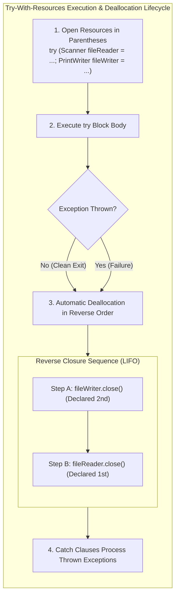

# Automatic Resource Management: Try-With-Resources & The `AutoCloseable` Contract

---

## Key Takeaways

When input or output streams, scanners, or writers are opened, runtime exceptions can interrupt program execution, leaving operating system resources hanging and unclosed unless explicit cleanup precautions are implemented. While placing cleanup routines in a `finally` block resolves this, modern Java provides the **try-with-resources** statement as a superior, idiomatic approach. By declaring and initializing resources inside parentheses directly following the `try` keyword, the Java Virtual Machine automatically guarantees that those resources are closed at the end of the block—even when exceptions occur. To participate in this automated lifecycle, resource classes must implement either the `AutoCloseable` or `Closeable` interface.



- **Elimination of Explicit `finally`**: Resources declared within the try specification header do not require manual null-checking or `.close()`invocations in a`finally` block; the JVM automatically generates cleanup instructions.
- **The `AutoCloseable` Contract**: Try-with-resources operates exclusively on types that implement `java.lang.AutoCloseable` or `java.io.Closeable` (both `Scanner` and `PrintWriter` conform to this contract).
- **Multiple Resource Declarations**: Multiple resources can be instantiated within the try header, delimited by semicolons (`;`).
- **Reverse Closure Order (LIFO)**: Resources are closed in the exact **reverse order** of their declaration (the second resource closes first, followed by the first resource).
- **Role of `finally`**: Try-with-resources replaces `finally` blocks used solely for resource cleanup, while `finally` remains available for general, non-resource finalization logic.

---

## Main Discussion

### Idiomatic Java Code Snippets

#### 1. Dual Resource Management (`Scanner` & `PrintWriter`)

Opening an input source to read data while simultaneously writing to an output file within a single try-with-resources construct:

```java
package resource_management;

import java.io.File;
import java.io.FileNotFoundException;
import java.io.PrintWriter;
import java.util.Scanner;

public class TryWithResourcesDemo {

    public static void main(String[] args) {
        File inputFile = new File("numbers.txt");
        File outputFile = new File("output.txt");

        // Resources declared inside try parentheses, separated by a semicolon (;)
        // Both Scanner and PrintWriter implement AutoCloseable / Closeable
        try (
            Scanner fileReader = new Scanner(inputFile);
            PrintWriter fileWriter = new PrintWriter(outputFile)
        ) {
            System.out.println("Processing file stream...");

            while (fileReader.hasNext()) {
                double value = fileReader.nextDouble();
                fileWriter.println("Processed Value: " + value);
            }

            System.out.println("File processing completed successfully.");

        } catch (FileNotFoundException e) {
            // Catches missing input file or invalid output destination
            System.out.println("I/O error occurred: " + e.getMessage());
        }

        // At this point, both fileWriter and fileReader are guaranteed to be closed:
        // 1. fileWriter closed first
        // 2. fileReader closed second
    }
}
```

#### 2. Closure Order Verification

Demonstrating how reverse closure functions during normal execution or when handling mid-stream exceptions:

```java
package resource_management;

// Custom AutoCloseable components to track closing lifecycle
class MonitoredResource implements AutoCloseable {
    private final String name;

    public MonitoredResource(String name) {
        this.name = name;
        System.out.println("Opened: " + name);
    }

    @Override
    public void close() {
        System.out.println("Closed: " + name);
    }
}

public class ReverseClosureOrderDemo {

    public static void main(String[] args) {
        // First declared: Resource A; Second declared: Resource B
        try (
            MonitoredResource resA = new MonitoredResource("Resource A");
            MonitoredResource resB = new MonitoredResource("Resource B")
        ) {
            System.out.println("Executing business logic inside try block...");
        }

        // Output guarantees LIFO (Last-In, First-Out) closing order
    }
}
```

**Console Output**:

```text
Opened: Resource A
Opened: Resource B
Executing business logic inside try block...
Closed: Resource B
Closed: Resource A
```

### Under the Hood / JVM Mechanics

1. **AutoCloseable Type Verification:**
   During compilation, javac validates that every variable declared within the try (...) header implements either java.lang.AutoCloseable or java.io.Closeable. If an uncompliant type is declared, compilation halts immediately with: incompatible types: try-with-resources not applicable to [Type].
2. **Synthetic Bytecode Scaffolding:**
   The compiler desugars the try-with-resources block into an extensive synthetic try-finally structure in bytecode, inserting null-checks and explicit calls to close() on each declared resource.
3. **Reverse Destruction Routing (LIFO):**
   The generated bytecode generates exit handlers that invoke close() starting from the last declared variable and moving backwards to the first, ensuring that dependent wrapper streams (like writers) flush and finalize before underlying input streams shut down.
4. **Exception Suppression Mechanics:**
   If the business block throws an exception and the subsequent implicit close() invocation also throws an exception, the JVM suppresses the secondary exception via Throwable.addSuppressed(), preserving the primary business exception as the thrown root cause.

### Structural Comparisons

#### Manual `finally` Cleanup vs. `try-with-resources`

| Feature                   | Manual `try-catch-finally`                      | `try-with-resources`                               |
| ------------------------- | ----------------------------------------------- | -------------------------------------------------- |
| **Resource Declaration**  | Declared before `try` as `null`                 | Declared and initialized inside `try (...)` header |
| **Close Invocations**     | Manual boilerplate calls (`fileReader.close()`) | **Automated** by compiler-generated bytecode       |
| **Null-Checking Guard**   | Required (`if (res != null) res.close()`)       | Automatically handled internally                   |
| **Multiple Resources**    | Nested `try-finally` blocks to avoid leaks      | Semicolon-delimited list in header                 |
| **Closing Sequence**      | Prone to human sequencing error                 | Strictly guaranteed **reverse order** (LIFO)       |
| **Interface Requirement** | None (calls any custom cleanup method)          | Must implement `AutoCloseable` or `Closeable`      |

### Common Anti-Patterns & Edge Cases

- **Declaring Non-AutoCloseable Types**: Attempting to declare objects like `String` or arbitrary classes inside the try header:

```java
try (String s = "data") { } // Compile error: String cannot be converted to AutoCloseable
```

- **Resource Reassignment**: Variables declared in the try-with-resources header are implicitly `final`. Reassigning them inside the try block (e.g., `fileReader = new Scanner(...)`) causes a compile-time failure.
- **Scope Leakage**: Variables declared inside `try (...)` are scoped strictly to that `try` block. Attempting to access `fileReader` inside `catch`, `finally`, or outside the construct triggers a `cannot find symbol` compiler error.
- **Relying on Forward Closing Order**: Assuming resources close in the order they were opened. Writers and downstream consumers must be declared after underlying sources so they close and flush _first_.

---

## Knowledge Check & JetBrains-Style Coding Challenges

### Theory Tips

- **Parentheses Requirement**: Try-with-resources syntax places resource declarations inside parentheses immediately following the `try` keyword: `try (Resource r = new Resource()) { ... }`.
- **The Required Interfaces**: Classes managed by try-with-resources must implement `java.lang.AutoCloseable` or `java.io.Closeable`.
- **Closing Sequence Rule**: When managing multiple resources separated by semicolons, Java always closes them in the **reverse order** of their declaration.

### Question 1: Conceptual / Code Analysis

Consider the following program utilizing custom `AutoCloseable` resources:

```java
class Door implements AutoCloseable {
    private final String id;
    Door(String id) { this.id = id; }
    public void close() { System.out.print(id + " "); }
}

public class ResourceOrderingQuiz {
    public static void main(String[] args) {
        try (
            Door front = new Door("FRONT");
            Door back = new Door("BACK");
            Door side = new Door("SIDE")
        ) {
            System.out.print("OPEN ");
        }
    }
}
```

What is the exact output printed to the console?

- [ ] **A.** `OPEN FRONT BACK SIDE `
- [ ] **B.** `OPEN SIDE BACK FRONT `
- [ ] **C.** `FRONT BACK SIDE OPEN `
- [ ] **D.** A compilation error occurs because `Door` must implement `Closeable`, not `AutoCloseable`.

<details>
<summary>Correct Answer</summary>

**Correct Answer**: **B**

**Technical Breakdown**:

- **B is correct**:

1. The resources are allocated in order: `front`, then `back`, then `side`.
2. The code enters the body of the `try` block and prints `"OPEN "`.
3. Upon reaching the end of the `try` block, automatic cleanup triggers in reverse order of declaration (LIFO):
   - `side.close()` runs first, printing `"SIDE "`.
   - `back.close()` runs second, printing `"BACK "`.
   - `front.close()` runs last, printing `"FRONT "`.
4. The complete console output is `"OPEN SIDE BACK FRONT "`.
   - **A is incorrect**: It assumes forward closing order rather than reverse order.
   - **C is incorrect**: Resource cleanup runs when exiting the block, not prior to executing the body.
   - **D is incorrect**: `AutoCloseable` is the base standard interface introduced specifically for try-with-resources.

</details>

---

### Question 2: Mini Coding Problem / Implementation Challenge

**Task**: Implement an automated file-mirroring utility named `StreamCopier` inside package `resource_management`:

1. Method `public static int copyAndCountLines(File source, File destination)`:
   - Uses a try-with-resources statement managing two resources simultaneously:
     - A `Scanner` initialized with `source`.
     - A `PrintWriter` initialized with `destination`.
   - Iterates through the source file line by line using `scanner.nextLine()`.
   - Writes each line to the destination using `writer.println(...)`.
   - Tracks and returns the total number of lines copied.
   - Catches `FileNotFoundException`: prints `"FILE_ACCESS_ERROR"` to `System.err` and returns `-1`.
   - Relies entirely on try-with-resources for stream closure (no manual calls to `.close()` or `finally` blocks).

**Test Assertions**:

- Reading a file with 3 lines of text and writing to destination:
  - Destination contains the mirrored 3 lines.
  - Method returns: `3`.
  - Both file handles are confirmed released back to the OS.
- Providing a non-existent source file:
- Catches `FileNotFoundException`, prints `"FILE_ACCESS_ERROR"` to `System.err`, and returns: `-1`.

<details>
<summary>Solution</summary>

```java
package resource_management;

import java.io.File;
import java.io.FileNotFoundException;
import java.io.PrintWriter;
import java.util.Scanner;

public class StreamCopier {

    public static int copyAndCountLines(File source, File destination) {
        int lineCount = 0;

        // Try-with-resources managing dual streams separated by a semicolon
        try (
            Scanner scanner = new Scanner(source);
            PrintWriter writer = new PrintWriter(destination)
        ) {
            while (scanner.hasNextLine()) {
                String line = scanner.nextLine();
                writer.println(line);
                lineCount++;
            }

            return lineCount;

        } catch (FileNotFoundException e) {
            System.err.println("FILE_ACCESS_ERROR");
            return -1;
        }
        // scanner and writer are automatically closed in reverse order (writer, then scanner)
    }
}
```

**Complexity Analysis**:

- **Time Complexity**: $\mathcal{O}(L)$ where $L$ is the total number of lines in the source file. Reading and writing each line runs in linear time.
- **Space Complexity**: $\mathcal{O}(M)$ auxiliary buffer memory where $M$ is the character length of the longest individual line processed by `scanner.nextLine()`.

</details>

---
