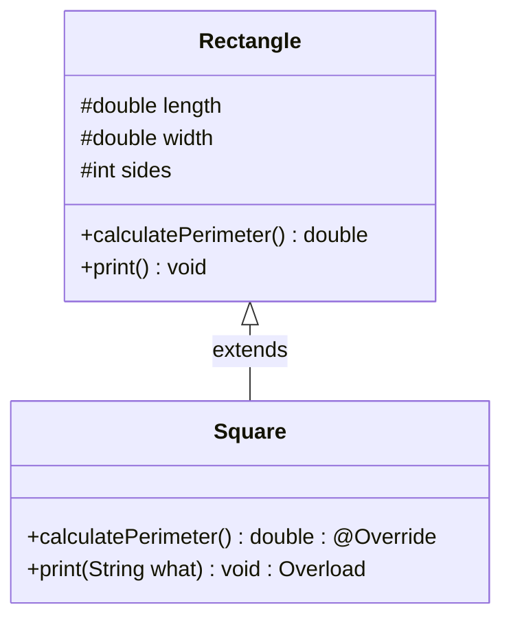

# Polymorphism & Inheritance: Method Overriding, Annotations & Inherited Overloading

---

## Key Takeaways

Method overriding occurs when a subclass redefines an inherited superclass method using the exact same method signature, replacing the inherited implementation with specialized behavior. In contrast, overloading an inherited method involves defining a method in the subclass with the same identifier but a distinct parameter list, introducing an additional method variant rather than replacing the parent version. The `@Override` annotation informs the compiler of an explicit intent to override, catching accidental signature discrepancies at compile time.



- **Method Overriding Rule**: Subclasses override an inherited method by declaring the exact same method signature (name and parameter list) and updating the method body.
- **Inherited Method Overloading**: Subclasses can overload inherited methods by retaining the method name while changing the parameter list; both the inherited and overloaded versions remain callable on the subclass.
- **Role of `@Override`**: The `@Override` annotation is an optional but strongly recommended compiler directive that verifies the method signature precisely matches an accessible method in the superclass.
- **Accessibility of Inherited State**: Methods overriding parent logic can directly access superclass fields if those fields are declared with `protected` visibility.

---

## Main Discussion / Deep Dive

### Idiomatic Java Code Snippets

#### 1. Defining the Superclass (`Rectangle`)

The superclass defines base geometry fields marked `protected` so derived classes can read them directly, alongside methods for computing perimeter and printing identity:

```java
package polymorphism_demo;

public class Rectangle {

    // Protected fields: directly accessible within subclasses
    protected double length;
    protected double width;
    protected int sides = 4;

    public double getLength() {
        return length;
    }

    public void setLength(double length) {
        this.length = length;
    }

    public double getWidth() {
        return width;
    }

    public void setWidth(double width) {
        this.width = width;
    }

    public double getSides() {
        return sides;
    }

    public void setSides(int sides) {
        this.sides = sides;
    }

    // Base implementation of perimeter calculation
    public double calculatePerimeter() {
        return (2 * length) + (2 * width);
    }

    // Base no-argument print method
    public void print() {
        System.out.println("I am a rectangle");
    }
}
```

#### 2. Overriding and Overloading in the Subclass (`Square`)

`Square` extends `Rectangle`, overrides `calculatePerimeter()` using `@Override` to apply square-specific formulas, and introduces an overloaded `print(String)` variant:

```java
package polymorphism_demo;

public class Square extends Rectangle {

    // Overriding: identical signature (name + empty parameter list), modified implementation
    @Override
    public double calculatePerimeter() {
        // Leverages inherited protected fields: sides * length
        return sides * length;
    }

    // Overloading: same name as inherited print(), but different parameter list
    public void print(String what) {
        System.out.println("I am a " + what);
    }
}

```

#### 3. Verification of Dynamic Dispatch and Overload Resolution

Demonstrating how calls on instances of `Rectangle` and `Square` resolve:

```java
package polymorphism_demo;

public class ShapeChecker {

    public static void main(String[] args) {
        Rectangle rectangle = new Rectangle();
        rectangle.setLength(5);
        rectangle.setWidth(10);
        System.out.println("Rectangle Perimeter: " + rectangle.calculatePerimeter()); // Prints 30.0
        rectangle.print(); // Prints: I am a rectangle

        Square square = new Square();
        square.setLength(5);
        // Overridden method execution
        System.out.println("Square Perimeter: " + square.calculatePerimeter()); // Prints 20.0

        // Subclass has access to both the inherited print() and overloaded print(String)
        square.print();                 // Inherited: I am a rectangle
        square.print("special square"); // Overloaded: I am a special square
    }
}
```

### Under the Hood / JVM Mechanics

1. **Compiler Check of @Override Annotation:**
   When javac encounters @Override, it searches the superclass hierarchy for an accessible method whose signature (name and parameter types) matches identically. If no exact match is found, compilation fails immediately.

2. **Method Table (vtable) Construction:**
   During class loading, the JVM builds an internal virtual method table (vtable) for the subclass. For an overridden method, the subclass entry points to the subclass implementation rather than the parent method code.

3. **Dynamic Method Dispatch at Runtime:**
   When an overridden method is invoked on a subclass instance, the runtime resolves the call to the subclass implementation through the vtable, executing the specialized formula or behavior.

4. **Static Overload Binding:**
   Unlike overridden methods, overloaded methods are resolved at compile time based on the static types and number of arguments provided at the invocation site.

### Structural Comparisons

#### Method Overriding vs. Method Overloading

| Characteristic         | Method Overriding                                 | Method Overloading                                  |
| ---------------------- | ------------------------------------------------- | --------------------------------------------------- |
| **Scope / Location**   | Across class boundaries (Subclass vs. Superclass) | Within the same class or across inherited hierarchy |
| **Method Name**        | Must be **identical**                             | Must be **identical**                               |
| **Parameter List**     | Must be **identical**                             | Must be **different** (type, count, or order)       |
| **Method Body**        | Replaced with specialized implementation          | Provides alternate logic for alternate arguments    |
| **Annotation Support** | `@Override` (compiler-verified)                   | None (compiles as a new, distinct method variant)   |
| **Resolution Time**    | Runtime (dynamic method dispatch)                 | Compile time (static parameter matching)            |

### Common Anti-Patterns & Edge Cases

- **Mistaken Overloading Instead of Overriding**: Omitting the `@Override` annotation and making a small typo in the parameter types (e.g., `calculatePerimeter(int precision)` instead of `calculatePerimeter()`) creates an overload rather than overriding the method. The original parent behavior remains unreplaced.
- **Mismatched Signatures Under `@Override`**: Annotating a method with `@Override`when its parameter types do not match the superclass method causes an immediate compilation failure:`method does not override or implement a method from a supertype`.
- **Accessing `private` Superclass Fields During Override**: An overridden method in a subclass cannot directly read private fields of the superclass. Fields must be marked `protected`, or accessed via inherited public getters/setters.
- **Assuming Overloaded Methods Erase Inherited Ones**: Overloading an inherited method does not hide the parent method; the subclass retains access to both the inherited zero-argument version and the new parameterized version.

---

## Knowledge Check & JetBrains-Style Coding Challenges

### Theory Tips

- **The Core Distinction**: To **override**, keep the same signature and change the body. To **overload**, keep the same name and change the signature (parameter list).
- **`@Override` Enforcement**: The `@Override` annotation is not syntactically required to override a method, but without it, accidental signature mismatches silently compile as independent overloads rather than overriding the intended method.
- **Inherited Scope of Overloads**: Overloading can occur both within a single class declaration and across an inheritance boundary between a parent and child class.

### Question 1: Conceptual / Code Analysis

Consider the following superclass and subclass definitions:

```java
public class Printer {
    public void printDocument(String content) {
        System.out.println("Printing standard: " + content);
    }
}

public class ColorPrinter extends Printer {

    @Override
    public void printDocument(String content, boolean highQuality) {
        System.out.println("Printing color: " + content);
    }
}

```

What is the result when compiling `ColorPrinter.java`?

- [ ] **A** Compilation succeeds; `ColorPrinter` successfully overrides `printDocument`.
- [ ] **B** A compilation error occurs because `@Override` is applied to a method whose parameter list differs from the superclass method.
- [ ] **C** Compilation succeeds, and the zero-argument `printDocument` in `Printer` is permanently removed.
- [ ] **D** A runtime error occurs during class loading because multiple `printDocument` methods collide.

<details>
<summary>Correct Answer</summary>

**Correct Answer**: **B**

**Technical Breakdown**:

- **B is correct**: The method in `ColorPrinter` declares two parameters (`String`, `boolean`), whereas the method in `Printer` declares only one (`String`). Because their parameter lists differ, the method signatures do not match. The method in `ColorPrinter` is an overload, not an override. Because `@Override` explicitly instructs the compiler to verify that an existing method is being overridden, the mismatch triggers a compilation error: `method does not override or implement a method from a supertype`.
- **A is incorrect**: The signatures do not match, so it is not an override.
- **C is incorrect**: Overloads do not replace or eliminate inherited methods.
- **D is incorrect**: Java checks method contracts and annotations at compile time, not at runtime.

</details>

---

### Question 2: Mini Coding Problem / Implementation Challenge

**Task**: Implement a banking interest domain demonstrating overriding and overloading across two classes:

1. Superclass `BankAccount`:

- Private field `balance` (`double`) initialized through a constructor `public BankAccount(double balance)`.
- Public getter `getBalance()`.
- Method `calculateMonthlyInterest()`: returns monthly interest calculated as `balance * (0.01 / 12)`.
- Method `describe()`: prints `"Standard Account"`.

2. Subclass `HighYieldSavingsAccount` extending `BankAccount`:

- Constructor passing `balance` to `super(balance)`.
- **Override** `calculateMonthlyInterest()`: returns interest calculated at an elevated rate: `getBalance() * (0.05 / 12)`. Use the `@Override` annotation.
- **Overload** `describe(String customLabel)`: prints `"High Yield Account: " + customLabel`.

**Test Assertions**:

- `BankAccount regular = new BankAccount(12000.0);` $\rightarrow$ `calculateMonthlyInterest()` returns `10.0`
- `HighYieldSavingsAccount hy = new HighYieldSavingsAccount(12000.0);` $\rightarrow$ `calculateMonthlyInterest()` returns `50.0`
- `hy.describe()` $\rightarrow$ Prints: `"Standard Account"`
- `hy.describe("Tier 1")` $\rightarrow$ Prints: `"High Yield Account: Tier 1"`

<details>
<summary>Solution</summary>

```java
package polymorphism_demo;

public class BankAccount {

    private double balance;

    public BankAccount(double balance) {
        this.balance = balance;
    }

    public double getBalance() {
        return balance;
    }

    public double calculateMonthlyInterest() {
        return balance * (0.01 / 12.0);
    }

    public void describe() {
        System.out.println("Standard Account");
    }
}
```

```java
package polymorphism_demo;

public class HighYieldSavingsAccount extends BankAccount {

    public HighYieldSavingsAccount(double balance) {
        super(balance);
    }

    // Overriding: same signature, specialized calculation
    @Override
    public double calculateMonthlyInterest() {
        return getBalance() * (0.05 / 12.0);
    }

    // Overloading: same method name, different parameter list
    public void describe(String customLabel) {
        System.out.println("High Yield Account: " + customLabel);
    }
}
```

**Complexity Analysis**:

- **Time Complexity**: $\mathcal{O}(1)$ for both `calculateMonthlyInterest()` and `describe()` operations, as arithmetic computations and method dispatch occur in constant time.
- **Space Complexity**: $\mathcal{O}(1)$ auxiliary space; calculations and parameters operate entirely within execution stack frames.

</details>

---
