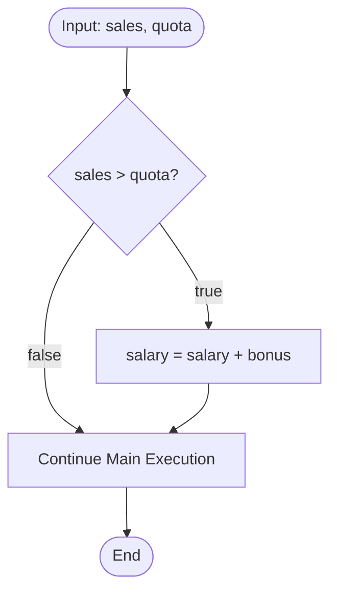

# Decision Structures: Branching Logic, Switch Constructs & Boolean Evaluation

---

## Key Takeaways

Decision structures alter linear program execution by defining alternate execution branches governed by boolean expressions. Java provides conditional branching via single-selection (`if`), dual-selection (`if-else`), and multi-selection (`if-else-if`) structures, alongside value-matching constructs using traditional `switch` statements and modern Java 17 arrow-syntax `switch` expressions. Relational and logical operators evaluate primitive data and compound conditions, utilizing short-circuit mechanics to optimize computational pathways.



- **Detours vs. Distinct Paths**: A solitary `if` functions as a temporary detour before rejoining the main flow; an `if-else` enforces two mutually exclusive paths, executing exactly one branch.
- **Boolean Expression Prerequisite**: Conditions placed inside an `if (...)` statement must evaluate strictly to a `boolean` type (`true` or `false`).
- **Condition-Based vs. Equality-Based**: The `if-else-if` ladder tests sequential boolean ranges or dynamic conditions, whereas `switch` matches a discrete variable against specific equality cases.
- **Fall-Through Control**: Traditional colon-based `switch` statements require an explicit `break` to avoid unintended fall-through to downstream cases; Java 17 arrow-syntax `switch` expressions eliminate fall-through entirely and can directly yield or return assigned values.
- **Short-Circuit Evaluation**: Compound conditions evaluated from left to right terminate immediately once the final truth value is determined (`false && ...` halts at the first operand; `true || ...` halts at the first operand).

---

## Main Discussion

### Idiomatic Java Code Snippets

#### Branching with `if`, `if-else`, and `if-else-if`

Conditional statements branch based on relational evaluations:

```java
package decision_structures;

public class BranchingDemo {

    public static void main(String[] args) {
        int sales = 15;
        int quota = 10;
        double salary = 1000.0;
        double bonus = 250.0;

        // Single-path detour: if statement
        if (sales > quota) {
            salary = salary + bonus;
        }

        // Dual-path branching: if-else statement
        if (sales >= quota) {
            System.out.println("Congrats! You've met your quota.");
        } else {
            int salesShort = quota - sales;
            System.out.println("You did not make your quota. You were " + salesShort + " sales short.");
        }

        // Multi-path branching: if-else-if ladder
        int score = 85;
        char grade;

        if (score < 60) {
            grade = 'F';
        } else if (score < 70) {
            grade = 'D';
        } else if (score < 80) {
            grade = 'C';
        } else if (score < 90) {
            grade = 'B';
        } else {
            grade = 'A';
        }
        System.out.println("Assigned Grade: " + grade);
    }
}
```

#### Traditional `switch` Statement vs. Modern `switch` Expression

A traditional `switch` matches values with required break points, while a modern Java 17 `switch` expression produces assignments directly via arrow syntax (`->`):

```java
package decision_structures;

public class SwitchDemo {

    public static void main(String[] args) {
        String grade = "B";

        // Traditional switch statement: uses colons and explicit breaks to prevent fall-through
        String traditionalMessage;
        switch (grade) {
            case "A":
                traditionalMessage = "Excellent job!";
                break;
            case "B":
                traditionalMessage = "Great job!";
                break;
            case "C":
                traditionalMessage = "Good job!";
                break;
            case "D":
                traditionalMessage = "You need to work a bit harder.";
                break;
            case "F":
                traditionalMessage = "Uh oh!";
                break;
            default:
                traditionalMessage = "Error. Invalid grade";
                break;
        }

        // Modern Java 17 switch expression: direct assignment, no break, multi-label matching
        String modernMessage = switch (grade) {
            case "A", "B" -> "Great or excellent performance!";
            case "C"      -> "Good job!";
            case "D"      -> "You need to work a bit harder.";
            case "F"      -> "Uh oh!";
            default       -> {
                // Multi-statement block within an arrow arm must yield a value
                System.out.println("Logging unrecognized grade input: " + grade);
                yield "Error. Invalid grade";
            }
        };

        System.out.println("Result: " + modernMessage);
    }
}
```

### Under the Hood / JVM Mechanics

1. **Condition Evaluation:**
   The execution engine evaluates relational expressions inside the if (...) parentheses to produce a raw boolean value on the operand stack.

2. **Jump Instruction Branching:**
   Based on the boolean outcome, the JVM uses conditional jump instructions to either step into the subsequent code block or bypass it completely to the target branch offset.

3. **Short-Circuit Halting:**
   When evaluating compound expressions with && or ||, the runtime stops processing sub-expressions left-to-right as soon as the definitive boolean result is established.

4. **Switch Dispatching:**
   In switch constructs, the evaluated variable matches directly against concrete case labels. In arrow-syntax expressions, execution jumps directly to the matching arm and immediately exits without falling through adjacent cases.

### Structural Comparisons

#### Relational Operators

| Operator | Meaning                  | Example  | Result  | Operand Restrictions                                    |
| -------- | ------------------------ | -------- | ------- | ------------------------------------------------------- |
| `>`      | Greater than             | `2 > 3`  | `false` | Numeric primitives only (cannot be used with `boolean`) |
| `<`      | Less than                | `2 < 3`  | `true`  | Numeric primitives only (cannot be used with `boolean`) |
| `>=`     | Greater than or equal to | `4 >= 4` | `true`  | Numeric primitives only (cannot be used with `boolean`) |
| `<=`     | Less than or equal to    | `4 <= 3` | `false` | Numeric primitives only (cannot be used with `boolean`) |
| `==`     | Equal to                 | `3 == 2` | `false` | All primitive types                                     |
| `!=`     | Not equal to             | `3 != 2` | `true`  | All primitive types                                     |

#### Logical Operators

| Operator | Name             | Syntax | Behavior                                                       | Short-Circuit Capable                  |
| -------- | ---------------- | ------ | -------------------------------------------------------------- | -------------------------------------- |
| **AND**  | Conditional AND  | `&&`   | True only if **both** operands are true                        | Yes (stops if left operand is `false`) |
| **OR**   | Conditional OR   | `      | True if **at least one** operand is true                       | Yes (stops if left operand is `true`)  |
| **NOT**  | Logical Negation | `!`    | Inverts single boolean operand (`!true` $\rightarrow$ `false`) | No (unary operator)                    |

#### Structural Branching Matrix

| Feature                  | `if-else-if` Ladder           | Traditional `switch` Statement  | Modern `switch` Expression           |
| ------------------------ | ----------------------------- | ------------------------------- | ------------------------------------ |
| **Evaluation Focus**     | Boolean conditions and ranges | Value equality matching         | Value equality matching              |
| **Assignment Style**     | Manual assignment per block   | Manual assignment per case      | Direct variable initialization       |
| **Fall-Through**         | None                          | Yes (unless stopped by `break`) | Impossible by design                 |
| **Syntax Delimiter**     | Curly braces `{}`             | Case labels with colons `:`     | Arrow operator `->`                  |
| **Multi-Value Matching** | Combines expressions with `   | Stacks multiple `case` labels   | Comma-separated labels (`case A, B`) |

### Common Anti-Patterns & Edge Cases

- **Assignment vs. Equality Confusion**: Using a single `=` instead of `==` inside conditions (e.g., `if (sales = 10)`) is an invalid syntax attempt to assign rather than compare.
- **Accidental Fall-Through**: Omitting `break` in a traditional switch case causes the execution engine to cascade through subsequent cases, executing their statements regardless of equality matches.
- **Invalid Relational Operations on Booleans**: Attempting to evaluate `boolean` operands with magnitude operators (e.g., `isEmployed > true` or `flag <= false`) causes a compile-time failure.
- **Blockless Scope Traps**: While curly braces are technically optional for single statements after an `if`, adding subsequent lines without braces causes those lines to execute unconditionally as part of the main path.

---

## Knowledge Check & JetBrains-Style Coding Challenges

### Theory Tips

- **Short-Circuit Direction**: Expressions evaluate strictly from **left to right**. In an `&&` expression, if the left-hand condition is `false`, the right-hand condition is never evaluated. In an `||` expression, if the left-hand condition is `true`, the right-hand condition is skipped.
- **Switch Expression Rules**: In a modern switch expression assigning a variable, all arms must yield an evaluation compatible with the target type, and multi-statement blocks enclosed in `{}` must use the `yield` keyword to output a value.
- **Default Case Necessity**: Supplying a `default` case in switch constructs guards against unhandled input, ensuring unmatched values have a deterministic handling branch.

### Question 1: Conceptual / Code Analysis

Examine the following code snippet:

```java
int x = 5;
int y = 10;
boolean result = (x > 10) && (++y > 10);
System.out.println("Result: " + result + ", Y: " + y);
```

What is printed to the console?

- [ ] **A** `Result: false, Y: 11`
- [ ] **B** `Result: false, Y: 10`
- [ ] **C** `Result: true, Y: 11`
- [ ] **D** A compilation error occurs due to the `&&` short-circuit expression.

<details>
<summary>Correct Answer</summary>

**Correct Answer**: **B**

**Technical Breakdown**:

- **B is correct**: The expression uses the logical AND (`&&`) operator, which evaluates left-to-right with short-circuit logic. The left operand `x > 10` evaluates to `5 > 10`, which is `false`. Because an AND expression requires both operands to be `true`, the runtime halts evaluation immediately without evaluating the right operand (`++y > 10`). Consequently, `y` is never incremented, remaining `10`, and `result` is assigned `false`.
- **A is incorrect**: This would occur only if evaluation did not short-circuit and proceeded to execute `++y`.
- **C is incorrect**: The expression cannot be `true` because the initial condition `x > 10` is `false`.
- **D is incorrect**: The syntax and types are fully valid Java code.

</details>

---

### Question 2: Mini Coding Problem / Implementation Challenge

**Task**: Implement a standalone game validator class named `ChangeForADollarGame`. The class contains a method named `evaluateChange` that accepts four whole numbers representing quantities of US coins: pennies ($0.01), nickels ($0.05), dimes ($0.10), and quarters ($0.25).

The method must calculate the total dollar amount.

1. If the total equals exactly $1.00, print `"You win!"` and return `true`.
2. If the total is less than \$1.00, print `"You were short by $[difference]"` and return `false`.
3. If the total is greater than \$1.00, print `"You went over by $[difference]"` and return `false`.

**Test Assertions**:

- Input `(0, 0, 0, 4)` $\rightarrow$ Prints: `You win!` | Returns: `true`
- Input `(0, 0, 5, 1)` $\rightarrow$ Prints: `You were short by $0.25` | Returns: `false`
- Input `(0, 5, 5, 2)` $\rightarrow$ Prints: `You went over by $0.25` | Returns: `false`

```java
package decision_structures;

public class ChangeForADollarGame {

    public static boolean evaluateChange(int pennies, int nickels, int dimes, int quarters) {
        double pennyValue = 0.01;
        double nickelValue = 0.05;
        double dimeValue = 0.10;
        double quarterValue = 0.25;

        // Calculate cumulative monetary total
        double total = (pennies * pennyValue) +
                       (nickels * nickelValue) +
                       (dimes * dimeValue) +
                       (quarters * quarterValue);

        double target = 1.00;

        // Evaluate conditions using if-else-if structure
        if (total == target) {
            System.out.println("You win!");
            return true;
        } else if (total < target) {
            double shortAmount = target - total;
            System.out.println("You were short by $" + shortAmount);
            return false;
        } else {
            double overAmount = total - target;
            System.out.println("You went over by $" + overAmount);
            return false;
        }
    }
}
```

**Complexity Analysis**:

- **Time Complexity**: $\mathcal{O}(1)$ as coin calculations and branch checks execute in fixed, constant-time steps.
- **Space Complexity**: $\mathcal{O}(1)$ auxiliary memory; local double variables are allocated directly on the stack without auxiliary heap structures.
