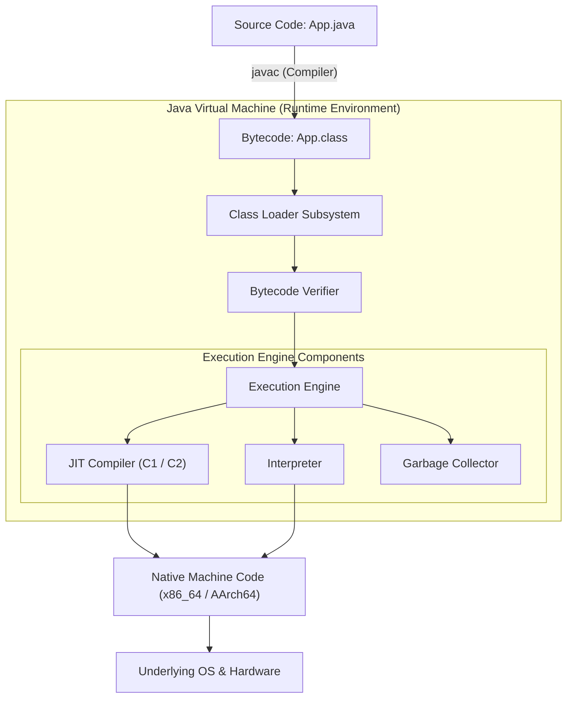

# Java 17 Platform Essentials: Ecosystem Architecture, Program Structure & JVM Execution Model

---

## Key Takeaways

Java 17 (Long-Term Support) is an object-oriented, statically typed platform engineered around the "Write Once, Run Anywhere" (WORA) paradigm. Source code (`.java`) compiles into architecture-neutral bytecode (`.class`), which the Java Virtual Machine (JVM) interprets and optimizes via Just-In-Time (JIT) compilation into host-specific native machine instructions. This two-phase translation model abstracts hardware dependencies while delivering near-native performance for enterprise systems.



- **Compilation vs. Execution**: `javac` validates language semantics and emits platform-independent bytecode; the JVM execution engine handles runtime optimization and OS system calls.
- **Strict Source-File Conventions**: A public top-level class must match the base name of its compilation unit (e.g., `public class HelloWorld` strictly requires `HelloWorld.java`).
- **Canonical Entry Point**: Execution begins unconditionally at `public static void main(String[] args)`, which must remain accessible, uninstantiated, and properly signed for the JVM launcher.
- **Modern Java 17 Baseline**: Java 17 LTS establishes standardized, predictable language features while preserving backward binary compatibility across earlier JVM specifications.

---

## Main Discussion

### Idiomatic Java Code Snippets

Every standalone Java application requires a designated class and an entry-point method that satisfies the signature contract expected by the runtime launcher:

```java
package com.jetbrains.academy.basics;

/**
 * Demonstrates canonical program structure and entry-point semantics in Java 17.
 */
public class PlatformBasics {

    // Standard JVM application entry point
    public static void main(String[] args) {
        // Output textual data to the standard output stream
        System.out.println("Java 17 runtime successfully initialized.");

        // Validating argument ingestion from the CLI invocation
        if (args.length > 0) {
            System.out.println("First argument: " + args[0]);
        } else {
            System.out.println("No launch arguments supplied.");
        }
    }
}
```

### Under the Hood / JVM Mechanics

The execution lifecycle of a Java application transitions through distinct architectural boundaries:

1. **Source Parsing & Semantic Analysis:**
   The javac compiler parses source code, validates strong typing, checks visibility constraints, and verifies scope rules.

2. **Bytecode Generation:**
   Upon successful compilation, javac emits a binary .class file containing constant pool tables, field and method descriptors, and stack-based bytecode instructions (e.g., invokevirtual, getstatic, return).

3. **Class Loading & Verification:**
   The JVM's ClassLoader reads the bytecode into the Metaspace. The Bytecode Verifier confirms the binary satisfies security boundaries (preventing stack overflows, illegal type conversions, or direct memory pointer manipulation).

4. **Execution & JIT Tiered Compilation:**
   The interpreter executes bytecode immediately. Frequently executed loops or method bodies ("hot spots") are identified by execution counters and compiled by C1 (client) and C2 (server) JIT compilers directly into native machine code.

### Structural Comparisons

| Feature / Artifact   | Java Source (`.java`)                 | Bytecode (`.class`)                | Native Machine Code                |
| -------------------- | ------------------------------------- | ---------------------------------- | ---------------------------------- |
| **Target Consumer**  | Human Developer / `javac`             | JVM Execution Engine               | Host CPU Architecture              |
| **Portability**      | Universal (Plaintext)                 | Universal (Platform-Neutral)       | Machine-Specific (x86_64, ARM)     |
| **Execution Method** | Cannot be executed directly           | Interpreted / JIT-compiled         | Executed directly by hardware      |
| **File Contents**    | High-level syntax, types, expressions | Opcode instructions, Constant Pool | Binary CPU instructions, registers |

### Common Anti-Patterns & Edge Cases

- **Invalid `main` Method Signatures**: Omitting `static`, returning a value instead of `void`, or changing parameter types (e.g., `void main(String args)`) causes a runtime `NoSuchMethodError: main` during JVM launch, even though `javac` compiles the class without errors.
- **File-Naming Mismatches**: Declaring `public class Engine {}` inside a file named `Car.java` triggers a compile-time failure: `class Engine is public, should be declared in a file named Engine.java`. Non-public classes can reside in differently named files, but standard convention requires single, matching class-to-file mappings.
- **Console Flushing and Null Streams**: Relying directly on `System.out` for high-throughput logging causes thread contention because standard output calls synchronize internally on a shared print stream lock.

---

## Knowledge Check & JetBrains-Style Coding Challenges

### Exam / Theory Tips

- The JVM launcher enforces strict signature matching: `public static void main(String[] args)` can also use varargs (`String... args`), but modifying access (`protected`, `private`), omitting `static`, or omitting return type `void` invalidates it as an application entry point.
- Java is case-sensitive: `String[] args` is valid, but `string[] args` or `String[] Args` (as a type) causes compiler symbol-resolution failures.
- A single `.java` compilation unit can contain multiple class declarations, but **at most one** top-level class can be marked `public`.

### Question 1: Conceptual / Code Analysis

Consider the following file named `Runner.java`:

```java
public class Runner {
    static void main(String[] args) {
        System.out.println("Starting application...");
    }
}
```

What is the result when compiling and executing this code via the command line?

```bash
javac Runner.java
java Runner
```

- [ ] **A.** It prints `Starting application...` without error.
- [ ] **B.** A compilation error occurs at `javac Runner.java` because `main` is missing the `public` modifier.
- [ ] **C.** Compilation succeeds, but executing `java Runner` throws a runtime error indicating that the `main` method is not found or not `public`.
- [ ] **D.** Compilation succeeds, and the program terminates silently without printing output.

<details>
<summary>Correct Answer</summary>

**Technical Breakdown**:

- **C is correct**: `javac` does not mandate that every class contain a valid entry point; package-private (`default`) methods named `main` are completely legal syntax. However, at runtime, the JVM's application launcher specifically checks for `public static void main(String[] args)` via reflection/internal lookup. Because package-private access prevents the external launcher from accessing the method, the JVM throws an error: `Error: Main method not found in class Runner, please define the main method as: public static void main(String[] args)`.
- **A is incorrect**: The JVM launcher enforces the `public` access modifier before invoking `main`.
- **B is incorrect**: The compiler checks grammatical and semantic correctness. A non-public method named `main` is valid Java syntax.
- **D is incorrect**: The class loader fails before reaching a silent termination state; the runtime launcher halts execution explicitly.

</details>

---

### Question 2: Mini Coding Problem / Implementation Challenge

**Task**: Implement an entry-point validator class named `LaunchDiagnostic`. The application must inspect command-line arguments and:

1. If no arguments are passed, output `Diagnostics: Missing Arguments` to `System.out` and terminate cleanly.
2. If arguments are present, print the total count followed by the arguments formatted as a comma-separated list enclosed in brackets (e.g., `Count: 2 | [arg1, arg2]`).

**Test Assertions**:

- Input `[]` $\rightarrow$ Outputs: `Diagnostics: Missing Arguments`
- Input `["dev", "verbose"]` $\rightarrow$ Outputs: `Count: 2 | [dev, verbose]`

```java
package com.jetbrains.academy.basics;

public class LaunchDiagnostic {

    public static void main(String[] args) {
        if (args == null || args.length == 0) {
            System.out.println("Diagnostics: Missing Arguments");
            return;
        }

        // Build formatted argument representation
        StringBuilder formattedArgs = new StringBuilder();
        formattedArgs.append("[");
        for (int i = 0; i < args.length; i++) {
            formattedArgs.append(args[i]);
            if (i < args.length - 1) {
                formattedArgs.append(", ");
            }
        }
        formattedArgs.append("]");

        System.out.println("Count: " + args.length + " | " + formattedArgs);
    }
}
```

**Complexity Analysis**:

- **Time Complexity**: $\mathcal{O}(N)$ where $N$ is the cumulative number of characters across all passed arguments. Iterating through the array processes each argument token exactly once.
- **Space Complexity**: $\mathcal{O}(N)$ auxiliary memory allocated within the heap for the `StringBuilder` buffer to store the joined string representation.
