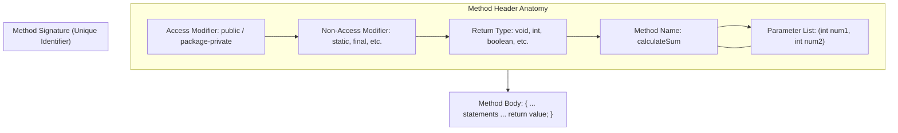

# Methods: Modular Architecture, Variable Scope & Method Overloading

---

## Key Takeaways

Methods are structured subtasks within a class designed to break complex problems into small, manageable units while eliminating redundant code. A method is governed by its header—consisting of access modifiers, non-access modifiers, a return type, an identifier, and a parameter list—which together with its body defines an executable unit of logic. In Java, methods execute only when explicitly called (with `main` serving as the runtime entry point), variables are bound strictly to their enclosing block scope, and methods may share names through overloading provided their parameter lists differ.



- **Method Signature Composition**: A method's signature consists exclusively of its **name** and its **parameter list** (types and order); it does not include return types or access modifiers.
- **Return Type Contract**: Every method requires a return type; if no data is returned, `void` must be specified, and methods returning a concrete type can only return a single value.
- **Variable Scope Limits**: Variables are strictly bounded by the immediate curly braces (`{}`) enclosing their declaration—local variables live within blocks or methods, while global variables span the entire class.
- **Shadowing & the `this` Keyword**: When a local variable shares an identifier with a global/class-level variable, the local variable takes precedence by default; `this.variableName` is required to reference the global counterpart.
- **Method Overloading**: Multiple methods in the same class may share identical names provided their parameter lists differ in type, count, or order; changing only the return type or parameter names is insufficient and causes compile-time errors.

---

## Main Discussion

### Idiomatic Java Code Snippets

#### 1. Method Definition, Parameter Passing & Return Processing

A method defines expected parameters in its header and returns calculated values to the caller:

```java
package methods_demo;

public class LoanQualifier {

    public static void main(String[] args) {
        int actualCreditScore = 720;
        double actualSalary = 35000.0;

        // Call method matching signature: isUserQualified(int, double)
        boolean qualified = isUserQualified(actualCreditScore, actualSalary);

        // Pass returned state into another modular subtask
        notifyUser(qualified);
    }

    // Method returning a single boolean value based on passed parameters
    public static boolean isUserQualified(int creditScore, double salary) {
        double requiredSalary = 25000.0;
        int requiredCreditScore = 700;

        if (creditScore >= requiredCreditScore && salary >= requiredSalary) {
            return true;
        } else {
            return false;
        }
    }

    // Method with a void return type indicating no value is passed back
    public static void notifyUser(boolean isQualified) {
        if (isQualified) {
            System.out.println("Congrats, you've been approved!");
        } else {
            System.out.println("Sorry, you've been declined.");
        }
    }
}
```

#### 2. Variable Scope, Shadowing and `this`

Local declarations take precedence over global fields unless qualified with `this`:

```java
package methods_demo;

public class ScopeExample {

    // Global variable (class scope)
    int myVariable = 100;

    public void demonstrateScope() {
        // Local variable shadowing the global field
        int myVariable = 50;

        // Unqualified reference resolves to local variable (lesser scope)
        System.out.println("Local: " + myVariable); // Prints 50

        // Explicit reference to class-level variable via 'this'
        System.out.println("Global: " + this.myVariable); // Prints 100
    }
}
```

#### 3. Method Overloading

Overloaded methods provide alternative entry points for similar operations by varying parameter lists:

```java
package methods_demo;

public class MonthConverter {

    // Overload 1: signature getMonth(int)
    public static String getMonth(int month) {
        return switch (month) {
            case 1 -> "January";
            case 2 -> "February";
            default -> "Invalid Month";
        };
    }

    // Overload 2: signature getMonth(String)
    public static int getMonth(String month) {
        return switch (month) {
            case "January" -> 1;
            case "February" -> 2;
            default -> -1;
        };
    }
}
```

### Under the Hood / JVM Mechanics

1. **Invocation & Argument Binding:**
   When a method is called, arguments are matched against the parameter list by position and type. The runtime assigns argument values to independent local parameter variables in the called method.

2. **Stack Frame Allocation:**
   Each method invocation creates a distinct stack frame in memory. Local variables and parameters reside in this isolated frame; identical variable names in separate frames maintain independent memory locations.

3. **Return Value Transmission:**
   When a non-void method executes a return statement, the evaluation result is placed onto the caller's operand stack, the method's stack frame pops, and control returns to the instruction following the invocation point.

4. **Overload Resolution at Compile Time:**
   The javac compiler inspects the static types of supplied arguments at the call site to link the call to the matching method signature.

### Structural Comparisons

#### Method Anatomy Elements

| Element                 | Requirement  | Syntax / Position                      | Description                                                                                                                                                                                              |
| ----------------------- | ------------ | -------------------------------------- | -------------------------------------------------------------------------------------------------------------------------------------------------------------------------------------------------------- |
| **Access Modifier**     | Optional     | First word (`public`, omitted)         | Controls visibility (`public` $\rightarrow$ accessible anywhere; omitted = `protected` $\rightarrow$ accessible within the same package; `private` $\rightarrow$ accessible only within the same class). |
| **Non-Access Modifier** | Optional     | Before return type (`static`, `final`) | Declares execution characteristics (e.g., static methods belong to the class).                                                                                                                           |
| **Return Type**         | **Required** | Immediately before method name         | Data type of returned result, or `void` if nothing is returned.                                                                                                                                          |
| **Method Name**         | **Required** | Follows return type                    | Verb-first lowerCamelCase identifier (e.g., `calculateSum`, `isUserQualified`).                                                                                                                          |
| **Parameter List**      | **Required** | Enclosed in parentheses `( ... )`      | Comma-delimited list of input types and names; can be empty `()`.                                                                                                                                        |
| **Method Body**         | **Required** | Enclosed in curly braces `{ ... }`     | Zero or more statements terminated with a `return` matching the return type.                                                                                                                             |

#### Local vs. Global (Class) Variables

| Characteristic       | Local Variable                            | Global (Class-Level) Variable                        |
| -------------------- | ----------------------------------------- | ---------------------------------------------------- |
| **Declaration Site** | Inside method bodies or control blocks    | Outside methods, inside the class body               |
| **Scope Boundary**   | Immediate enclosing curly braces (`{}`)   | Enclosing class body                                 |
| **Accessibility**    | Restricted to the declaring block/method  | Accessible across all methods in the class           |
| **Disambiguation**   | Default resolution when identifiers match | Prefaced via `this.` when shadowed by local variable |

### Common Anti-Patterns & Edge Cases

- **Missing Return Statement**: If a method specifies a return type other than `void`, all conditional branches must provide a valid `return` statement; failing to return a value on every possible execution branch triggers a `missing return statement` compilation failure.
- **Overloading by Return Type Only**: Attempting to overload a method by changing only the return type (e.g., `int compute()` and `double compute()`) causes a compile-time failure. The compiler differentiates methods solely by parameter lists.
- **Overloading by Parameter Name Only**: Declaring two methods with the same parameter types but different parameter names (e.g., `void print(String text)` and `void print(String message)`) triggers `method already defined` because their method signatures are identical.
- **Mismatched Argument Ordering**: Passing arguments out of order relative to the parameter list (e.g., passing `double salary` first when `(int creditScore, double salary)` is expected) causes type mismatch compilation errors.
- **Accessing Block-Scoped Variables Outside Their Braces**: Declaring a variable inside an `if` block or loop and referencing it after the closing brace fails with `cannot resolve symbol`.

---

## Knowledge Check & JetBrains-Style Coding Challenges

### Theory Tips

- **Method Signature Rules**: A method signature consists **strictly of the method name and the parameter list** (order and types). Modifiers, parameter names, and return types are **never** part of the signature.
- **Naming Conventions**: Method names should begin with a lowercase verb (`calculate`, `print`, `process`). Methods returning boolean values conventionally ask a question (e.g., `isUserQualified`, `hasAccess`).
- **Main Method Rule**: `public static void main(String[] args)` is the only method launched automatically by the JVM; all other methods require explicit invocation.

### Question 1: Conceptual / Code Analysis

Consider the following class definition:

```java
public class Processor {

    public int process(int a, double b) {
        return a + (int) b;
    }

    // Method variant 1
    public double process(int x, double y) {
        return x + y;
    }

    // Method variant 2
    public int process(double a, int b) {
        return (int) a + b;
    }
}
```

What is the result when compiling `Processor.java`?

- [ ] **A** Compilation succeeds; both variant 1 and variant 2 are valid overloads.
- [ ] **B** A compilation error occurs because variant 1 has the same method signature as the initial `process` method.
- [ ] **C** A compilation error occurs because variant 2 reverses the parameter types, which is illegal in Java.
- [ ] **D** A compilation error occurs because methods cannot return primitive calculations directly.

<details>
<summary>Correct Answer</summary>

**Correct Answer**: **B**

**Technical Breakdown**:

- **B is correct**: The initial method has the signature `process(int, double)`. Variant 1 also has the signature `process(int, double)`. Renaming parameter names from `(a, b)` to `(x, y)` and changing the return type from `int` to `double` does not alter the signature. Because method signatures must be unique within a class, the compiler fails with an error indicating `process(int, double)` is already defined.
- **A is incorrect**: Variant 1 duplicates the signature of the initial method, causing a collision.
- **C is incorrect**: Changing parameter ordering (e.g., `process(double, int)`) produces a distinct, valid method signature.
- **D is incorrect**: Returning expressions matching the declared return type is standard, legal syntax.

</details>

---

### Question 2: Mini Coding Problem / Implementation Challenge

**Task**: Implement a utility class named `Calculator` containing four overloaded or modular mathematical methods designed to isolate arithmetic operations:

1. `add(int num1, int num2)`: returns the sum of both numbers.
2. `subtract(int num1, int num2)`: returns `num1` minus `num2`.
3. `multiply(int num1, int num2)`: returns the product of both numbers.
4. `divide(int num1, int num2)`: returns the integer division result of `num1 / num2`.
5. `calculateNumbers(int first, int second)`: computes sequential subtasks: adds `first` and `second`, subtracts `second` from that result, multiplies that result by `first`, and divides that result by `second`, returning the final integer result.

**Test Assertions**:

- `add(10, 5)` $\rightarrow$ Returns `15`
- `subtract(15, 5)` $\rightarrow$ Returns `10`
- `multiply(10, 10)` $\rightarrow$ Returns `100`
- `divide(100, 5)` $\rightarrow$ Returns `20`
- `calculateNumbers(10, 5)` $\rightarrow$ Returns `20`

```java
package methods_demo;

public class Calculator {

    public static int add(int num1, int num2) {
        return num1 + num2;
    }

    public static int subtract(int num1, int num2) {
        return num1 - num2;
    }

    public static int multiply(int num1, int num2) {
        return num1 * num2;
    }

    public static int divide(int num1, int num2) {
        return num1 / num2;
    }

    public static int calculateNumbers(int firstNumber, int secondNumber) {
        // Execute modular operations step-by-step
        int result = add(firstNumber, secondNumber);
        result = subtract(result, secondNumber);
        result = multiply(result, firstNumber);
        result = divide(result, secondNumber);

        return result;
    }
}

```

**Complexity Analysis**:

- **Time Complexity**: $\mathcal{O}(1)$ as all arithmetic method invocations execute in constant time.
- **Space Complexity**: $\mathcal{O}(1)$ auxiliary space; parameters and intermediate return values reside in isolated execution frames on the call stack.
