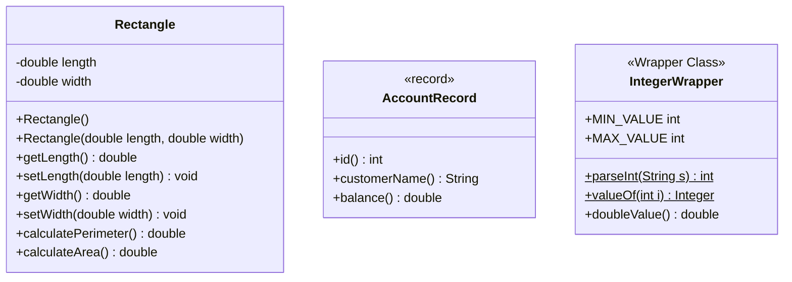

# Objects: Encapsulation, Constructors, Parameter Passing, Wrapper Classes & Modern Records

---

## 1. Key Takeaways

An object is a software structure combining state (fields) and behavior (methods) instantiated from a class that acts as its blueprint. Encapsulation protects this internal state by declaring fields with the `private` access modifier while exposing behavior and controlled field access through `public` methods (getters, setters, and business operations). Java facilitates object initialization via constructors, allows complex data transfer by passing and returning objects across method boundaries, packages primitive values into objects using wrapper classes, and offers modern immutable data carriers through `record` declarations.



- **Encapsulation Contract**: Fields should be declared `private` to safeguard internal data integrity, while methods intended for external use are declared `public`.
- **Constructors vs. Methods**: Constructors share the exact name of the class, lack any return type (not even `void`), and initialize object state during instantiation using `new`.
- **Compound Return Mechanism**: Because Java methods can return only a single value, returning an object instance allows multiple related values (e.g., both length and width) to be transferred to the caller simultaneously.
- **Primitive Wrappers**: Wrapper classes (such as `Integer` for `int`) turn primitive types into objects and provide conversion and parsing utilities like `parseInt()` and `valueOf()`.
- **Immutable Records**: The `record` construct provides a concise way to create immutable data carriers where fields are implicitly `final`, constructors are generated automatically, and accessors match the field names directly without the `get` prefix (e.g., `account.balance()`).

---

## Main Discussion

### Idiomatic Java Code Snippets

#### 1. Encapsulated Blueprint with Multiple Constructors (`Rectangle`)

The class encapsulates its dimensions, exposes accessors and mutators, and supplies overloaded constructors:

```java
package objects_demo;

public class Rectangle {

    // Encapsulation: fields are private to prevent uncontrolled direct access
    private double length;
    private double width;

    // Explicit default constructor assigning default values
    public Rectangle() {
        this.length = 0.0;
        this.width = 0.0;
    }

    // Overloaded constructor initializing state via setter methods
    public Rectangle(double length, double width) {
        setLength(length);
        setWidth(width);
    }

    // Accessor (getter) for length
    public double getLength() {
        return length;
    }

    // Mutator (setter) for length
    public void setLength(double length) {
        this.length = length;
    }

    // Accessor (getter) for width
    public double getWidth() {
        return width;
    }

    // Mutator (setter) for width
    public void setWidth(double width) {
        this.width = width;
    }

    // Behavioral methods operating on encapsulated fields
    public double calculatePerimeter() {
        return (2 * length) + (2 * width);
    }

    public double calculateArea() {
        return length * width;
    }
}

```

#### 2. Passing and Returning Objects in Methods

Objects can be created, returned as factory outputs, and passed into utility methods to calculate aggregate metrics:

```java
package objects_demo;

import java.util.Scanner;

public class HomeAreaCalculator {

    // Factory method returning a single compound object containing both dimensions
    public static Rectangle getRoom(Scanner scanner, String roomName) {
        System.out.println("Enter the length for " + roomName + ":");
        double length = scanner.nextDouble();

        System.out.println("Enter the width for " + roomName + ":");
        double width = scanner.nextDouble();

        // Instantiate and return the object directly without a temporary local variable
        return new Rectangle(length, width);
    }

    // Method accepting multiple objects as parameters
    public static double calculateTotalArea(Rectangle rectangle1, Rectangle rectangle2) {
        return rectangle1.calculateArea() + rectangle2.calculateArea();
    }

    public static void main(String[] args) {
        Scanner scanner = new Scanner(System.in);

        // Retrieve newly created Rectangle objects returned from method invocations
        Rectangle kitchen = getRoom(scanner, "kitchen");
        Rectangle bathroom = getRoom(scanner, "bathroom");

        scanner.close();

        // Pass objects as arguments to compute total area
        double totalArea = calculateTotalArea(kitchen, bathroom);
        System.out.println("The total area is: " + totalArea);
    }
}

```

#### 3. Wrapper Classes & Modern Immutable Records

Wrapper classes provide utility transformations, while modern Java records define immutable models:

```java
package objects_demo;

public class ModernObjectIdioms {

    // Record: concise immutable Plain Old Java Object (POJO)
    // Fields are final, and accessors match field names without 'get'
    public record Account(int id, String customerName, double balance) {
        // Additional custom methods can be declared inside the body
        public void printSummary() {
            System.out.println("Account #" + id + " for " + customerName + ": $" + balance);
        }
    }

    public static void main(String[] args) {
        // === Wrapper Class Demo ===
        int primitiveNum = 42;

        // Boxing primitive into Integer object to access convenience methods
        Integer wrappedNum = Integer.valueOf(primitiveNum);
        int parsedInt = Integer.parseInt("1250");
        double convertedDouble = wrappedNum.doubleValue();

        System.out.println("Max Integer: " + Integer.MAX_VALUE);
        System.out.println("Parsed String to int: " + parsedInt);
        System.out.println("Converted to double: " + convertedDouble);

        // === Record Demo ===
        // Instantiated using standard new keyword
        Account myAccount = new Account(101, "Alex Morgan", 5400.75);

        // Accessor methods do not use the 'get' prefix
        System.out.println("Customer: " + myAccount.customerName());
        System.out.println("Balance: " + myAccount.balance());
        myAccount.printSummary();
    }
}
```

### Under the Hood / JVM Mechanics

1. **Heap Memory Allocation via new:**
   Executing new Rectangle(30, 75) instructs the JVM to allocate a block of heap memory sufficient to store the object's instance fields (two 64-bit double primitives).

2. **Constructor Execution (&lt;init&gt;):**
   The JVM calls the constructor method `<init>` matching the passed argument types. Field values are populated either directly or via the invoked setter methods.

3. **Pass-by-Value Reference Passing:**
   When passing an object into calculateTotalArea(kitchen, bathroom), the value of the reference (the heap memory address pointer) is copied onto the method's stack frame. The method operates on the exact same underlying heap instance.

4. **Record Bytecode Generation:**
   For record Account(...), the javac compiler automatically generates a final class extending java.lang.Record, sets all component fields to private final, generates canonical constructors, and synthesizes accessor methods matching each field's identifier.

### Structural Comparisons

#### Access Modifiers Summary

| Modifier                  | Accessible in Declaring Class | Accessible in Same Package | Accessible in Subclasses Outside Package | Accessible Everywhere |
| ------------------------- | ----------------------------- | -------------------------- | ---------------------------------------- | --------------------- |
| **`private`**             | **Yes**                       | No                         | No                                       | No                    |
| **Default (No modifier)** | **Yes**                       | **Yes**                    | No                                       | No                    |
| **`protected`**           | **Yes**                       | **Yes**                    | **Yes**                                  | No                    |
| **`public`**              | **Yes**                       | **Yes**                    | **Yes**                                  | **Yes**               |

#### Standard Class vs. Modern Java Record

| Characteristic               | Standard Class (`class`)                            | Java Record (`record`)                               |
| ---------------------------- | --------------------------------------------------- | ---------------------------------------------------- |
| **Primary Purpose**          | Mutable or complex domain model                     | Simple immutable data carrier / POJO                 |
| **Mutability**               | Mutable by default unless fields are marked `final` | **Immutable**; fields are implicitly `private final` |
| **Boilerplate Requirements** | Explicit getters, setters, constructors             | Auto-generated canonical constructor and accessors   |
| **Accessor Naming**          | Conventional `getFieldName()`                       | Direct field name: `fieldName()`                     |
| **Mutator (Setter) Support** | Yes (`setFieldName(...)`)                           | **No setters generated or permitted**                |

### Common Anti-Patterns & Edge Cases

- **Adding a Return Type to Constructors**: Writing `public void Rectangle()` turns the constructor into a standard method. The compiler will not treat it as a constructor, causing calls like `new Rectangle()` to fail if no other default constructor exists.
- **Accessor Prefix Confusion with Records**: Attempting to call `account.getBalance()` on a record triggers a compilation error: `cannot find symbol method getBalance()`. Record accessors match the component identifier directly (`account.balance()`).
- **Mutating Record Fields**: Attempting to reassign record state (e.g., `account.balance = 500.0;`) is illegal because all record components are implicitly `final`.
- **Bypassing Encapsulation**: Declaring class fields as `public double length;` exposes the internal representation, allowing external code to bypass validation or business rules.
- **Unboxing / Parsing Misalignment**: Passing non-numeric text to `Integer.parseInt("abc")` compiles cleanly but throws a runtime `NumberFormatException`.

---

## Knowledge Check & JetBrains-Style Coding Challenges

### Theory Tips

- **Implicit Default Constructor Rule**: Java automatically provides a no-argument default constructor **only** if no constructors are declared in the class. Once you define any constructor (such as `Rectangle(double, double)`), the implicit default constructor is no longer provided and must be declared explicitly if needed.
- **Encapsulation Definition**: Encapsulation is the object-oriented principle where fields are marked `private` to safeguard internal state, and methods are exposed as `public` to control how other classes interact with that data.
- **Record Accessor Naming**: Record accessors do **not** use the `get` prefix; they use the field name directly (e.g., `account.balance()` instead of `account.getBalance()`).

### Question 1: Conceptual / Code Analysis

Consider the following class declaration:

```java
public class Box {
    private int volume;

    public Box(int volume) {
        this.volume = volume;
    }

    public int getVolume() {
        return volume;
    }
}
```

A developer writes the following instantiation in another class:

```java
Box smallBox = new Box();
```

What is the result when compiling this code?

- [ ] **A.** Compilation succeeds, and `volume` defaults to `0`.
- [ ] **B.** A compilation error occurs because the implicit default constructor is no longer provided once an explicit constructor is defined.
- [ ] **C.** Compilation succeeds, but a runtime `NullPointerException` occurs upon accessing `smallBox`.
- [ ] **D.** A compilation error occurs because `volume` is marked `private` and cannot be accessed by constructors.

<details>
<summary>Correct Answer</summary>

**Correct Answer**: **B**

**Technical Breakdown**:

- **B is correct**: In Java, the compiler automatically generates a no-argument default constructor only when the class defines zero constructors. Because `Box` explicitly defines a parameterized constructor (`public Box(int volume)`), the compiler suppresses the automatic default constructor. Calling `new Box()` fails compilation because no matching constructor with an empty parameter list exists.
- **A is incorrect**: Java does not generate a default constructor if another constructor has already been defined.
- **C is incorrect**: Constructor resolution errors occur at compile time, preventing any bytecode from executing.
- **D is incorrect**: Constructors declared inside a class have full access to its private fields.

</details>

---

### Question 2: Mini Coding Problem / Implementation Challenge

**Task**: Implement an immutable transaction modeling system inside package `objects_demo`:

1. Define a `record` named `Transaction` representing a monetary event:
   - Fields: `id` (`int`), `description` (`String`), and `amount` (`double`).
   - Add an instance method `isCredit()` inside the record that returns `true` if `amount` is greater than `0`, and `false` otherwise.
2. Create a utility class named `TransactionLedger`:
   - Implement a method `public static Transaction parseTransactionString(String data)`:
   - Accepts a comma-separated string formatted as: `"id,description,amount"` (e.g., `"101,Salary,3500.50"`).
   - Uses `String.split(",")` to extract tokens.
   - Uses `Integer.parseInt(...)` to parse the `id`.
   - Uses `Double.parseDouble(...)` (or retrieves double values via wrapper conversion) to parse the `amount`.
   - Instantiates and returns a new `Transaction` record with the extracted values.

**Test Assertions**:

- Input string `"202,Grocery,-85.25"`:
  - `Transaction tx = TransactionLedger.parseTransactionString("202,Grocery,-85.25");`
  - `tx.id()` $\rightarrow$ Returns: `202`
  - `tx.description()` $\rightarrow$ Returns: `"Grocery"`
  - `tx.amount()` $\rightarrow$ Returns: `-85.25`
  - `tx.isCredit()` $\rightarrow$ Returns: `false`
- Input string `"303,Bonus,500.00"`:
  - `tx.isCredit()` $\rightarrow$ Returns: `true`

<details>
<summary>Solution</summary>

```java
package objects_demo;

public class ModernObjectChallenge {

    // Immutable record component declaration
    public record Transaction(int id, String description, double amount) {

        // Custom behavioral method within a record
        public boolean isCredit() {
            return amount > 0;
        }
    }

    public static class TransactionLedger {

        public static Transaction parseTransactionString(String data) {
            // Split comma-delimited data payload
            String[] tokens = data.split(",");

            // Utilize wrapper class parsing methods
            int parsedId = Integer.parseInt(tokens[0].trim());
            String parsedDescription = tokens[1].trim();
            double parsedAmount = Double.parseDouble(tokens[2].trim());

            // Construct and return the compound record object
            return new Transaction(parsedId, parsedDescription, parsedAmount);
        }
    }
}

```

**Complexity Analysis**:

- **Time Complexity**: $\mathcal{O}(L)$ where $L$ is the character length of the input data string parsed by `split()` and wrapper parsing methods. Field assignment in the record constructor executes in constant time $\mathcal{O}(1)$.
- **Space Complexity**: $\mathcal{O}(L)$ auxiliary memory allocated on the heap for the intermediate split token array and the newly instantiated `Transaction` record instance.

</details>

---
