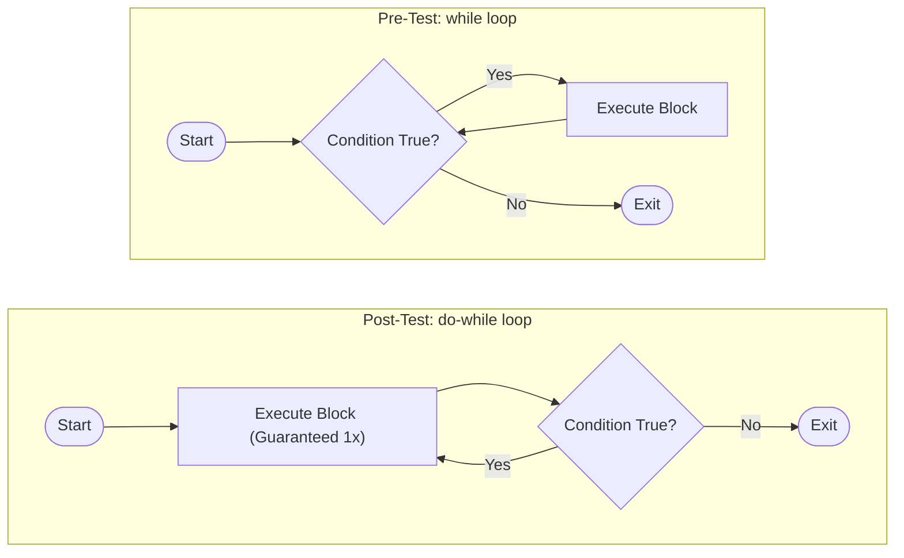

# Repetition Structures: Loop Mechanics, Flow Control & Nested Iterations

---

## Key Takeaways

Repetition structures (loops) execute a designated block of statements repeatedly, eliminating code duplication. Java provides condition-controlled loops (`while`, `do-while`) and count-controlled loops (`for`), evaluated either pre-execution or post-execution. Flow control statements like `break` interrupt loop iteration immediately regardless of whether the governing condition remains true, transferring execution directly to the statement immediately following the loop block.



- **Condition-Controlled vs. Count-Controlled**: `while` and `do-while` execute based on a dynamic boolean condition; `for` loops execute a predetermined, counted number of times.
- **Pre-Test vs. Post-Test**: `while` and `for` test their condition _before_ entering the body (may execute zero times); `do-while` tests the condition _after_ the body (guaranteed to execute at least once).
- **State Mutation & Infinite Loops**: A condition-controlled loop must update at least one variable present within its condition during each iteration; otherwise, the condition remains permanently true, causing an infinite loop.
- **Short-Circuit Termination (`break`)**: The reserved word `break` halts loop iteration prematurely across any loop construct (`for`, `while`, `do-while`).
- **Nested Loop Scoping**: Inner loops nested inside outer loops require distinct loop control variables (e.g., `i` for outer, `j` for inner) to avoid name collisions and variable masking.

---

## Main Discussion

### Idiomatic Java Code Snippets

#### 1. Input Validation with a Pre-Test `while` Loop

A `while` loop checks the condition before executing the block, making it ideal for gating execution when input might already be valid:

```java
package repetition_structures;

import java.util.Scanner;

public class InputValidator {

    public static void main(String[] args) {
        int payRate = 15;
        int maxHours = 40;

        Scanner scanner = new Scanner(System.in);
        System.out.println("How many hours did you work?");
        double hoursWorked = scanner.nextDouble();

        // Validate input: repeats while the entry exceeds allowed hours
        while (hoursWorked > maxHours) {
            System.out.println("Invalid entry. Your hours must be between 1 and 40. Try again.");
            hoursWorked = scanner.nextDouble(); // Mutate variable to avoid infinite loop
        }

        scanner.close();
        double grossPay = hoursWorked * payRate;
        System.out.println("Gross pay: $" + grossPay);
    }
}
```

#### 2. Guaranteed Single Execution with a Post-Test `do-while` Loop

A `do-while` loop executes its statements first and evaluates its condition at the bottom, terminated with a semicolon (`;`):

```java
package repetition_structures;

import java.util.Scanner;

public class SumCalculator {

    public static void main(String[] args) {
        Scanner scanner = new Scanner(System.in);
        int runAgain;

        do {
            System.out.println("Enter the first number:");
            double number1 = scanner.nextDouble();

            System.out.println("Enter the second number:");
            double number2 = scanner.nextDouble();

            double sum = number1 + number2;
            System.out.println("The sum is " + sum);

            System.out.println("Would you like to start over? Enter 1 for yes, 2 for no.");
            runAgain = scanner.nextInt();
        } while (runAgain == 1); // Condition checked post-execution; note the trailing semicolon

        scanner.close();
    }
}
```

#### 3. Count-Controlled `for` Loop with Early `break`

A standard `for` loop packages counter initialization, loop condition, and counter increment into three expressions separated by semicolons:

```java
package repetition_structures;

public class CharacterSearch {

    public static void main(String[] args) {
        String text = "Java Programming";
        boolean letterFound = false;

        // Loop from 0 up to text.length() - 1
        for (int i = 0; i < text.length(); i++) {
            char currentLetter = text.charAt(i);

            if (currentLetter == 'A' || currentLetter == 'a') {
                letterFound = true;
                break; // Prematurely terminate loop once letter is located
            }
        }

        System.out.println("Letter 'A' found: " + letterFound);
    }
}
```

#### 4. Nested Iteration

When subtasks must run repeatedly inside a repetitive task, loops are nested:

```java
package repetition_structures;

import java.util.Scanner;

public class StudentGradeAverage {

    public static void main(String[] args) {
        int numberOfStudents = 24;
        int numberOfTests = 4;
        Scanner scanner = new Scanner(System.in);

        // Outer loop processes each student
        for (int i = 0; i < numberOfStudents; i++) {
            double total = 0.0;

            // Inner loop processes test scores for the current student
            for (int j = 0; j < numberOfTests; j++) {
                System.out.println("Enter score for test #" + (j + 1) + " for student #" + (i + 1) + ":");
                double score = scanner.nextDouble();
                total += score;
            }

            double average = total / numberOfTests;
            System.out.println("The test average for student #" + (i + 1) + " is: " + average);
        }

        scanner.close();
    }
}
```

### Under the Hood / JVM Mechanics

1. **Header Initialization:**
   In a for loop, the initialization statement (e.g., int i = 0) executes exactly once before any iteration begins.

2. **Condition Evaluation:**
   For while and for loops, the condition is evaluated. If the expression yields false, execution jumps immediately beyond the loop body. For do-while, the jump target is evaluated only after the block executes.

3. **Body Execution & Update Statement:**
   If the condition is true, the enclosed block executes. In a for loop, reaching the closing curly brace routes execution directly to the update expression (e.g., i++) before returning to Step 2.

4. **Break Interruption:**
   When the runtime encounters a break; statement, it immediately issues an unconditional branch instruction to the instruction address directly following the loop construct, bypassing update expressions and remaining statements.

### Structural Comparisons

| Feature                        | `while` Loop                        | `do-while` Loop                           | `for` Loop                        |
| ------------------------------ | ----------------------------------- | ----------------------------------------- | --------------------------------- |
| **Control Mechanism**          | Condition-controlled                | Condition-controlled                      | Count-controlled                  |
| **Condition Evaluation Point** | Pre-test (before execution)         | Post-test (after execution)               | Pre-test (before each iteration)  |
| **Minimum Iterations**         | `0`                                 | `1`                                       | `0`                               |
| **Header Structure**           | `while (condition)`                 | `do { ... } while (condition);`           | `for (init; condition; update)`   |
| **Trailing Semicolon**         | No (ends with `}`)                  | Yes (after `while (...)`)                 | No (ends with `}`)                |
| **Primary Use Case**           | Unknown iteration count, validation | Must run at least once (e.g., retry menu) | Known, fixed number of iterations |

### Common Anti-Patterns & Edge Cases

- **Missing Update in Condition Variable**: Forgetting to update the variable that governs the condition inside a `while` or `do-while` loop causes an **infinite loop**, resulting in programs that never terminate.
- **Missing Semicolon on `do-while`**: Leaving off the trailing semicolon after `while (condition)`in a`do-while`block (e.g.,`do { ... } while (x == 1)`) triggers a compile-time syntax error (`';' expected`).
- **Loop Variable Variable Collisions**: Declaring `for (int i = 0; ...)` inside an outer loop that also uses `int i` fails to compile because the variable `i` is already declared in that scope.
- **Off-By-One Index Traversal**: Iterating over string indices using `i <= text.length()` instead of `i < text.length()` results in an out-of-bounds error at runtime, because valid indices span from `0` to `text.length() - 1`.

---

## Knowledge Check & JetBrains-Style Coding Challenges

### Theory Tips

- **The `do-while` Semicolon**: Unlike standard block structures, the `do-while` construct is the only loop structure that requires a terminating semicolon after its closing parenthesis: `do { ... } while (condition);`.
- **Standard 0-Based Indexing**: Loop counters typically initialize at `0` (e.g., `int i = 0`), continuing while `i < count`. This matches 0-indexed structures like string characters (`text.charAt(i)`).
- **`break` Scope**: A `break` statement only exits the immediate loop in which it resides; in nested loops, a `break` inside the inner loop returns control back to the outer loop.

### Question 1: Conceptual / Code Analysis

Consider the following Java code snippet:

```java
int count = 5;
do {
    System.out.print(count + " ");
    count++;
} while (count < 5);
```

What is printed to the console?

- [ ] **A** `5 `
- [ ] **B** Nothing prints because `count < 5` evaluates to `false`.
- [ ] **C** An infinite sequence of numbers starting with `5`.
- [ ] **D** A compilation error occurs because `count` is initialized to a value equal to the loop boundary.

<details>
<summary>Correct Answer</summary>

**Correct Answer**: **A**

**Technical Breakdown**:

- **A is correct**: A `do-while` loop is a post-test loop. It unconditionally executes the enclosed statements once before evaluating the condition. It prints `5 `, increments `count` to `6`, and then evaluates `6 < 5`, which is `false`. The loop exits immediately after this first iteration.
- **B is incorrect**: This would occur in a pre-test loop like `while (count < 5)`, but a `do-while` always executes at least once.
- **C is incorrect**: The condition evaluates to `false` after the first iteration, preventing subsequent executions.
- **D is incorrect**: The syntax and initial conditions are completely valid Java code.

</details>

---

### Question 2: Mini Coding Problem / Implementation Challenge

**Task**: Implement a board simulation game method named `playDieGame` inside class `DieGameSimulator`.

The rules of the game are:

- The player has a maximum of `5` die rolls to advance across a game board of exactly `20` spaces.
- On each roll, an integer roll value between `1` and `6` (inclusive) is supplied from an input array `rolls`.
- If at any point the player reaches space `20` exactly, return `"You win!"`.
- If at any point the player exceeds `20` spaces, return `"You went over. You lose."`.
- If after `5` rolls the player has accumulated fewer than `20` spaces, return `"Too low. You lose."`.

**Test Assertions**:

- Input `rolls = [4, 5, 5, 6, 0]` (reaches 20 on roll 4) $\rightarrow$ Returns: `"You win!"`
- Input `rolls = [6, 6, 6, 3, 0]` (accumulates 21 on roll 4) $\rightarrow$ Returns: `"You went over. You lose."`
- Input `rolls = [1, 2, 3, 2, 4]` (ends at 12 after 5 rolls) $\rightarrow$ Returns: `"Too low. You lose."`

```java
package repetition_structures;

public class DieGameSimulator {

    public static String playDieGame(int[] rolls) {
        int totalSpaces = 20;
        int maxRolls = 5;
        int currentSpace = 0;

        // Count-controlled loop across the fixed number of allowed rolls
        for (int i = 0; i < maxRolls; i++) {
            currentSpace += rolls[i];

            if (currentSpace == totalSpaces) {
                return "You win!";
            } else if (currentSpace > totalSpaces) {
                return "You went over. You lose.";
            } else if (i == maxRolls - 1) {
                // Last roll reached without hitting the target
                return "Too low. You lose.";
            }
        }

        return "Too low. You lose.";
    }
}

```

**Complexity Analysis**:

- **Time Complexity**: $\mathcal{O}(1)$ because the loop is bounded by a constant maximum of 5 iterations.
- **Space Complexity**: $\mathcal{O}(1)$ auxiliary space; variables are stored locally on the stack without heap allocation.
