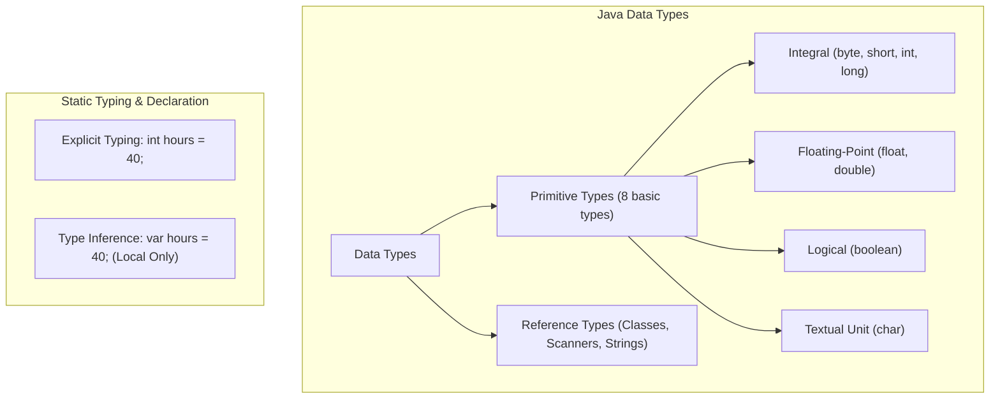

# Variables: Types, Memory Allocation, Local Type Inference & User Input

---

## Key Takeaways

A variable is a named memory location used to store program data. Because Java is a statically typed language, the data type of every variable must be determined at compile time rather than at runtime, defining both the format and the amount of memory allocated. Java provides eight primitive data types for foundational numeric, character, and truth values, alongside modern local variable type inference (`var`). External data ingestion relies on reference types such as `Scanner` from standard utility packages to mutate variable states dynamically.



- **Static vs. Dynamic Typing**: Java checks types at compile time, requiring either explicit declaration or local compile-time inference before variables can receive values.
- **Primitive Categories**: Eight primitives cover integers (`byte`, `short`, `int`, `long`), decimals (`float`, `double`), logical states (`boolean`), and single characters (`char`).
- **Local Type Inference (`var`)**: Reserved type name `var` allows the compiler to infer the type based on the initialization expression; it requires immediate initialization and is restricted exclusively to local variables inside methods.
- **Naming Standard**: Variable identifiers require lowerCamelCase, allow letters, digits, `$`, and `_` (digits cannot start the name), and disallow spaces, hyphens (`-`), or Java reserved keywords.
- **Input Streams**: Reading dynamic user values requires importing `java.util.Scanner`, wrapping `System.in`, calling type-specific input methods (`nextInt()`, `nextDouble()`), and releasing resources via `close()`.

---

## Main Discussion

### Idiomatic Java Code Snippets

The following implementation prompts the user for work metrics, performs arithmetic calculations, and outputs the computed gross pay:

```java
package gross_calculator;

// Import Scanner utility from the standard java.util package
import java.util.Scanner;

public class GrossPayCalculator {

    public static void main(String[] args) {
        // Initialize primitive variables with default values
        int hours = 0;
        double payRate = 0.0;

        // Instantiate Scanner to read from the standard input stream
        Scanner scanner = new Scanner(System.in);

        // Prompt and retrieve integral input
        System.out.println("How many hours did you work?");
        hours = scanner.nextInt();

        // Prompt and retrieve decimal input
        System.out.println("Enter your pay rate:");
        payRate = scanner.nextDouble();

        // Scanner resource clean-up
        scanner.close();

        // Perform multiplication: int promoted along with double yields double
        double grossPay = hours * payRate;

        // String concatenation using the overloaded '+' operator
        System.out.println("Gross pay: " + grossPay);
    }
}
```

Local variable type inference (`var`) can replace explicit declarations when initial values are supplied immediately:

```java
// Compile-time inferred types
var defaultHours = 40;           // Inferred as int
var hourlyRate = 25.50;          // Inferred as double
var isEmployed = true;           // Inferred as boolean
var currencySymbol = '$';        // Inferred as char
```

### Under the Hood / JVM Mechanics

Understanding how variables and primitives function within the execution model:

1. **Compile-Time Type Checking:**
   The javac compiler validates that assigned expressions match declared target types. If a variable is uninitialized or types mismatch without legal conversion, compilation halts with an error (e.g., cannot resolve symbol).

2. **Local Variable Type Inference Resolution:**
   When encountering var, the compiler inspects the right-hand side expression at compile time to inject the concrete type directly into the generated bytecode. No runtime overhead occurs.

3. **Memory Sizing & Stack Frame Allocation:**
   Primitive variables declared inside methods reside locally within the thread's execution stack frame. The primitive type dictates memory footprint (e.g., byte consumes 8 bits, int consumes 32 bits, double consumes 64 bits).

4. **External Package Resolution:**
   Referencing external classes like Scanner requires an explicit import java.util.Scanner; statement, directing the compiler and class loader to find the class inside the standard runtime library.

### Structural Comparisons

#### The Eight Primitive Data Types

| Primitive Type | Size / Memory         | Data Category | Precision / Value Limits                 | Example Literal        |
| -------------- | --------------------- | ------------- | ---------------------------------------- | ---------------------- |
| **`byte`**     | 8-bit                 | Integral      | Whole numbers up to 256 states           | `(byte) 100`           |
| **`short`**    | 16-bit                | Integral      | Whole numbers                            | `(short) 5000`         |
| **`int`**      | 32-bit                | Integral      | Standard default integer                 | `40`                   |
| **`long`**     | 64-bit                | Integral      | Up to ~9.2 quintillion                   | `9223372036854775807L` |
| **`float`**    | 32-bit                | Decimal       | Up to 7 decimal digits                   | `12.34f`               |
| **`double`**   | 64-bit                | Decimal       | High precision (up to 16 decimal digits) | `25.50`                |
| **`boolean`**  | 1-bit / JVM-dependent | Logical       | `true` or `false` (conceptually 1 or 0)  | `true`                 |
| **`char`**     | 16-bit                | Character     | Single character in single quotes        | `'A'`, `'$'`           |

#### Basic Arithmetic Operators

| Operator                     | Syntax | Functional Behavior                                    | Operand Constraints                    | Example                                                                  |
| ---------------------------- | ------ | ------------------------------------------------------ | -------------------------------------- | ------------------------------------------------------------------------ |
| **Addition / Concatenation** | `+`    | Adds numbers; appends values if combined with `String` | Numeric types or `String` combinations | `10 + 5` $\rightarrow$ `15`<br/>`"Pay: " + 50` $\rightarrow$ `"Pay: 50"` |
| **Subtraction**              | `-`    | Subtracts right operand from left operand              | Numeric types only                     | `10 - 4` $\rightarrow$ `6`                                               |
| **Multiplication**           | `*`    | Multiplies numeric operands                            | Numeric types only                     | `40 * 25.50` $\rightarrow$ `1020.0`                                      |
| **Division**                 | `/`    | Divides numerator by denominator                       | Numeric types only                     | `10 / 2` $\rightarrow$ `5`                                               |
| **Modulo**                   | `%`    | Computes remainder of integer division                 | Numeric types only                     | `5 % 2` $\rightarrow$ `1`                                                |

### Common Anti-Patterns & Edge Cases

- **Missing Variable Initialization with `var`**: Writing `var hours;` causes a compilation error. Because Java uses compile-time type inference, the compiler cannot determine the type without an immediate right-hand assignment.
- **Scope Violations with `var`**: Attempting to declare global/class-level fields with `var`(e.g.,`public class Account { var balance = 100.0; }`) is illegal. `var` is strictly limited to local variables declared inside methods.
- **Single vs. Double Quote Discrepancy**: Assigning a character using double quotes (e.g., `char c = "A";`) causes a compiler error. Single quotes (`'A'`) are required for `char` primitives; double quotes are reserved for `String` text constructs.
- **Illegal Identifier Syntax**: Starting a variable name with a number (`int 1stChoice = 1;`) or including hyphens (`double pay-rate = 15.0;`) or spaces (`int hours worked = 40;`) produces immediate syntax compilation errors. Identifiers must use lowerCamelCase and cannot match reserved keywords.
- **Failure to Import Packages**: Using `Scanner scanner = new Scanner(System.in);` without `import java.util.Scanner;` results in a compilation failure (`cannot resolve symbol 'Scanner'`) because `Scanner` does not live in the default package.

---

## Knowledge Check & JetBrains-Style Coding Challenges

### Theory Tips

- **Statically Typed vs. Dynamically Typed**: In dynamically typed languages (such as JavaScript), types are determined at runtime. Java is statically typed: all variable types are determined and checked at compile time.
- **Overloaded `+` Operator**: The `+` operator is the only arithmetic operator overloaded to support non-numeric operands: it concatenates strings whenever at least one operand is a `String`.
- **Scanner Method Alignment**: Always align the `Scanner` method call with the variable's declared type: use `scanner.nextInt()` for `int`, `scanner.nextDouble()` for `double`.

### Question 1: Conceptual / Code Analysis

Consider the following proposed code snippet inside a class method:

```java
var rate;
rate = 15.75;
var total = rate * 2;
System.out.println(total);

```

What is the result of attempting to compile and execute this code?

- [ ] **A** The code compiles and prints `31.5` to the console.
- [ ] **B** A compilation error occurs on the first line because `var` cannot be used without an immediate assignment.
- [ ] **C** A compilation error occurs on line 3 because `var` cannot be used in arithmetic expressions.
- [ ] **D** A runtime error occurs because `rate` defaults to `0` before being reassigned.

<details>
<summary>Correct Answer</summary>

**Correct Answer**: **B**

**Technical Breakdown**:

- **B is correct**: Java requires local variables declared with `var` to include an initializer expression at the point of declaration (e.g., `var rate = 15.75;`). Without it, the compiler cannot infer the underlying type, producing a compile-time failure.
- **A is incorrect**: The code fails at the compilation stage and never runs.
- **C is incorrect**: Variables declared with `var` are fully functional typed variables once inferred; `total` would have been inferred as a `double` if `rate` had been initialized correctly.
- **D is incorrect**: Type inference errors occur at compile time, not at runtime, and local variables in Java do not receive automatic default values.

</details>

---

### Question 2: Mini Coding Problem / Implementation Challenge

**Task**: Implement a program named `StoryBuilder` inside the package `story_creator`. The program must prompt the user via console input using `Scanner` for three specific values:

1. An adjective (`String`)
2. A season of the year (`String`)
3. A whole number representing cups of coffee (`int`)

The program must output the completed text formatted exactly as follows:
`"On a [adjective] [season] day, I drank a minimum of [number] cups of coffee."`

**Input Sample**:

```text
cold
winter
4
```

**Output Sample**:

```text
On a cold winter day, I drank a minimum of 4 cups of coffee.
```

```java
package story_creator;

import java.util.Scanner;

public class StoryBuilder {

    public static void main(String[] args) {
        Scanner scanner = new Scanner(System.in);

        // Prompt and retrieve string values
        System.out.println("Enter an adjective:");
        String adjective = scanner.next();

        System.out.println("Enter a season:");
        String season = scanner.next();

        // Prompt and retrieve integral value
        System.out.println("Enter the number of coffees consumed:");
        int numberOfCoffees = scanner.nextInt();

        // Clean up scanner resources
        scanner.close();

        // Concatenate parts into a single sentence using the overloaded '+' operator
        String story = "On a " + adjective + " " + season + " day, I drank a minimum of "
                     + numberOfCoffees + " cups of coffee.";

        System.out.println(story);
    }
}
```

**Complexity Analysis**:

- **Time Complexity**: $\mathcal{O}(L)$ where $L$ is the total character length of the concatenated strings read from the standard input.
- **Space Complexity**: $\mathcal{O}(L)$ auxiliary memory allocated in the heap to build the final concatenated output string.
