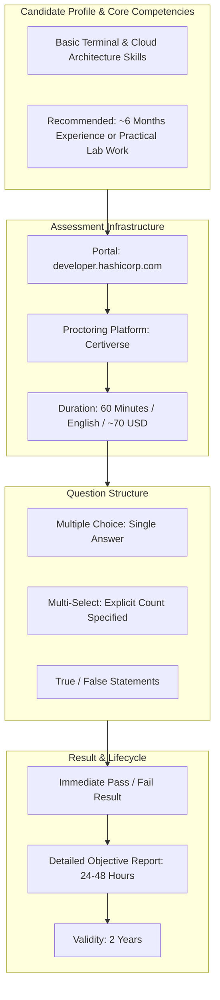
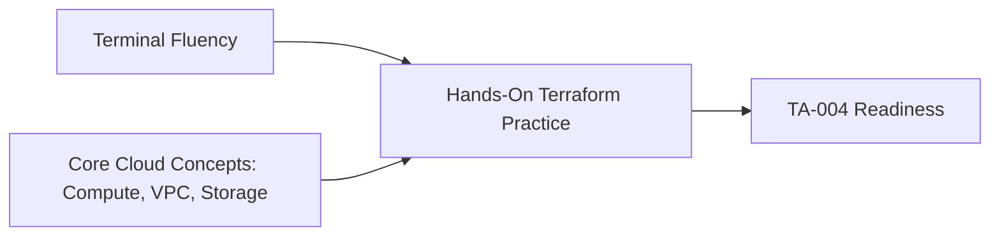
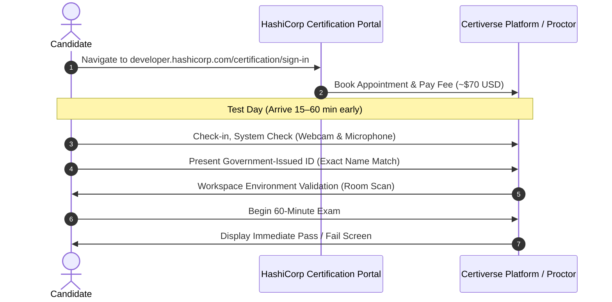
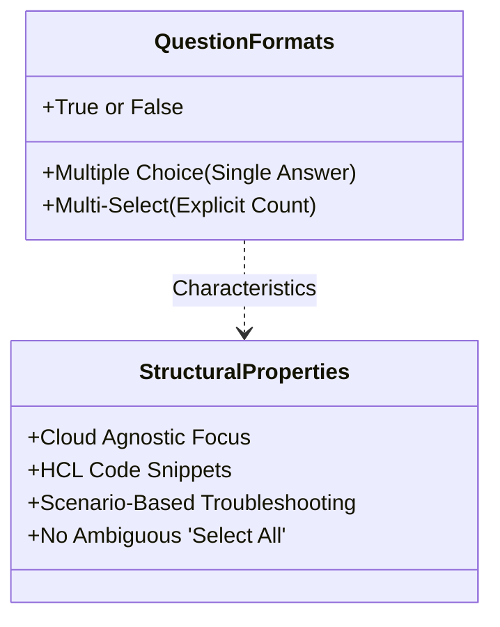

# About the Terraform Associate Exam: Core Exam Logistics, Candidate Profile & TA-004 Testing Structure

---

## Key Takeaways

The HashiCorp Certified: Terraform Associate (004) exam validates foundational competencies in Infrastructure as Code (IaC) principles, the Terraform CLI workflow, state management, module consumption, and collaboration within HCP Terraform. Designed for cloud and DevOps engineers, the credential demonstrates practical operational proficiency rather than memorization of edge cases or cloud-provider-specific API schemas. Understanding the testing environment, item formats, and logistical parameters ensures candidates can approach the standardized assessment methodically.

- **Core Assessment Scope**: Tests foundational Terraform concepts, core CLI workflows, state lifecycles, configuration syntax, and HCP Terraform collaboration without requiring platform-specific expertise.
- **Delivery & Logistics**: Administered as an online-proctored exam via Certiverse lasting 60 minutes, delivered in English, with immediate preliminary pass/fail reporting.
- **Explicit Question Standards**: Question types include single-answer multiple choice, true/false, and multi-select items that explicitly state the required number of choices (e.g., "Choose two").
- **Credential Validity**: The certification remains active for two years and can be renewed by retaking the Associate exam or passing the advanced HashiCorp credential.

---

## Main Discussion / Deep Dive

### Candidate Profile and Target Audience

The TA-004 exam targets cloud and DevOps engineers responsible for provisioning, changing, and versioning cloud infrastructure.

- **Target Roles**: Cloud Engineers, DevOps Engineers, Infrastructure Architects, and Systems Administrators moving away from manual provisioning ("ClickOps").
- **Recommended Prerequisites**:
  - Understanding of core cloud architecture components (virtual machines, networking, security groups, and object/block storage).
  - Foundational command-line interface (CLI) and terminal skills.
  - Approximately six months of practical Terraform experience (or equivalent thorough hands-on lab practice covering all official objectives).

### Exam Logistics and Operational Parameters

The examination process is governed by strict administrative rules enforced through digital remote proctoring.

| Parameter              | Specification                       | Operational Detail                                                                                                                            |
| ---------------------- | ----------------------------------- | --------------------------------------------------------------------------------------------------------------------------------------------- |
| **Duration**           | 60 Minutes                          | Standard testing window; candidates who are non-native English speakers can request an accommodation for additional time during registration. |
| **Delivery Mechanism** | Online Proctored                    | Delivered via the **Certiverse** platform utilizing live video/audio proctoring and automated boundary monitoring.                            |
| **Language**           | English                             | Technical documentation and assessment items are provided solely in English.                                                                  |
| **Fee Structure**      | ~$70.00 USD (plus applicable taxes) | Fixed cost; does not include free retakes. Unsuccessful attempts require paying the full fee again.                                           |
| **Validity Period**    | 2 Years                             | Valid for 24 months from the date of passing; renewable via retaking the Associate exam or passing the advanced professional exam.            |
| **Score Reporting**    | Immediate / 24–48 Hours             | Preliminary Pass/Fail result is displayed immediately upon submission; comprehensive score report per objective issued within 24–48 hours.    |

### Registration and Check-In Workflow

Adherence to procedural rules during test check-in avoids immediate invalidation by the proctor.

#### Verification and Environment Checklist

- **Identity Verification**: The candidate's legal name on the registration record must match the submitted government-issued photo ID **character for character**. Discrepancies can lead to admission refusal.
- **Workspace Isolation**: Testing requires a private, walled room. Third parties entering the room, background voices, or eye movements shifting away from the primary display for extended periods trigger proctor intervention or immediate session termination.
- **Hardware Requirements**: A functioning webcam, active microphone, and stable internet connection. Dual-monitor setups must be disconnected, keeping the workspace clear of unauthorized materials.

### Question Formats and Exam Structure

The TA-004 exam utilizes standardized formats that emphasize the real-world application of HCL and CLI workflows.

- **Single-Answer Multiple Choice**: Select one correct option out of four to six available choices.
- **Explicit Multi-Select**: When multiple answers are required, the prompt explicitly states the exact number to select (e.g., _"Select TWO"_, _"Choose THREE"_). There are no unbounded _"Select all that apply"_ questions.
- **True/False**: Rapid conceptual validation evaluating statements regarding CLI behavior, HCL rules, or state storage mechanisms.
- **Cloud Agnosticism**: While examples in question prompts may reference resources from AWS, Azure, or GCP, candidates are tested strictly on **Terraform semantics**, syntax parsing, workflow order, and state synchronization—not on the cloud provider's internal API architecture.
- **Practical Scenarios & Snippets**: Questions frequently feature code blocks, plan outputs, or state configuration errors, asking the candidate to identify why a resource failed to provision or how to migrate remote state.

---

## Exam Guide

### Exam Tips

- **Vendor Neutrality**: Do not spend time memorizing proprietary cloud architecture parameters (e.g., specific AWS IAM policies or Azure Resource Manager schemas). The exam tests core Terraform constructs, CLI flags, lifecycle arguments, and state locking.
- **Selection Accuracy**: In multi-select questions, always note the required selection count specified in bold or capital letters (e.g., "Choose two"). Selecting fewer or more options than requested will invalidate the answer.
- **Proctor Strictness**: Ensure your test area is cleared of secondary monitors, paper, and smart devices. Keep your face centered in the webcam frame to prevent automated proctor alerts.
- **Time Management**: With 60 minutes for the assessment, pacing at roughly one minute per question leaves adequate time to flag and review scenario-based code questions.

## Extras

- [Hands-On Labs](https://github.com/btkrausen/terraform-associate-labs) - Course Labs Repository
