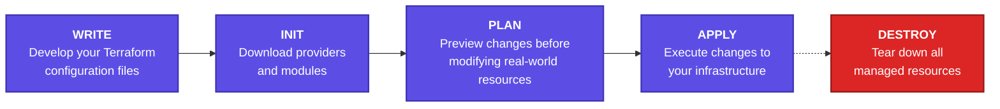
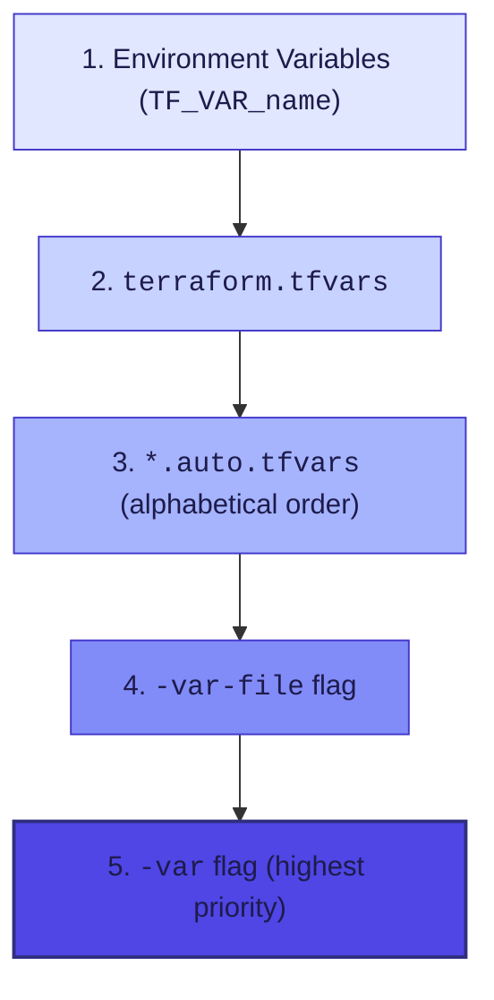

# Terraform CLI & Core Workflow Cheat Sheet

> Essential Commands, Block Types & Developer Workflow — from Write to Apply.

---

## Core Terraform Workflow

The core developer lifecycle from writing code to provisioning and tearing down infrastructure.



---

## HCL Block Types

| Block Type  | Description                                                            |
| :---------- | :--------------------------------------------------------------------- |
| `resource`  | Creates & manages infrastructure objects (e.g., VMs, networks).        |
| `data`      | Reads and fetches existing external data or resources.                 |
| `variable`  | Parameterizes configuration with input arguments.                      |
| `output`    | Exposes values after apply for users or other configurations.          |
| `locals`    | Defines computed intermediate values and expressions.                  |
| `module`    | Consumes reusable packages of Terraform configurations.                |
| `provider`  | Configures target platform plugins (e.g., AWS, Azure, GCP).            |
| `terraform` | Configures global settings, backend storage, and `required_providers`. |

---

## Essential CLI Commands

| Command               | Purpose                                                                       |
| :-------------------- | :---------------------------------------------------------------------------- |
| `terraform init`      | Initialize working directory, download modules, and install provider plugins. |
| `terraform fmt`       | Rewrites configuration files to canonical formatting style.                   |
| `terraform validate`  | Validates configuration syntax and internal consistency.                      |
| `terraform plan`      | Generates and previews the execution plan without modifying infrastructure.   |
| `terraform apply`     | Provisions or updates the infrastructure as specified in configuration.       |
| `terraform destroy`   | Destroys all infrastructure managed by this configuration.                    |
| `terraform output`    | Reads and extracts output values from the state file.                         |
| `terraform console`   | Launches an interactive console for evaluating expressions and state.         |
| `terraform graph`     | Outputs the visual dependency graph in Graphviz (DOT) format.                 |
| `terraform providers` | Displays a tree of providers required by the configuration.                   |

---

## Variable Definition Precedence

Terraform loads variables according to a strict order of precedence. Values loaded later override those loaded earlier.



> **Note:** CLI flags (`-var` and `-var-file`) always override file-based and environment definitions. Auto-loaded files are processed in alphabetical order.

---

## Useful CLI Flags & Environment Variables

### Common CLI Flags

| Flag                 | Description                                                    |
| :------------------- | :------------------------------------------------------------- |
| `-auto-approve`      | Skips interactive approval prompt before applying changes.     |
| `-target=<resource>` | Focuses execution only on a specific resource address.         |
| `-var="k=v"`         | Sets an input variable value inline via the CLI.               |
| `-var-file=<path>`   | Loads variable definitions from a specified `.tfvars` file.    |
| `-refresh-only`      | Checks state against remote objects without proposing changes. |
| `-out=<path>`        | Writes the generated plan file to disk (e.g., `plan.out`).     |

### Environment Variables

| Variable        | Description                                       | Example / Values                          |
| :-------------- | :------------------------------------------------ | :---------------------------------------- |
| `TF_LOG`        | Configures logging verbosity.                     | `TRACE`, `DEBUG`, `INFO`, `WARN`, `ERROR` |
| `TF_LOG_PATH`   | Writes log output to a designated file.           | `/path/to/tf.log`                         |
| `TF_VAR_<name>` | Supplies an input variable value via environment. | `TF_VAR_region="us-east-1"`               |

---

## HCP Terraform / Terraform Cloud Block

```hcl
terraform {
  cloud {
    organization = "org"

    workspaces {
      name = "my-app"
    }
  }
}
```

> _Original by Bryan Krausen (`btk.me/btk`)_
