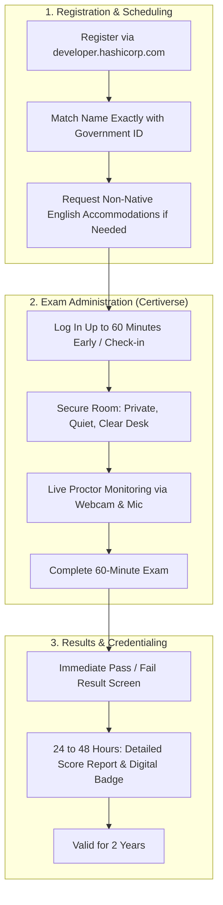
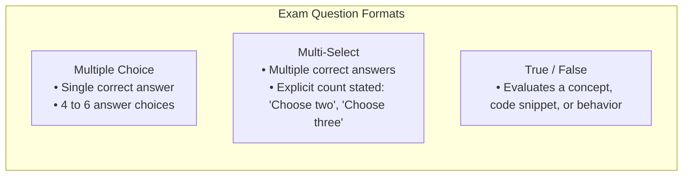
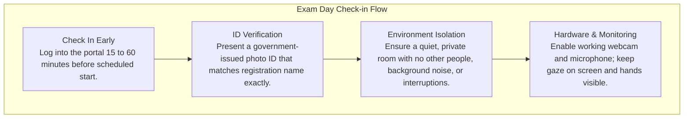

# Introduction to the Terraform Associate Certification & Exam Logistics

---

## Key Takeaways

- The HashiCorp Certified: Terraform Associate certification validates foundational infrastructure as code (IaC) skills, confirming you can write configurations, manage state, work with modules, and collaborate using tools like HCP Terraform.
- Delivered as an online proctored exam via Certiverse, the test evaluates core, real-world Terraform workflows in a cloud-agnostic format rather than provider-specific memorization.
- Candidates must answer multiple-choice, multi-select, and true/false questions within a 60-minute testing window with immediate preliminary results upon completion.

- **Foundational, Cloud-Agnostic Focus**: Tests foundational Terraform operations across platforms (AWS, Azure, Google Cloud) without requiring deep specialization in any specific cloud provider.
- **Strict Format Constraints**: Consists of single-select multiple choice, multi-select with explicitly defined answer counts, and true/false questions completed in 60 minutes.
- **Logistical Rules**: Costs approximately $70 USD with no free retakes; delivered in English through an online proctored environment on Certiverse; credentials remain valid for 2 years.

---

## Main Discussion

### Purpose and Value of the Certification

The Terraform Associate credential validates foundational understanding of infrastructure as code concepts and practical skills in real-world scenarios:

- **Industry Recognition**: Frequently listed as a preferred or required qualification in job descriptions for DevOps, cloud engineering, and infrastructure roles.
- **Demonstration of Competence**: Proves hands-on capability to write Terraform configurations, handle state files, integrate modules, and collaborate with teams using HCP Terraform.
- **Foundational Scope**: Assesses whether a candidate can manage everyday Terraform workflows rather than demanding mastery of edge cases or cloud-specific quirks.

---

### Candidate Profile & Prerequisites

The certification is targeted at cloud engineers, DevOps professionals, and individuals preparing to enter these fields.

| Requirement Area          | Recommended Baseline             | Operational Context                                                                                  |
| ------------------------- | -------------------------------- | ---------------------------------------------------------------------------------------------------- |
| **Practical Experience**  | ~6 months of hands-on experience | Guideline rather than a strict requirement; lab practice and objective-focused study are sufficient. |
| **Terminal / CLI Skills** | Basic command-line proficiency   | Running core Terraform commands, navigating directories, and interpreting CLI output.                |
| **Cloud Fundamentals**    | Basic architectural knowledge    | Core understanding of compute (virtual machines), networking, and storage components.                |

---

### Exam Format and Question Types

The exam questions are designed to be straightforward and fair, focusing on practical comprehension and code analysis rather than intentional trickery.

- **Multiple-Choice Questions**: Present a scenario or technical question alongside 4 to 6 options, with one distinct correct answer.
- **Multi-Select Questions**: Require multiple answers. The prompt will always specify the exact count required (e.g., _"Choose two"_ or _"Choose three"_); candidates are never asked to guess how many apply.
- **True / False Statements**: Require evaluating whether a statement about Terraform behavior, state handling, or syntax is correct.
- **Scenario and Code Snippets**: Questions frequently feature realistic infrastructure scenarios or code snippets where candidates identify errors or choose the right workflow action.
- **Cloud Agnosticism**: While examples may reference AWS, Azure, or Google Cloud resources, the exam evaluates Terraform mechanics, not provider APIs.

---

### Exam Logistics, Policies, and Environment Setup

Understanding the operational rules prevents delays or disqualifications on test day.

| Parameter              | Policy / Rule           | Action Required                                                                                                           |
| ---------------------- | ----------------------- | ------------------------------------------------------------------------------------------------------------------------- |
| **Platform**           | Certiverse              | Browser-based proctored platform.                                                                                         |
| **Duration**           | 60 Minutes              | Sufficient for well-prepared candidates; extra time can be requested during registration for non-native English speakers. |
| **Cost & Retakes**     | ~$70 USD                | Full fee applies to every attempt; no free retakes provided.                                                              |
| **Validity & Renewal** | 2 Years                 | Recertify by retaking the Associate exam or passing the Terraform Professional exam.                                      |
| **Results**            | Immediate / 24–48 Hours | Pass/fail displayed immediately; detailed objective breakdown and badge sent within 24–48 hours.                          |

- **Registration Portal**: Book exams through [developer.hashicorp.com/certification](https://developer.hashicorp.com/certifications).
- **Identity Verification**: The name on the registration account must match your government-issued ID character for character.
- **Testing Space Constraints**: Must be an enclosed, private room. If another person walks into view or speaks in the background, the proctor may pause or terminate the exam session.
- **Hardware Monitoring**: The Certiverse system and live proctor monitor audiovisual feeds throughout the test, tracking unusual movements or eyes darting off-screen.

---

## Exam Tips

- **Name Matching**: Verify your profile name in the HashiCorp certification portal matches your government ID before scheduling to avoid refusal by the proctor.
- **Multi-Select Count Checks**: Pay attention to the specified count in multi-select questions (e.g., "Choose two"). This constraint helps eliminate distractors.
- **Focus on Fundamentals**: Do not spend time memorizing individual cloud provider APIs or specific service features; questions test core Terraform syntax, state, and workflows.
- **Early Arrival**: Open the check-in session 15 to 60 minutes before your scheduled start time to complete identity verification and workspace checks smoothly.
- **Language Accommodations**: If English is not your native language, request extra time during initial registration before confirming your appointment.

## Extras

- [Hands-On Labs](https://github.com/btkrausen/terraform-associate-labs) - Course Labs Repository
