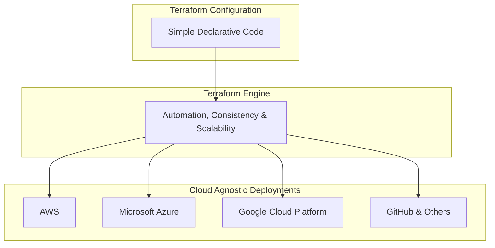
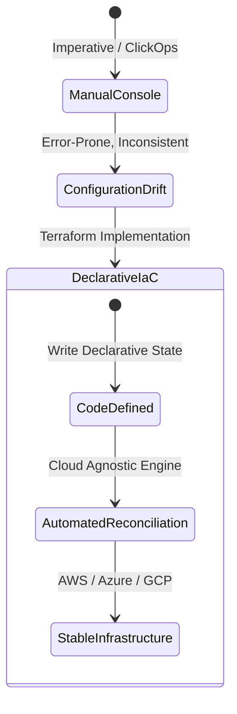

# Course Introduction: Core Terraform Concept, Workflow & TA-004 Context

---

## Key Takeaways

Terraform provides an Infrastructure as Code (IaC) approach that replaces manual provisioning with declarative configuration files across multi-cloud and hybrid environments. By expressing desired infrastructure states in human-readable definitions, teams achieve consistent, repeatable deployments and eliminate configuration drift across multiple providers. Developing proficiency with HashiCorp Terraform enables organizations to scale operations predictably while bridging critical industry talent shortages in multi-cloud governance.

- **Declarative Infrastructure as Code**: Terraform allows operators to define what target infrastructure should look like rather than executing manual, imperative deployment steps.
- **Cloud-Agnostic Workflows**: A single workflow manages resources across diverse cloud providers (e.g., AWS, Azure, GCP) and platforms (e.g., GitHub), maximizing operational flexibility across multi-cloud environments.
- **Modern Enterprise Need**: High industry adoption (79% multi-cloud usage, 66% year-over-year spending increases) drives significant demand for skilled infrastructure automation professionals.
- **Hands-On Application**: True competence and TA-004 exam readiness require iterative practice, configuration debugging, and practical lab experimentation across diverse infrastructure providers.

---

## Main Discussion / Deep Dive

### The Business Case for Infrastructure as Code (IaC)

Enterprise environments are rapidly moving away from manual cloud infrastructure configuration via consoles or custom shell scripts. According to data from the HashiCorp State of Cloud Strategy Survey:

- **66% of organizations** are increasing their overall cloud expenditures year-over-year.
- **79% of organizations** currently use or plan to implement multi-cloud deployments to utilize specialized services from different providers.
- A notable **skills shortage** exists: organizations require operational engineers capable of implementing consistent, automated infrastructure architectures at enterprise scale.

Manual provisioning creates operational silos, configuration drift, and unrepeatable deployments. Infrastructure as Code solves these challenges through automation, strict consistency, and elastic scalability.

### Declarative Code and the Cloud-Agnostic Paradigm

Terraform uses declarative configuration syntax. In a declarative paradigm:

- The practitioner specifies the **desired end state** of the target infrastructure.
- The Terraform engine calculates the differences between the real-world state and the configuration, then determines the necessary actions to reconcile them.

Terraform is **cloud-agnostic**. While resource models differ natively between providers, the core tool, syntax patterns, CLI operations, and state reconciliation lifecycles remain uniform whether deploying resources to AWS, Azure, Google Cloud Platform, or GitHub.

### Hands-On Lab Implementation Strategy

Mastering Terraform for production systems and certification demands practical scenario execution. Hands-on labs can be implemented across three distinct execution targets:

| Lab Environment Target    | Deployment Mechanism            | Operational Prerequisites                                      | Primary Use Case                                                                  |
| ------------------------- | ------------------------------- | -------------------------------------------------------------- | --------------------------------------------------------------------------------- |
| **Udemy Integrated Labs** | In-browser cloud sandboxes      | Supported subscription / course access tier                    | Preferred, zero-setup isolated practice directly in the course viewer.            |
| **GitHub Codespaces**     | Cloud-hosted browser container  | GitHub account                                                 | Alternative browser-based environment with pre-configured developer dependencies. |
| **Local Machine Setup**   | Self-hosted CLI and workstation | Local OS terminal, Git, Terraform binary, provider credentials | Complete offline control utilizing the public course GitHub repository.           |

Practitioners must actively experiment with sample configurations, observe provider reactions, and deliberately debug errors encountered during the compilation and provisioning workflows. Debugging configuration errors forms an essential part of developing proficiency for both day-to-day operations and exam readiness.

---

## Exam Guide

### Exam Tips

- **Declarative vs. Imperative**: Always recognize that Terraform uses a _declarative_ syntax. You define the end state, not the step-by-step procedural shell instructions to build it.
- **Multi-Cloud Terminology**: Terraform is _cloud-agnostic_, but configurations are not automatically universal across providers. The same workflow and tool apply everywhere, but AWS resource types differ from Azure resource types.
- **Troubleshooting Mindset**: Expect exam questions assessing how to resolve misconfigurations, interpret state variances, and manage real-world deployment challenges.
