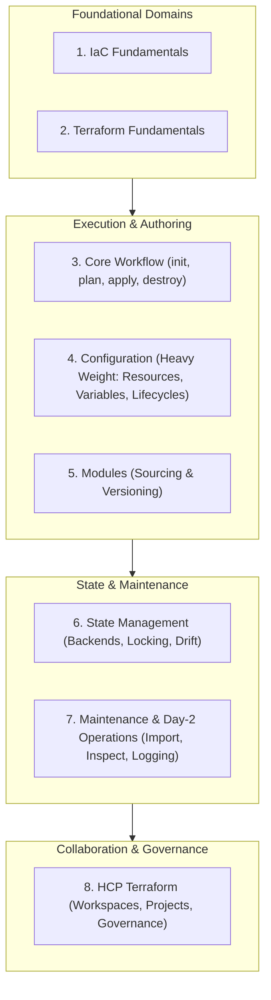
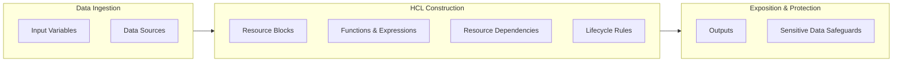
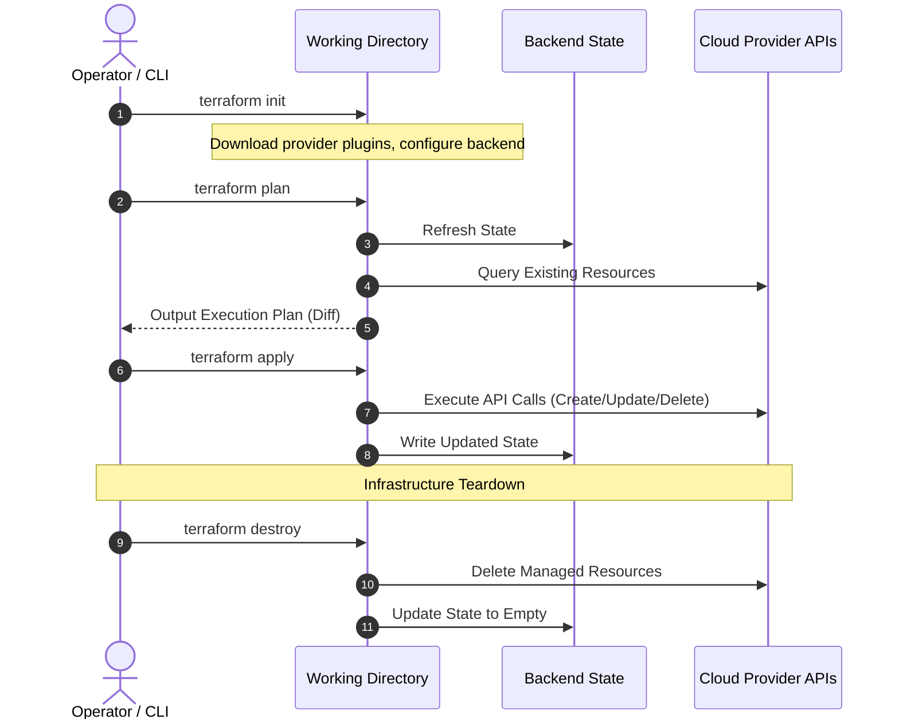
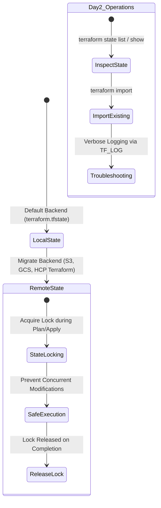

# Exam Objectives: Core Terraform Domains, Curriculum Scope & TA-004 Context

---

## Key Takeaways

The HashiCorp Certified: Terraform Associate (004) exam evaluates operational competence across eight distinct technical domains, spanning foundational Infrastructure as Code concepts to advanced team collaboration and governance. Objective 4 (Terraform Configuration) represents the largest single focus area of the curriculum, requiring mastery of core syntax, variables, resource orchestration, and data security. Achieving certification requires balanced competence in day-to-day CLI execution, state lifecycle maintenance, reusable module architecture, and HCP Terraform operational workflows.

- **Eight Curriculum Domains**: The TA-004 exam blueprint spans IaC fundamentals, core engine concepts, CLI workflows, HCL authoring, module consumption, state operations, ongoing maintenance, and HCP Terraform.
- **Core Focus Area**: Domain 4 (Configuration) carries the heaviest curriculum footprint, covering resource and data blocks, variables, outputs, dependencies, functions, lifecycle rules, and sensitive data safeguards.
- **Daily Operational Routine**: Domain 3 centers on the core commands executed daily: `terraform init`, `terraform plan`, `terraform apply`, and `terraform destroy`.
- **Expanded HCP Terraform Scope**: Domain 8 represents an expanded focus in the 004 version of the exam, emphasizing HCP Terraform workspaces, project boundaries, collaboration, and governance.

---

## Main Discussion / Deep Dive

### Overview of the Eight Exam Domains

The TA-004 exam blueprint structures candidate assessment into eight sequential domains. Candidates must demonstrate practical and conceptual proficiency across each area:

| Domain Number   | Domain Name                  | Core Subject Matter & Objectives Addressed                                                            | Primary Operational Scope                                             |
| --------------- | ---------------------------- | ----------------------------------------------------------------------------------------------------- | --------------------------------------------------------------------- |
| **Objective 1** | **IaC Fundamentals**         | Infrastructure as Code concepts, benefits of automation, multi-cloud workflows                        | Architectural advantages of IaC over manual provisioning.             |
| **Objective 2** | **Terraform Fundamentals**   | Provider ecosystem, provider architecture, role and purpose of state                                  | How the core engine uses plugins and state to track infrastructure.   |
| **Objective 3** | **Core Terraform Workflow**  | Execution lifecycle (`init`, `plan`, `apply`, `destroy`)                                              | Sequential, day-to-day command-line interactions.                     |
| **Objective 4** | **Terraform Configuration**  | Resources, data sources, variables, outputs, functions, dependencies, lifecycle rules, sensitive data | Authoring declarative HCL configurations and protecting secrets.      |
| **Objective 5** | **Terraform Modules**        | Module authoring, sourcing methods, versioning, reusability                                           | Packaging and consuming modular infrastructure code.                  |
| **Objective 6** | **State Management**         | Local default backend vs. remote backends, state locking, drift remediation                           | Maintaining single sources of truth and preventing race conditions.   |
| **Objective 7** | **Maintenance & Operations** | Infrastructure import, state inspection, CLI troubleshooting, verbose logging                         | Day-two administrative management and debugging operational failures. |
| **Objective 8** | **HCP Terraform**            | Workspaces, project structures, team collaboration, governance                                        | Scaling Terraform across teams using managed cloud services.          |

---

### Deep Dive: Configuration (Objective 4)

Objective 4 forms the technical core of the exam. The topics within this domain encompass the authoring patterns used to declare real-world infrastructure:

- **Resource & Data Blocks**: Defining managed resources to create, update, or destroy, while using data source blocks to read external or pre-existing infrastructure data.
- **Variables & Outputs**: Injecting flexible runtime parameters through input variables and exporting computed attributes via output blocks.
- **Dependencies & Functions**: Establishing implicit and explicit resource relationships, using built-in HCL functions to transform strings, collections, and numbers dynamically.
- **Lifecycle Rules & Sensitivity**: Customizing default resource behaviors using meta-arguments, and protecting sensitive credentials from leaking into plain text outputs or unencrypted state representations.

---

### Deep Dive: The Core Daily Workflow (Objective 3)

Domain 3 standardizes the procedural lifecycle used when developing and deploying changes. The execution order is deterministic:

1. **`terraform init`**: Initializes the working directory, downloads required provider plugins, and configures the configured backend. Must run before any operations.
2. **`terraform plan`**: Reads the current state, refreshes against target provider APIs, and outputs an execution plan detailing proposed changes without applying them.
3. **`terraform apply`**: Executes the changes required to reach the desired state defined in the configuration files, prompting for interactive user confirmation by default.
4. **`terraform destroy`**: Safely terminates all managed infrastructure recorded in the state file for the corresponding working directory.

---

### Deep Dive: State, Maintenance & Day-Two Operations (Objectives 6 & 7)

Managing state and long-term operations separates basic authoring from enterprise maintenance:

- **Local vs. Remote State**: Terraform defaults to writing state to a local file (`terraform.tfstate`). In team environments, remote backends provide centralized storage, prevent conflicts, and support state locking to stop concurrent runs from corrupting data.
- **Drift Handling**: Detects discrepancies between the declared configuration and the actual real-world environment.
- **State Inspection**: Using CLI subcommands to inspect resources recorded in state without modifying underlying files.
- **Import Operations**: Bringing existing, unmanaged cloud resources under Terraform control.
- **Verbose Troubleshooting**: Leveraging debug logging levels to isolate API, plugin, or CLI compilation errors.

---

### Expanded Scope: HCP Terraform (Objective 8)

The 004 version of the Associate exam expands coverage of HCP Terraform (formerly Terraform Cloud). Core testing areas include:

- **Workspaces & Projects**: Organizing workspace boundaries, environment-specific variables, and project grouping for enterprise multi-tenancy.
- **Collaboration Workflows**: Enabling shared execution pipelines, automated run triggers, and team-based access permissions.
- **Governance**: Implementing organizational guardrails, policy enforcement, and compliance controls across deployment environments.

---

## Exam Guide

### Exam Tips

- **Heaviest Weight (Objective 4)**: Expect a high density of questions testing variables, data sources, resource block configurations, dependency management, and lifecycle configurations.
- **Core Command Order**: Remember the sequential order: `init` $\rightarrow$ `plan` $\rightarrow$ `apply` $\rightarrow$ `destroy`. You cannot run `plan` or `apply` in an uninitialized working directory.
- **Default Backend**: Terraform automatically defaults to a **local backend** unless a `backend` block or cloud integration is explicitly declared.
- **Verbose Logging Flag**: Know that troubleshooting deep execution issues relies on configuring verbose logging (such as the `TF_LOG` environment variable).
- **HCP Terraform Familiarity**: Do not focus solely on the local CLI. The TA-004 exam requires functional knowledge of HCP Terraform workspaces, projects, and governance workflows.
