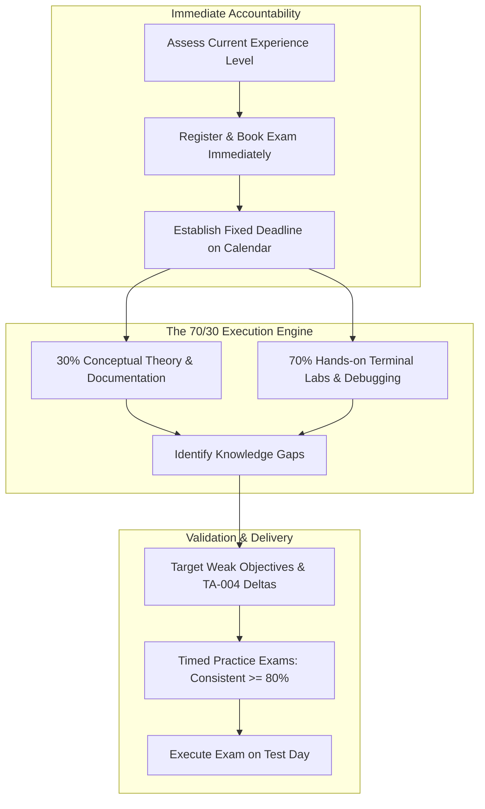
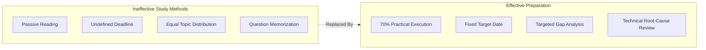
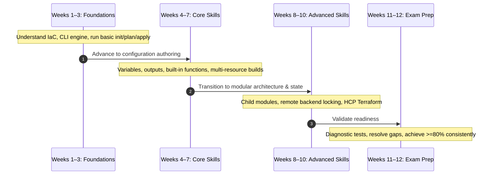
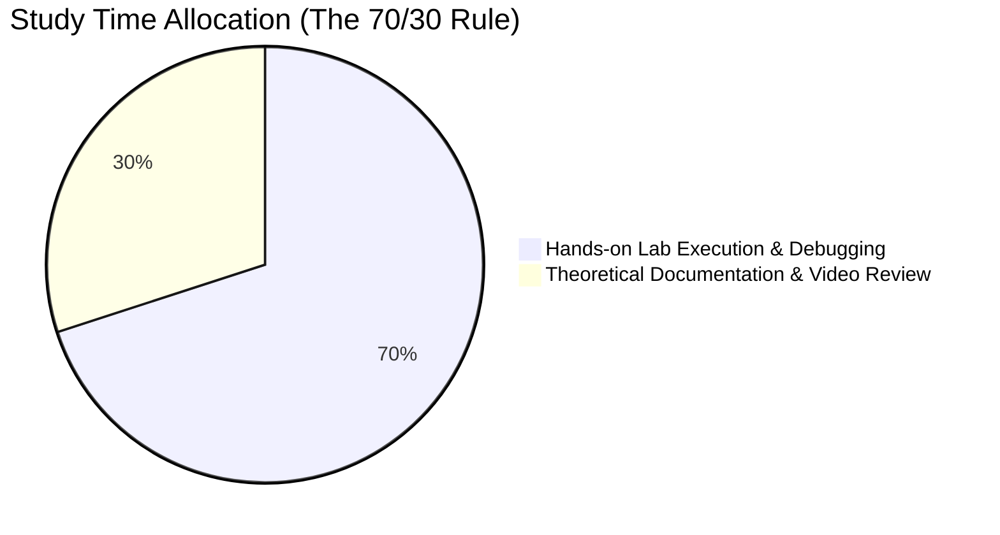

# Your Study Plan for Passing: Preparation Pathways, the 70/30 Rule & Exam Readiness Strategy

---

## Key Takeaways

Achieving certification on the HashiCorp Certified: Terraform Associate (004) exam requires an intentional, timeline-driven study strategy rather than passive reading or rote answer memorization. Establishing an immediate registration date creates mandatory accountability, preventing endless preparation cycles while anchoring targeted study milestones. Candidates must tailor their timeline to their actual hands-on baseline, adhering strictly to the 70/30 preparation rule (70% practical terminal execution and configuration debugging versus 30% theoretical documentation review).

- **Immediate Deadline Commitment**: Booking the exam immediately provides structural accountability, establishes financial investment ("skin in the game"), and eliminates perpetual readiness delays.
- **The 70/30 Rule**: Preparation must be balanced as 70% active hands-on lab development, troubleshooting, and terminal execution, alongside 30% theoretical reading and video review.
- **Experience-Based Pathways**: Candidates should categorize themselves into Beginner (8–12 weeks), Practitioner (4–6 weeks), or Experienced (2–3 weeks) tracks.
- **Gap-Driven Review**: Practice assessments must be used early to identify and target conceptual deficiencies—particularly HCP Terraform and TA-004 delta topics—rather than reviewing known domains equally.

---

## Main Discussion / Deep Dive

### Core Pitfalls in Certification Preparation

Candidates who fail the Terraform Associate exam on their initial attempt frequently encounter five recurring preparation errors:

1. **Passive Reading Without Execution**: Attempting to memorize syntax or commands through text and videos without building, breaking, and resolving infrastructure in a live environment.
2. **Lack of a Timeline**: Studying without a fixed exam appointment, which typically leads to endless review without execution.
3. **Equal Topic Weighting**: Allocating equivalent study time across all areas rather than prioritizing known personal deficiencies or high-weight exam domains.
4. **Perpetual Readiness Procrastination**: Delaying registration until "feeling fully prepared," an arbitrary benchmark that rarely materializes.
5. **Rote Practice Exam Memorization**: Memorizing specific question/answer pairs from practice tests or question banks rather than understanding the technical rationale for why an answer is correct and why alternative options are incorrect.

---

### The Three Structured Preparation Pathways

Preparation roadmaps must be selected based on existing terminal fluency, cloud knowledge, and daily operational interaction with Terraform.

| Pathway Track    | Target Candidate Profile                                       | Recommended Duration | Primary Study Focus & Strategy                                                                                       | Booking Milestone        |
| ---------------- | -------------------------------------------------------------- | -------------------- | -------------------------------------------------------------------------------------------------------------------- | ------------------------ |
| **Beginner**     | Little to no prior Terraform experience in labs or production. | 8–12 Weeks           | Complete curriculum coverage; incremental mastery from IaC fundamentals to advanced configuration and HCP Terraform. | Schedule 10–12 weeks out |
| **Practitioner** | Prior hands-on lab experience or intermittent workplace usage. | 4–6 Weeks            | Diagnostic gap analysis starting with an initial practice test; focus on HCP Terraform and TA-004 feature deltas.    | Schedule 5–6 weeks out   |
| **Experienced**  | Daily production user writing configurations and modules.      | 2–3 Weeks            | Delta-specific review (TA-004 updates), HCP Terraform features, and timed practice testing for pacing.               | Schedule ~3 weeks out    |

---

### Detailed Pathway Breakdown and Progression

#### 1. Beginner Pathway Walkthrough (8–12 Weeks)

The beginner pathway establishes fundamental concepts before advancing to configuration syntax and cloud governance.

- **Weeks 1–3 (Foundations)**: Focus on Infrastructure as Code principles, provider block declarations, and fundamental CLI operations (`init`, `plan`, `apply`, `destroy`).
- **Weeks 4–7 (Core Skills)**: Author configurations from scratch, define input variables and output values, implement interpolation functions, and manage resource relationships.
- **Weeks 8–10 (Advanced Skills)**: Construct reusable modules, configure remote backend state storage with locking mechanisms, and explore HCP Terraform workspaces and projects.
- **Weeks 11–12 (Exam Preparation)**: Complete full-length practice exams, research incorrect answers in the official documentation, and confirm scoring consistency of 80% or higher.

#### 2. Practitioner Pathway Walkthrough (4–6 Weeks)

Designed for engineers with basic syntax familiarity who need to formalize their knowledge across all exam objectives.

1. **Week 1 (Diagnostic Assessment)**: Take a comprehensive practice exam immediately to identify objective-level performance gaps without prior review.
2. **Weeks 2–3 (Targeted Remediation)**: Deep-dive into the weakest domains—typically HCP Terraform workspaces/governance and TA-004 updates (such as custom `validation` blocks, ephemeral values, and lifecycle rules).
3. **Week 4 (End-to-End Environment Build)**: Build a multi-resource configuration utilizing custom modules, explicit dependencies (`depends_on`), and remote backends.
4. **Week 5 (HCP Terraform Integration)**: Configure VCS-driven runs, manage workspace variables, and practice project structuring inside HCP Terraform.
5. **Week 6 (Final Readiness & Practice Tests)**: Execute timed practice assessments to ensure consistent scores of 80%+ and address lingering uncertainties.

#### 3. Experienced Pathway Walkthrough (2–3 Weeks)

Designed for production engineers who must bridge the gap between their organization's specific toolchain and the standardized TA-004 exam scope.

- **Week 1 (TA-004 Deltas)**: Study modern exam updates: `create_before_destroy`, `depends_on`, input variable `validation` blocks, ephemeral values, write-only arguments, and HCP Terraform governance.
- **Week 2 (Targeted Gap Analysis)**: Complete timed practice tests to highlight uncommonly used CLI flags or administrative commands; review technical documentation for unfamiliar topics.
- **Week 3 (Exam Simulation)**: Take full-length, timed assessments under strict 60-minute constraints to adjust to question pacing.

---

### The 70/30 Operational Rule

To build true operational competence and long-term retention, study time should be divided strictly using the 70/30 operational ratio:

- **70% Hands-On Practical Execution**:
- Writing original `.tf` configurations and managing deployment lifecycles.
- Troubleshooting syntax failures, dependency errors, and provider API rejections.
- Running the core CLI commands repeatedly until parameter structures and behaviors become second nature.

- **30% Theory and Review**:
- Reading official HashiCorp language documentation and provider guides.
- Reviewing conceptual lectures and architecture patterns.
- Analyzing question explanations to understand why incorrect options fail under Terraform engine rules.

---

## Exam Guide

### Exam Tips

- **Diagnostic Practice First**: If you have existing Terraform experience, take a practice assessment before studying to avoid spending time reviewing familiar concepts.
- **Pacing Standard**: Target a steady score of **80% or higher** across multiple practice exams before test day.
- **Dissect Every Option**: When reviewing practice items, analyze every incorrect choice. Identifying why a distractor is wrong builds the necessary troubleshooting knowledge for the real assessment.
- **HCP Terraform Awareness**: Local CLI practitioners should pay close attention to HCP Terraform components (Workspaces, Projects, Run Triggers, Governance), which are heavily emphasized on the 004 exam.
- **Rescheduling Buffer**: Remember that exam appointments can generally be rescheduled via the portal up to 24 hours prior to the scheduled appointment time.

---
