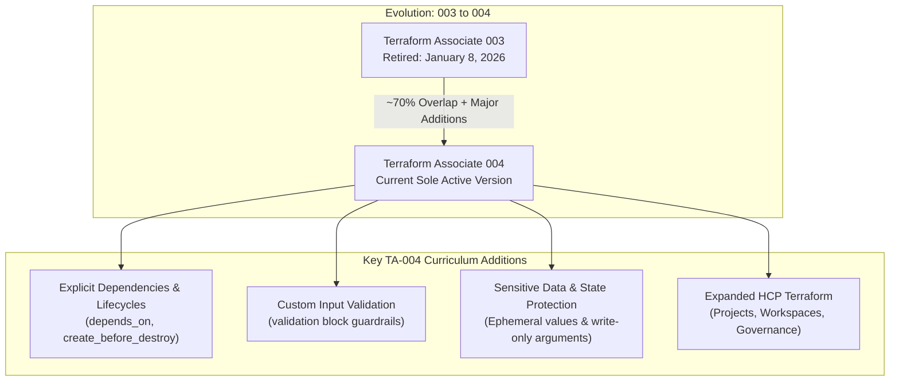
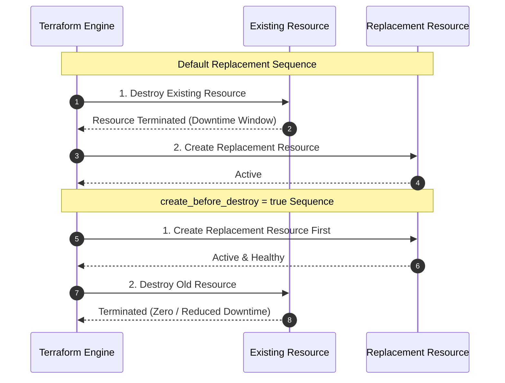
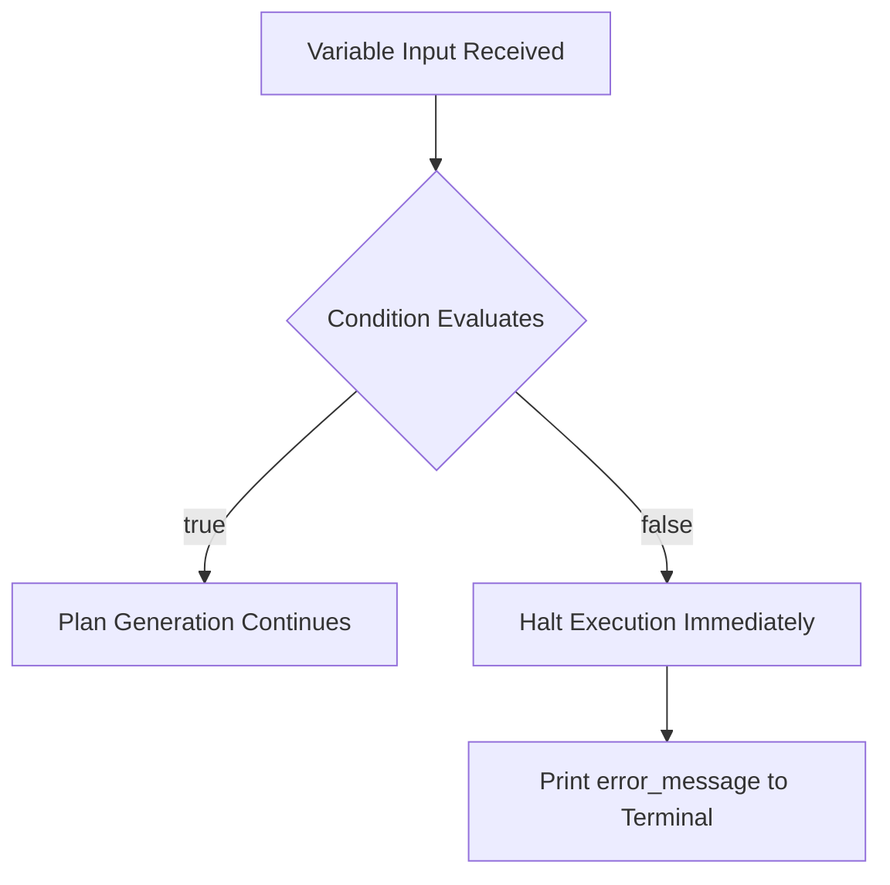
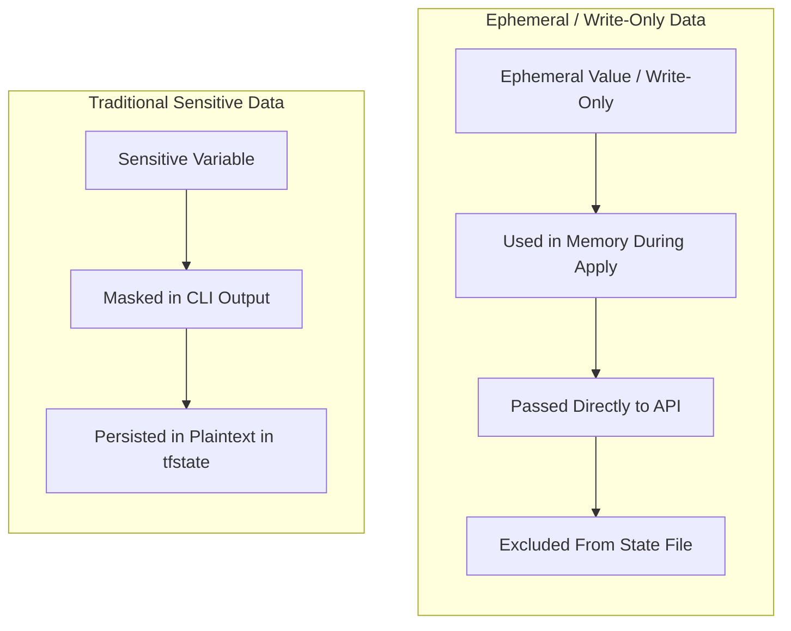
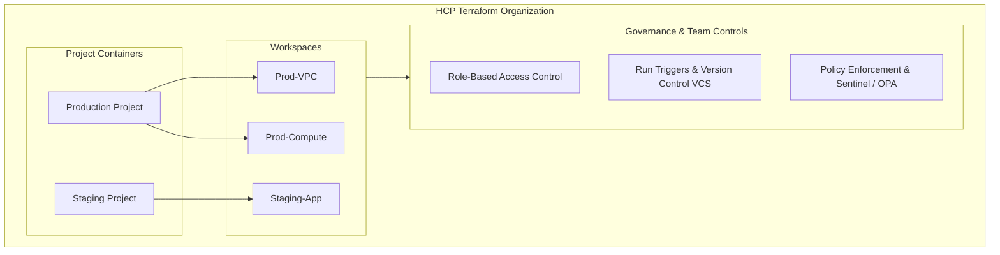

# What's New in the Terraform Associate 004 Exam: Differences, Evolution & TA-004 Delta

---

## Key Takeaways

The transition from the Terraform Associate 003 (retired in January 2026) to the 004 exam maintains an estimated 70% curriculum overlap while updating objectives to reflect modern Terraform capabilities and cloud practices. The 004 release eliminates older question styles—specifically fill-in-the-blank items—in favor of multiple-choice, multi-select, and true/false questions delivered via the Certiverse online proctoring system. The update introduces four primary focus areas: explicit resource dependency rules and lifecycle controls, custom variable validation conditions, sensitive data handling via ephemeral values and write-only arguments, and expanded governance and collaboration architecture within HCP Terraform.



- **Exam Retirement Timeline**: The TA-003 exam reached official end-of-life on January 8, 2026; all candidates taking or renewing credentials take the TA-004 exam.
- **Simplified Delivery Structure**: The exam duration remains 60 minutes with a two-year credential validity, administered via Certiverse without fill-in-the-blank questions.
- **Declarative Code Guardrails**: Candidates are tested directly on custom input validation (`validation` blocks) to enforce structural constraints before execution plans generate.
- **Advanced State Sanitization**: Incorporates security features for secrets management, notably ephemeral values and write-only arguments that prevent plaintext persistence in state files.
- **Enterprise Cloud Infrastructure**: Expands testing of HCP Terraform management boundaries, including projects, workspaces, team collaboration, and governance.

---

## Main Discussion / Deep Dive

### Version Comparison: TA-003 vs. TA-004

While the core HCL design patterns remain consistent, the testing framework and sub-objectives reflect modern platform improvements.

| Parameter / Feature          | Terraform Associate 003                                      | Terraform Associate 004                        | Operational & Testing Impact                                                        |
| ---------------------------- | ------------------------------------------------------------ | ---------------------------------------------- | ----------------------------------------------------------------------------------- |
| **Availability Status**      | Retired (Final date: Jan 8, 2026)                            | Active (Sole version available)                | Candidates must align their study plans with 004 sub-objectives.                    |
| **Testing Engine**           | PSI / Early Transition                                       | Certiverse                                     | Remote proctored delivery with automated checks and live monitoring.                |
| **Question Types**           | Multiple choice, multi-select, true/false, fill-in-the-blank | Multiple choice, multi-select, true/false      | **Fill-in-the-blank items removed**, simplifying question mechanics.                |
| **Exam Duration & Validity** | 60 minutes / 2-year validity                                 | 60 minutes / 2-year validity                   | Core testing duration and recertification cycles remain unchanged.                  |
| **Secrets & State Storage**  | Traditional `sensitive = true` (still saved in state)        | Ephemeral values & write-only arguments        | Modern secrets management preventing sensitive data from persisting in state files. |
| **Configuration Guardrails** | Standard type checking                                       | Custom `validation` blocks with error messages | Pre-plan input verification before provisioning occurs.                             |
| **HCP Terraform Footprint**  | Basic cloud workflows & remote backends                      | Expanded: Projects, Workspaces, Governance     | In-depth evaluation of enterprise team workflows and policy tools.                  |

---

### Delta 1: Explicit Dependencies and Advanced Lifecycle Rules

In standard Terraform execution, dependency relationships between resources are inferred implicitly via reference expressions. The 004 exam introduces dedicated sub-objectives around explicit ordering controls and lifecycle modifications:

- **Explicit Dependencies (`depends_on`)**: Used when a resource must wait for another resource or module to complete, but does not reference that resource directly in its configuration arguments (e.g., granting an IAM role assignment before deploying an application service that assumes that role).
- **Lifecycle Rules (`create_before_destroy`)**: Inverts Terraform’s default replacement sequence. Normally, Terraform destroys the existing resource first before creating its replacement. Setting `create_before_destroy = true` ensures the replacement resource is healthy and running before tearing down the old one, reducing downtime.



```hcl
# Example: Using explicit dependencies and lifecycle rules
resource "aws_security_group" "web_sg" {
  name        = "web-server-sg"
  description = "Security group for web instances"
  vpc_id      = "vpc-0123456789abcdef0"

  lifecycle {
    create_before_destroy = true
  }
}

resource "aws_instance" "web_server" {
  ami           = "ami-0c55b159cbfafe1f0"
  instance_type = "t3.micro"

  # Explicitly enforce dependency even if SG is not referenced directly in this block
  depends_on = [
    aws_security_group.web_sg
  ]

  lifecycle {
    create_before_destroy = true
  }
}
```

---

### Delta 2: Custom Variable Validation Conditions

A major addition to Objective 4 is the requirement to write and understand custom validation rules within input variable blocks. This adds guardrails to reusable modules, failing fast during the initial planning phase if an operator supplies invalid values.



A `validation` block contains:

1. `condition`: A boolean expression defining valid input (must return `true`).
2. `error_message`: A descriptive failure message shown when the condition evaluates to `false` (must be at least one full sentence starting with an uppercase letter and ending with a period).

```hcl
variable "environment" {
  type        = string
  description = "Deployment target environment name"

  validation {
    condition     = contains(["dev", "staging", "prod"], var.environment)
    error_message = "The environment variable must be one of: dev, staging, prod."
  }
}

variable "instance_count" {
  type        = number
  description = "Number of worker compute nodes"
  default     = 2

  validation {
    condition     = var.instance_count >= 1 && var.instance_count <= 10
    error_message = "Worker instance count must be between 1 and 10 nodes inclusive."
  }
}
```

---

### Delta 3: Ephemeral Values and Write-Only Arguments

Traditional Terraform configurations using `sensitive = true` mask output strings in CLI logs, but **still store sensitive attributes in plaintext in the `.tfstate` file**.

To address this security limitation, modern Terraform versions and the 004 exam introduce:

- **Ephemeral Values**: Temporary runtime variables and values that exist only in memory during the execution phase (`plan` and `apply`) and are **not saved to state files or disk backends**.
- **Write-Only Arguments**: Provider-level arguments that pass sensitive values (e.g., initial bootstrap administrative passwords, certificates, or tokens) directly to an API endpoint without persisting them back into the resource state representation.



---

### Delta 4: Expanded HCP Terraform Footprint

The TA-004 exam broadens coverage of HashiCorp Cloud Platform (HCP) Terraform, testing multi-user organization and governance features beyond basic remote state storage:



- **Projects**: Organizational containers used to group related workspaces, making it easier to manage permissions across teams.
- **Workspaces**: Independent state and variable management boundaries tied to VCS repositories or CLI pipelines.
- **Governance and Policies**: Integrating automated guardrails, compliance rules, and access permissions across development teams.

---

## Exam Guide

### Exam Tips

- **Question Types in 004**: Fill-in-the-blank questions are no longer present. Focus on multiple-choice, multi-select (where the required count is explicitly stated), and true/false items.
- **State Sensitivity Trap**: Remember that setting `sensitive = true` does **not** keep values out of the state file; it only masks them in CLI console output. To keep values out of the state file entirely, modern Terraform uses **ephemeral values** and **write-only arguments**.
- **Validation Block Placement**: Custom `validation` blocks reside **inside** the `variable` block, not at the root module level or inside resource blocks.
- **`create_before_destroy` Dependency Requirement**: When setting `create_before_destroy = true` on a resource, any dependencies that reference it must often also implement `create_before_destroy` to prevent dependency cycles.
- **HCP Organizational Hierarchy**: Understand how HCP Terraform uses **Projects** to organize groups of **Workspaces**.

---
